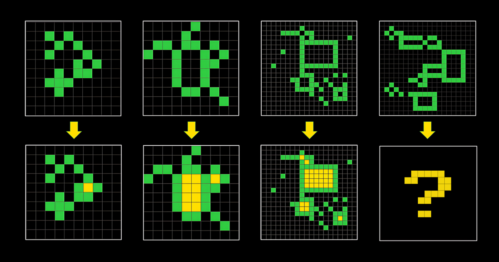

# Business Understanding

<!--- --->

## Challenge description

<!--- Look at the challenge description, understand the goal of the challenge
and write it here with your own words. Use images if they improve the explanation--->

> The Abstraction and Reasoning Corpus for Artificial General Intelligence (ARC-AGI) benchmark measures an AI system's ability to efficiently learn new skills. Humans easily score 85% in ARC, whereas the best AI systems only score 34%. The ARC Prize competition encourages researchers to explore ideas beyond LLMs, which depend heavily on large datasets and struggle with novel problems.

<!--- --->

> The objective of this competition is to create an algorithm that is capable of solving abstract reasoning tasks. Critically, these are novel tasks: tasks that the algorithm has never seen before. Hence, simply memorizing a set of reasoning templates will not suffice.

## Evaluation

<!--- Understand the metric used on the challenge, write it here and study
the characteristics of the metric --->

> This competition evaluates submissions on the percentage of correct predictions. For each task, you should predict exactly 2 outputs for every test input grid contained in the task. (Tasks can have more than one test input that needs a predicted output.) Each task test output has one ground truth. For a given task output, any of the 2 predicted outputs matches the ground truth exactly, you score 1 for that task test output, otherwise 0. The final score is the sum averaged of the highest score per task output divided by the total number of task test outputs.

## Assess situation

<!---This task involves more detailed fact-finding about all of the resources,
constraints, assumptions, and other factors that should be considered in determining
the data analysis goal and project plan

* timeline. Is there any week where I could not work on the challenge?
* resources. Is there any other project competing for resources?
* other projects. May I have other more interesting projects in the horizon?
 --->

I will devote at least the 2 following months (July and August) to better understand intelligence.
This challenge is a good applied exercise of that.

It is a code competition and runtime should be less than 12 hours.

## Terminology

<!--- Sometimes the field of the challenge has specific terms, if that is the
case write them here, otherwise delete this section.--->

## Questions

<!--- Write here any question that arises when reading about the challenge --->

## Project Plan

<!--- Write initial ideas for the project. This is just initial thoughts,
during the challenge I will have a better understanding of the project and
with better information I could decide other actions not considered here.--->

No one knows how to solve this problem yet. So this competition is about deeply understanding the problem,
designing and building a solution.

The first step for this competition is to read about the state of the art and explore the space
of possible solutions.
