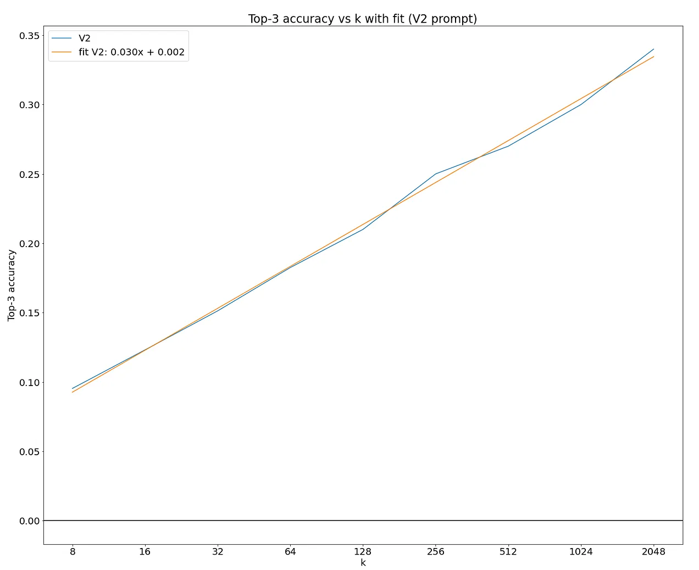
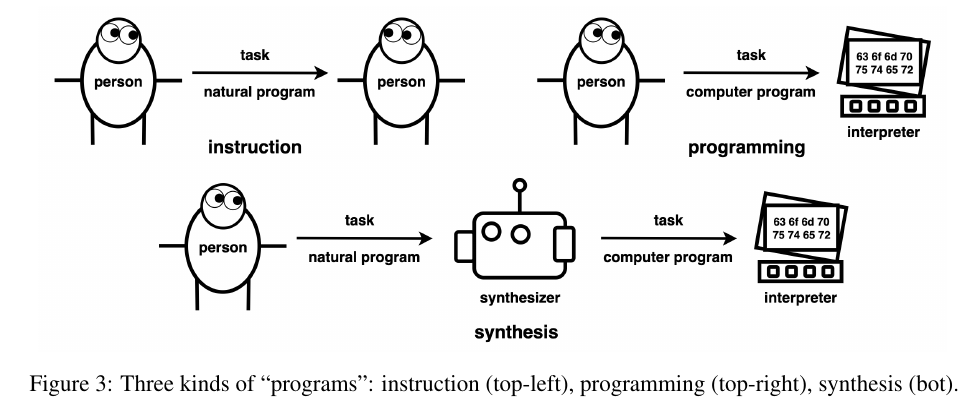
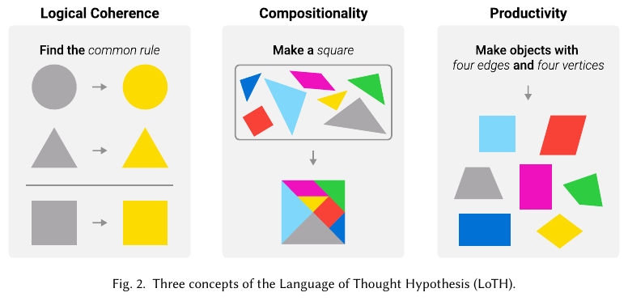

# State of the art

<!--- --->

## Papers

These are the sources of papers used:

- [Citations to the "On the measure of intelligence" paper on Google Scholar](https://scholar.google.com/scholar?start=10&hl=en&scisbd=1&as_sdt=2005&sciodt=0,5&cites=645844335140263496&scipsc=)
- [Papers on Arxiv with `abstraction reasoning corpus` in the title](https://arxiv.org/search/advanced?advanced=&terms-0-operator=AND&terms-0-term=abstraction+reasoning+corpus&terms-0-field=title&classification-physics_archives=all&classification-include_cross_list=include&date-filter_by=all_dates&date-year=&date-from_date=&date-to_date=&date-date_type=submitted_date&abstracts=show&size=50&order=-announced_date_first)
- [ARC prize resources](https://arcprize.org/guide#arc-agi-resources)

### ⭐⭐ [Getting 50% (SoTA) on ARC-AGI with GPT-4o by Ryan Greenblatt](https://redwoodresearch.substack.com/p/getting-50-sota-on-arc-agi-with-gpt)

> I recently got to 50% accuracy on the public test set for ARC-AGI by having GPT-4o generate a huge number of Python implementations of the transformation rule (around 8,000 per problem) and then selecting among these implementations based on correctness of the Python programs on the examples (if this is confusing, go to the next section). I use a variety of additional approaches and tweaks which overall substantially improve the performance of my method relative to just sampling 8,000 programs.

As Chollet says in the section below, this would not be SOTA but it is a great result.

> The additional approaches and tweaks are:
>
> - I use **few-shot prompts** which perform meticulous **step-by-step reasoning**.
> - I have GPT-4o try to **revise** some of the implementations after seeing what they actually output on the provided examples.
> - I do some feature engineering, providing the model with considerably **better grid representations** than the naive approach of just providing images. (See below for details on what a “grid” in ARC-AGI is.)
> - I used specialized few-shot prompts for the two main buckets of ARC-AGI problems (cases where the grid size changes vs doesn’t).

<!--- --->

> The main idea behind my solution is very simple: get GPT-4o to generate around 8,000 python programs which attempt to implement the transformation, select a program which is right on all the examples (usually there are 3 examples), and then submit the output this function produces when applied to the additional test input(s). I show GPT-4o the problem as images and in various ascii representations.

<!--- --->

> My approach is similar in spirit to the approach applied in AlphaCode in which a model generates millions of completions attempting to solve a programming problem and then aggregates over them to determine what to submit.

<!--- --->

> Actually getting to 50% with this main idea took me about 6 days of work. This work includes constructing few-shot prompts, building better text representations of these grids, iterating against the train set, and implementing various other tweaks to improve performance

- [Github ARC Draw more samples](https://github.com/rgreenblatt/arc_draw_more_samples_pub)
  - [Few shot prompts with reasoning and python code](https://github.com/rgreenblatt/arc_draw_more_samples_pub/blob/dc4b6080574183b690429a176d5f18437ecf7036/arc_solve/reasoning_and_labels.py)

#### High level method

- Provide the ARC-AGI problem to GPT-4o, with both an image representation and with various text representations for each grid in the problem. The text representations include showing which cells are occupied by different connected components of colors and showing diffs between the input and output (in cases where the grid shapes are the same).
- Instruct GPT-4o to reason about what the transformation is, reason how to implement the transformation as code, and then finally actually implement the transformation in code.
- Use a few-shot prompt with several carefully handwritten examples of step-by-step reasoning to actually get GPT-4o to do this reasoning somewhat effectively. The resulting prompt is usually around 30k tokens long including images.
  - We actually have a pair of few-shot prompts: one prompt for when the grid size changes (in any of the examples) and one for when it doesn’t.
  - We also ensemble over multiple pairs of few-shot prompts. This doesn’t help much, but I already had the samples in the cache.
- Sample vast, vast numbers of completions (~5,000 per problem) from GPT-4o.
- Take the most promising 12 completions for each problem, and then try to fix each by showing GPT-4o what this program actually outputs on the examples, and then asking GPT-4o to revise the code to make it correct. We sample ~3,000 completions that attempt to fix per problem in total across these 12 starting implementations.
  - We use a few-shot prompt for revisions with step-by-step reasoning.
  - We also have a text representation which shows the diff between the actual output and the expected output.
- Then, we select 3 submissions to make based on a majority vote over programs which get the examples correct. (In the case where we don’t have 3 distinct submissions from programs which get the examples right, we apply some heuristics to pick a submission, but this doesn’t matter much.).

In addition to iterating on the training set, I also did a small amount of iteration on a 100 problem subset of the public test set. All the results I presented here were computed on a different subset of the public test set that does not overlap.  The train and test set are not IID, and the test set is both much harder and somewhat qualitatively different (I think), so using a subset of the test set for iteration was useful for quickly getting a better sense of how things change with difficulty. It's unfortunate that these sets aren’t IID: it makes iteration harder and more confusing.

#### What are the returns to more sampling?

> There appears to be a relatively clean scaling law. The fit is in terms of log base 2. So, it indicates an additional 3% correct per doubling of k

#### Tricks in the solution

- Using a better representation is crucial, allows to sample 10 times more efficiently
- Also revision of the proposed solutions is crucial, allows to sample 10 times more efficiently
- So without revision and good representation it would have needed close to 1M samples instead of 8k

#### [Chollet reaction](https://x.com/fchollet/status/1803174151680569570)

> SotA on the public evaluation set of ARC-AGI is ~60% for a heterogenous ensemble, 54% for a single approach. But what really matters is the private leaderboard on Kaggle (33% there so far vs 85% needed to beat the challenge)

<!--- --->

> In general, we see 10-20 pts worse performance on the private test set compared to the public eval set. 
> This is likely in part due to information leak from the public tasks into the model (which can happen in a number of ways, including LLM pretraining, and tuning of an approach's knobs based on eval set performance, aka overfitting).
> This is *also* likely in part due to the fact that the eval set contains more "easy" tasks. The eval set and test set were not calibrated for difficulty. So while all tasks across the board are feasible for humans, the tasks in the test set may be harder on average. This was not intentional, and is likely either a fluke (there are only 100 tasks in the test set) or due to the test set having been created last.

#### Implications of this work

The fact that they have to generate thousands of responses seems the typical tradeoff between train and inference compute. It is very likely that future and bigger models will need far less generations to achieve
the same level of accuracy (see f.e. AlphaCode2 where they replaced PaLM by Gemini with great improvements. They could reach the performance of AlphaCode1 with 100 samples instead of 1e6 samples.)

The fact that an LLM without fine-tuning can achieve such high score on the ARC dataset is a contradiction
with the postulates of Chollet that say that LLM cannot do in-context learning.

I believe this result is more impressive that MindsAI team because GPT4o was not fine-tuned for this task. The MindsAI team fine-tune a model on ARC like tasks and do test time fine-tuning on the test tasks.
Thus considering the priors and experience of both models GPT4o is clearly more intelligent than MindsAI team model.

There might be some risk of data contamination because the data is publicly available on Github. However the approach
is not directly solving the task, but writing python code to solve the task. And that kind of data is not
available to the best of my knowledge.

### ⭐ [Neural networks for abstraction and reasoning: Towards broad generalization in machines](https://arxiv.org/abs/2402.03507)

Nicely written paper that tries to solve the ARC challenge with two methods:

1. Dreamcoder. Is a method to create programs given a set of primitive functions
2. LLMs. They show that using `transpose` and `rot90` augmentations can double the accuracy of the models. This highlights the sequential and non-2d nature of the typical LLM data.

Results are weak and do not surpass the state of the art.

> Abstraction and reasoning - developing computer systems that can learn new concepts from a small number of examples, something that humans find relatively easy

<!--- --->

> We revisit whether new advances can allow computers to extrapolate to new concepts rather than merely interpolate.

<!--- --->

> With only a handful of training examples per ARC task, and 10900 possible answers (of which exactly one gains credit), traditional machine learning (ML) methods that require large datasets have so far been unable to make progress.

<!--- --->

> Analogy-making has been considered central to the notion of intelligence. When presented with novel situations (for example; opening a new type of door, or conversing about a new topic), humans effortlessly solve these situations by creating analogies to previous experiences and concepts.

<!--- --->

> Chollet notes that while excellent progress has been made in solving specific tasks to approach or surpass human-level (such as detecting cats and playing Go), these models generally require a huge amount of training and are limited to performing well on situations that they were trained on. The failure of neural network models to perform when extrapolating outside the training data has been widely explored

<!--- --->

> Inductive programming describes algorithms that derive programs that explain a series of examples.

<!--- --->

> when a person attempts an ARC task, we see a similar process: one tries to abstract the
training tasks to a ‘program’ (generally in natural language in one’s head, for example “rotate by 90
degrees”); human intuition is the search procedure.

### ⭐ [Icecuber 1st place solution on ARC2020](https://www.kaggle.com/competitions/abstraction-and-reasoning-challenge/discussion/154597)

> Unfortunately, I don't feel like my solution itself brings us closer to AGI. The main component is a DSL which applies up to 4 of 142 unary transformations (42 different functions, some have different variants). This DSL is solved by enumeration (exploiting duplicates) + a greedy stacking combiner. Everything is implemented efficiently in C++ (with no dependencies) and running in parallel.

- [Icecuber solution repo](https://github.com/top-quarks/ARC-solution)
- [Icecuber solution documentation](https://github.com/top-quarks/ARC-solution/blob/master/ARC-solution_documentation.pdf)

> I then noticed that **distribution of training, evaluation and LB were quite different, so I decided the evaluation dataset was better used as training data**. I hand-coded 100 evaluation tasks, which I used to add more transformations, and improve my DSL. I noticed that functions taking more than 1 argument were growing my search space super-exponentially, and that they usually just took either the input or output image size as second argument. This led me to only keep unary functions. I also added lists of images as a type, to solve tasks that required looping. I also started representing my DSL in a DAG to exploit duplicates (multiple transformations giving same output). This required me to rewrite most of my code, but gave me 14 tasks on LB.

<!--- --->

> I double the sample inputs by adding the same tasks flipped along a diagonal. This makes for 3 full runs (depth 3 for performance reasons): one normal, and one for each diagonal. This simple addition moved me from 17 to 21 tasks solved on the LB (and hence helped more than all the optimizations needed for doing depth 4 search instead of depth 3).

#### Implications of this work

This work shows that at least 20% of the test set tasks can be solved using just 3-4 transformations (because the search was limited to a depth of 3-4).

The ARC set can be solved given enough compute and a complete DSL. This will be a brute-force approach
to the problem that won't be intelligent. The intelligence lies in the developer that produced the
complete DSL and the search algorithm. This system won't generalize to new problems.

The world is too complex to have a DSL, that's why we write new python code for each application.
The way we solve the ARC is important, we have to design the more general solution possible.

### ⭐ [LLMs and the Abstraction and Reasoning Corpus: Successes, Failures, and the Importance of Object-based Representations](https://arxiv.org/abs/2305.18354v2)

This paper highlights the fact that LLMs have difficulties understanding the 2d nature of the ARC dataset.

1. Evaluate the model with few-shot prompt as it is my idea, giving reasoning as input. However I don't believe this is done as extensively as I want to do myself
2. Create a 1D ARC dataset where the models perform better
3. Using a object based representation of the problem where GPT4 solves 23/50 problems (an easy subset from ARC)

What would be the best input for the LLMs to understand 2d structures?
I could fine-tune a model to do row, col, diagonal addition or presence detection. This might force the model to create a great representation for the problem.

> Reasoning is using evidence, arguments, and logic to arrive at conclusions or make judgments

<!--- --->

> A closer examination of the tasks that GPT-4 solved correctly using the direct-grid approach reveals some interesting patterns in the reasoning provided by the model. Out of the 13 tasks that were correctly solved, only three tasks were accompanied by the correct reasoning steps.

<!--- --->

> To address the challenges we have identified thus far and to enhance LLM performance, we propose the integration of an external tool to aid in producing an object representation of a task. More specifically, we leverage the ARGA algorithm to execute object abstraction before prompting LLMs for the solution.

<!--- --->

> Our exploration started with a straightforward, grid-based textual encoding approach, which revealed that GPT struggles due to the non-sequential representation of complex objects in text. We then introduced the 1D-ARC, a simplified, single-dimensional version of the ARC. By reducing the task complexity and dimensionality, we aimed to make ARC tasks more approachable for LLMs. Our evaluations on the 1D-ARC indicated improvements in performance but also highlighted that simplification alone could not bridge all the gaps in GPT’s reasoning processes. In the third phase of our exploration, we adopted an object-based approach, integrating an external tool, the ARGA framework, to assist in object abstraction. This led to significant improvements in GPT’s problem-solving abilities, reaffirming the importance of structured, object-based representations in complex reasoning tasks.

### ⭐ [Addressing the Abstraction and Reasoning Corpus via Procedural Example Generation](https://arxiv.org/abs/2404.07353)

This paper presents the [re-arc repo](https://github.com/michaelhodel/re-arc), which allows to generate at least 10k new samples for each task in the ARC training dataset.

Could I modify it to output text descriptions of the synthetic inputs? That could allow the model to learn a good representation of the grids and also to learn what the transformation is.

> The sample-efficiency of learning algorithms might be improved by building a curriculum that increases example difficulty over the course of training - as opposed to training on instances of the full range of difficulties throughout the entire training

<!--- --->

> Each generator is a standalone Python function merely making use of the DSL and functions from the random module from the standard library. The median generator consists of 40 lines of code and uses 22 DSL primitive calls and 10 calls to the random module

It is curious that so many (22) primitive function calls are needed on median.

My rough estimation of primitive functions in [arc-dsl](https://github.com/michaelhodel/arc-dsl) is 160 (count the number of occurrences of `def `). We know that this set of primitives is complete for the train set, but is it for the evaluation and test set?

### ⭐ [Communicating Natural Programs to Humans and Machines](https://arxiv.org/abs/2106.07824)

This paper is very interesting, they supplement the ARC dataset with text descriptions.

They argue that those natural descriptions are equivalent to the input/output examples, it's just another way of expressing the same message.

> We present LARC, the Language-complete ARC: a collection of natural language descriptions by a group of human participants who instruct each other on how to solve ARC tasks using language alone, which contains successful instructions for 88% of the ARC tasks. We analyze the collected instructions as ‘natural programs’, finding that while they resemble computer programs, they are distinct in two ways: First, they contain a wide range of primitives; Second, they frequently leverage communicative strategies beyond directly executable codes. We demonstrate that these two distinctions prevent current program synthesis techniques from leveraging LARC to its full potential, and give concrete suggestions on how to build the next-generation program synthesizers.

> In this work, we adopt the Wizard-of-Oz approach by using a human as an interpreter of natural language instructions (Fig 3 top-left). We define a natural program as instructions constructed by a person that can be interpreted by another person to produce a specific output. This program is natural–it can be understood by speakers of the language4 without a prior consensus–but behaves as a program, in that it produces a definitive output, which can be unambiguously checked for correctness. For instance, **the original ARC tasks are natural programs: Given a program consisting of input-output examples, a fellow human can readily interpret this program to produce an output on a new input, which can be checked for correctness**. By starting with (linguistic) natural programs, one can directly observe the set of concepts and strategies necessary to master a domain (such as ARC), without committing to a specific interpreter.

This is really interesting: it implies that a program defined with natural language is equivalent to a program
defined with input-output samples in the ARC dataset.
Thus translating an ARC task to a text description would not be necessary, although it would be helpful
to verify that the task has been understood.

However results do not show a big benefit from using the text descriptions.

### [Reasoning Abilities of Large Language Models: In-Depth Analysis on the Abstraction and Reasoning Corpus](https://arxiv.org/abs/2403.11793)

This papers studies if LLMs are good at the three elements of Language of Thought Hypothesis:

1. Logical Coherence: Using prompting techniques, LLMs are set to solve ARC tasks. By analyzing the types of ARC tasks it can solve and the process of solving them, we aim to determine whether LLMs are capable of logical reasoning and whether its logic is consistent.
2. Compositionality: ARC tasks are known to be solvable through the application of step-by-step functions. With such functions provided, we aim to ascertain whether LLMs can identify the combinations of functions that are needed to solve a task. This process can be broken down into two parts: understanding how LLMs manipulate the problem input and determining whether they can achieve the desired results through multiple steps of manipulation.
3. Productivity: We tested if LLMs can create new input-output pairs for ARC tasks. We selected tasks with multiple inputs leading to the same output, devised prompts for inverse transformation, and assessed LLMs’ ability to generate varied inputs based on these prompts.

It finds that current LLMs are weak at all the three elements.

### [Large Language Models Are Not Strong Abstract Reasoners](https://arxiv.org/abs/2305.19555)

Results on ARC challenge are very weak, but they don't add task descriptions that I believe would have helped the models (in addition to few-shot prompting)

> Abstract reasoning is a fundamental task for cognition, consisting of finding and applying a general pattern from few data

<!--- --->

> We perform extensive evaluations of state-of-the-art LLMs, showing that they currently achieve very limited performance in contrast with other natural language tasks, even when applying techniques that have been shown to improve performance on other NLP tasks.

<!--- --->

> In this paper, we present what is, to the best of our knowledge, the first extensive evaluation of Large Language Models for abstract reasoning. We show that LLMs do not perform well on all types of tasks, although not all models are equally poor. Prompting and refinement techniques that improve performance on NLP tasks do not work for abstract reasoning. Our experiments show that the bottleneck in the performance lies in the recognition of new unseen abstract patterns and not in a lack of understanding of the task or the prompt. These results hold in discriminative settings, where the models must find the correct answer within a small set of propositions. A qualitative study of selected failure cases in the appendix further reveals that models tend to reason inconsistently and in a shallow way. We hypothesize that current self-supervised autoregressive LLMs lack fundamental properties for strong abstract reasoning tasks and human-like cognition. We posit that methods based on causal reasoning and program induction could help improve the reasoning abilities of neural networks.

### [Comparing Humans, GPT-4, and GPT-4V On Abstraction and Reasoning Tasks](https://arxiv.org/abs/2311.09247)

This paper shows an evaluation of GPT4 on ConceptARC dataset, an easier version of ARC dataset that has well defined categories.

However there isn't task description so that is equivalent to trying to learn MATH problems with just the answer and not the reasoning.

> The defining characteristic of abstract reasoning is the ability to induce a rule or pattern from limited data or experience and to apply this rule or pattern to new, unseen situations.

<!--- --->

> Here, we performed evaluations using a more informative, one-shot prompt for text versions of tasks, and experimented with similar zero- and one-shot prompts for the multimodal case in which task-grids were given as images. We found that our more informative one-shot prompt improved GPT-4’s performance in the text case, but its performance remained well below that of humans and the special-purpose Kaggle-ARC program.

### [Large Language Models as General Pattern Machines](https://arxiv.org/abs/2307.04721)

This seems to be one of the initial evaluations of ARC using LLMs. The results are modest, but they show they can solve the problems for arbitrary symbols (not just 0-9 but any symbol)

> The capacity of LLMs to act as general pattern machines is driven by their ability to perform in-context learning on sequences of numeric or arbitrary tokens.

<!--- --->

> Observation: consistent tokenization matters.

<!--- --->

> Observation: token mapping invariance. The hypothesis that LLMs can serve as general pattern machines stems from the observation that they can still solve a non-trivial number of ARC problems using alphabets A sampled randomly from the LLM’s token vocabulary.

### [Do Large Language Models Solve ARC Visual Analogies Like People Do?](https://arxiv.org/abs/2403.09734)

They create  a very simple version of ARC challenge for kids. They compare the results between kids and LLMs.

Not very useful for our task, we need to solve the real and difficult one.

### [Large Language Model as a System of Multiple Expert Agents: An Approach to solve the Abstraction and Reasoning Corpus Challenge](https://arxiv.org/abs/2310.05146)

They use GPT4 to write python code to solve the tasks. Is similar to the Ryan's approach but with less computation.

It's a bit weird that they make some proposals but do not implement all of them.

Input tokens is a limitation because at the time of the publication GPT4 could only receive 8k tokens. In Kaggle we could have a similar limitation due to GPU RAM memory.

> While GPT-4 has proven to be a general purpose solver, being (currently) a text-based model, GPT-4 lacks some of the innate human priors necessary to solve the ARC challenge. For example, GPT-4 is not able to identify objects accurately from text alone.

<!--- --->

> For our method, we use only three views - Grid View, Object View, Pixel View - and that has already achieved quite good results. In brief, Grid View provides the entire grid repre- sentation, except we change the pixel numbers to characters so that we do not bias GPT-4 to treat it as an arithmetic problem to perform arithmetic on the pixel values. This also has the added benefit of ensuring that GPT-4 has not seen the ARC tasks before as it is now of a different form. The Object View groups pixels that are contiguous together, so that they can be manipulated as a group. Pixel View gives the coordinates for each pixel, which can help with more fine-grained movement tasks or relational tasks between pixels.

### [Generalized Planning for the Abstraction and Reasoning Corpus](https://arxiv.org/abs/2401.07426)

Another paper that uses the DSL approach, but from the perspective of planning. It achieves slightly better results than icecuber and ARGA.

### [Tackling the Abstraction and Reasoning Corpus (ARC) with Object-centric Models and the MDL Principle](https://arxiv.org/abs/2311.00545)

This paper proposes to search a representation of the grids using the Minimun Description Length (MDL) principle. Then it searches a program to transform the input into the output.
So it does not only use a DSL but also a representation. Patterns + Functions.

It scores very poorly on private test set (2%)

### [A Neurodiversity-Inspired Solver for the Abstraction and Reasoning Corpus Using Visual Imagery and Program Synthesis](https://arxiv.org/abs/2302.09425)

I haven't read the whole paper but it's just another DSL with some inspiration on Neurodiversity.

It only achieves 2% on the private test set, which is omitted in the paper and only said that they got the 4th-place.

### [Graphs, Constraints, and Search for the Abstraction and Reasoning Corpus](https://arxiv.org/abs/2210.09880)

This paper proposes to use an object centric representation of the grids based on graphs. Using that representation and a small Domain Specific Language (DSL) it is able to solve a comparable number of tasks to icecuber solution (but using only tasks about objects).

This representation was later used on other papers as the input to GPT.

### [Teaching Large Language Models to Reason with Reinforcement Learning](https://arxiv.org/abs/2403.04642)

This paper applies different RL methods to Llama 2 to improve reasoning at math problems. All RL methods have a similar result.

They don't use ARC data at all.

### [Can Large Language Models Learn Independent Causal Mechanisms?](https://arxiv.org/abs/2402.02636)

A new architecture is proposed to enhance reasoning, but the results are similar to Llama 2.

I don't believe this is relevant to solve the ARC challenge.

### [Learn Abstraction in an Abstract Way: The Long Journey Ahead](https://openreview.net/forum?id=wHanWNJN0r)

This paper is not relevant for the task.

## Repos

- [arc-dsl](https://github.com/michaelhodel/arc-dsl) Domain Specific Language for the Abstraction and Reasoning Corpus by Michael Hodel, member of MindsAI team
- [https://github.com/michaelhodel/re-arc](https://github.com/michaelhodel/re-arc) RE-ARC: Reverse-Engineering the Abstraction and Reasoning Corpus by Michael Hodel, member of MindsAI team
- [ARC Draw more samples](https://github.com/rgreenblatt/arc_draw_more_samples_pub) is the repo for the article "Getting 50% (SoTA) on ARC-AGI with GPT-4o by Ryan Greenblatt"
- [Generalized-Planning-for-the-Abstraction-and-Reasoning-Corpus](https://github.com/you68681/GPAR)
- [Icecuber solution repo](https://github.com/top-quarks/ARC-solution)

## Videos

I could use [downsub](https://downsub.com/) to get subtitles from a Youtube video.

### ⭐ [Dwarkesh Patel | Francois Chollet - LLMs won’t lead to AGI - $1,000,000 Prize to find true solution](https://www.youtube.com/watch?v=UakqL6Pj9xo)

> Each task in the ARC is novel. You cannot memorize the solution programs in advance. You have to synthesize a new program for each task.

<!--- --->

> There are two definitions of reasoning:
>
> 1. I have a set of program templates. When faced a new problem I fetch the right template and input the values to solve the problem. This is what GPT does. It needs some intelligence to fetch the correct template.
> 2. When faced with a new puzzle there isn't a template available you have to synthesize on the fly
> a new program based on bits and pieces of existing programs that you have.

### ⭐ [Machine Learning Street Talk | Chollet's ARC Challenge + Current Winners](https://youtu.be/jSAT_RuJ_Cg?si=-s_XpeeDA2BQYlVy)

> Basically that we use so many training examples.
> It's it's not to necessarily teach it so many concepts.
> It's to teach it a space around the concepts and to also prevent it
> from kind of using the shortcuts that the models are prone to.

<!--- --->

> Ideally we would train a model on internet data and generalize to the ARC dataset, that's what Chollet would love to see.

<!--- --->

> So I just figured, okay, how well could we do?
> Uh, even just something very simple, like learning a task in isolation.
> If we had an unlimited number of examples for a given task.

<!--- --->

> Probably 20 different kind of many experiments in formatting the data in various ways.

<!--- --->

> If you train a model on the re-arc dataset you will get like 1% on the test set. But if you apply their
> techniques of active inference the score will increase to 23%

<!--- --->

> There are some scaling laws that suggest that the bigger the model the less test data needs to learn

<!--- --->

> The DSL has 160 functions, but the author believes it could rewrite it to be just 30

Their method is:

1. Fine-tune an LLM on augmented ARC tasks. Probably on the re-arc dataset, maybe a bigger version of it.
2. On inference they augment the test samples (I don't know how) and fine-tune the LLM again on those tasks
3. Make predictions with the LLM

[Test-Time Augmentation to solve ARC, interview with Jack Cole](https://lab42.global/community-interview-jack-cole/) Almost no details about the approach.

### [LLMs as a system to solve the Abstraction and Reasoning Corpus (ARC) Challenge!](https://www.youtube.com/watch?v=plVRxP8hQHY)

TODO:

## Conclusions

- Problem representation is very relevant. Ryan Greenblatt and Jack Cole mention they have worked to create
  a good problem representation.
- It is likely that the MindsAI team is expanding re-arc to the evaluation dataset, or maybe to synthesize
  new tasks.

### Definitions of abstraction and reasoning

> Abstract reasoning is a fundamental task for cognition, consisting of finding and applying a general pattern from few data

<!--- --->

> The defining characteristic of abstract reasoning is the ability to induce a rule or pattern from limited data or experience and to apply this rule or pattern to new, unseen situations.

<!--- --->

> Abstraction and reasoning - developing computer systems that can learn new concepts from a small number of examples, something that humans find relatively easy

<!--- --->

> Reasoning is a knowledge acquisition efficiency

## TODO

- [x] Jack Cole approach (active inference)
- [x] Buck approach (write python programs with GPT4o)
- [x] Icecuber approach (DSL): https://www.kaggle.com/competitions/abstraction-and-reasoning-challenge/discussion/154597
- [ ] What is the best way to encode 2d information for an LLM like Llama3?
- [ ] How can we learn from few examples? Do we need a good representation of the data? Why ML methods need huge datasets? That is where the priors kick in, those priors influence the representation of the data.
- [x] Search more relevant papers
  - [x] Citations from 2024
  - [x] Papers with Abstraction and Reasoning Corpus in the title
  - [x] Read Kaggle's forum to see if more relevant papers were added
  - [x] Links from https://arcprize.org/guide
- [ ] Contrastive learning. Can a model predict if two input/output pairs belong to the same task?
