# Solution Summary
<!--
https://www.kaggle.com/WinningModelDocumentationGuidelines
https://www.kaggle.com/solution-write-up-documentation
https://www.kaggle.com/competitions/arc-prize-2024#paper-award

Here are some pointers from ARC Prize Co-founder François Chollet to help guide you in your paper submission writing.

Be sure to include:

- Abstract: Here’s what the contribution is (e.g., “we present a method to solve ARC-AGI, with the following characteristics…”)
- Intro: Let’s remind people about what ARC-AGI is, why it’s important, and let’s maybe quickly mention what the inspiration behind our approach was.
- Prior work: Here’s the list of previous approaches that are related to our approach.
  Note, they don’t have to have inspired your approach, they only need to be similar in some way - 
  they also don’t need to have been formally published as papers. Highlight similarities and differences. 
  Make sure that your approach still retains something unique (the contribution).
- Approach: Here’s how the approach works. Include an algorithm-level description. 
- Results: Here are the results we’re getting on ARC-AGI! Make sure to mention scores on various
  different sets, e.g., Kaggle leaderboard, public eval… And don’t report train set performance 
  - that’s not what the train set is for.
- Conclusion: Just quickly summarize what the contribution was and what you achieved. Can be 2 lines.

Optionally, you can also have some kind of “analysis” section where you discuss the various things you think you’ve learned from your experimental results (e.g., what kinds of tasks do you solve? Why? What kind of tasks are out of reach?)

Remember that shorter and clearer is always better. Absolutely no filler. Absolutely no attempt to act out sophistication for the sake of it. No equations unless they’re necessary to convey some concept formally.

Papers are about communicating your ideas clearly so that others can learn from them and reuse them. Don’t feel bad if your approach seems too “simple” when you write it down - that’s actually a great thing. There are no points for complication.
--->

## Abstract

This paper presents my approach to the 2024 Abstraction and Reasoning Challenge. I have focused
on the abstraction side of the challenge and on data efficiency, trying to build the best representation
possible of the ARC problems using the available public data. The main contribution of the solution
is that it is possible to train a model to learn multiple tasks about the ARC problems. The default
task of the ARC challenge is to learn to predict the output of the test sample given input-output train samples.
But there are many other tasks that can be done, for example we can train a model to learn the inputs
distributions and to generate a new input given the train input samples. Since we train a model
to do multiple ARC-related tasks we called the approach Omni-ARC. The Omni-ARC solution starts with
a public LLM, fine-tunes it to learn multiple ARC-related tasks and finally uses test-time fine-tuning
to improve the accuracy of the model on the private test set. It achieves a score of 40 on the public leaderboard,
resulting in the 4 position in the challenge.

## Intro

### Abstraction and Reasoning Challenge

There are two different definitions of artificial intelligence. The first says that artificial intelligence is
the science of creating machines that can do the tasks that humans can do. According to this definition
we would be very close to artificial general intelligence (AGI) because systems like ChatGPT can do many
tasks that only humans were able to do before such as solving math problems, answering all kind of questions,
improving the style of some text... Many AI researchers believe that scale is all we need, and simply
scaling the models and the data will lead to AGI.

But there is also another view championed by François Chollet that says that skill is not intelligence,
that intelligence is the ability to handle novelty and learn new skills.

> The intelligence of a system is a measure of its skill-acquisition efficiency over a scope of tasks, with respect to priors, experience, and generalization difficulty.

According to this definition we are far from AGI because the accuracy of the current deep learning models
on some task does not depend on the complexity of the task, but on the familiarity of the model with the task.

To spark research into this view of intelligence Chollet created the Abstraction and Reasoning Corpus (ARC)
and so far it has resisted the test of time. Whereas LLMs are saturating all kind of publicly available
benchmarks, they still do very poorly on the ARC dataset. This can be explained by two big reasons:

1. The test dataset is private
2. All the problems in the test dataset are novel

In 2024 Chollet joined forces with Mike Knoop to launch the ARC Prize 2024, with a total prize pool of 1M$.
The goal was to rise awareness of the unbeaten ARC and to increase the number of people working to solve it.

## Motivation of my approach

In the [ARC challenge](https://arcprize.org/arc) we have to learn a transformation rule given a few
high-dimensional pairs of input and output images. The images can have a size of up to 30x30 pixels
and each pixel can take 10 different colors. The images are not as complex as real world images, but nevertheless
they are high dimensional data.

### How can we learn from few high-dimensional examples?

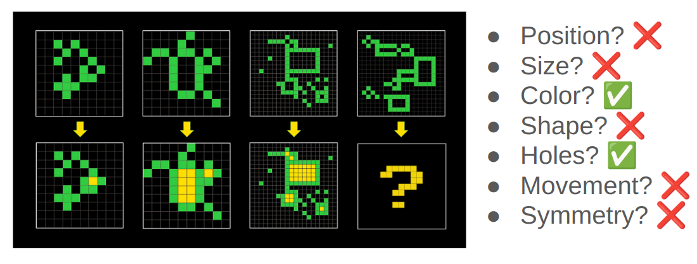

To solve each ARC problem we have to find the **right representation** of the data. When humans solve the
tasks, the biggest challenge is to find the **right perspective** to look at the problem. Once we have the right
perspective of the data the ARC problems are trivial to solve.

The right representation of the data allows to decrease the dimensionality of the data and makes
possible to learn the transformation from very few examples.

<!--
TODO: think of a better image
I don't like this image, don't know if helps.
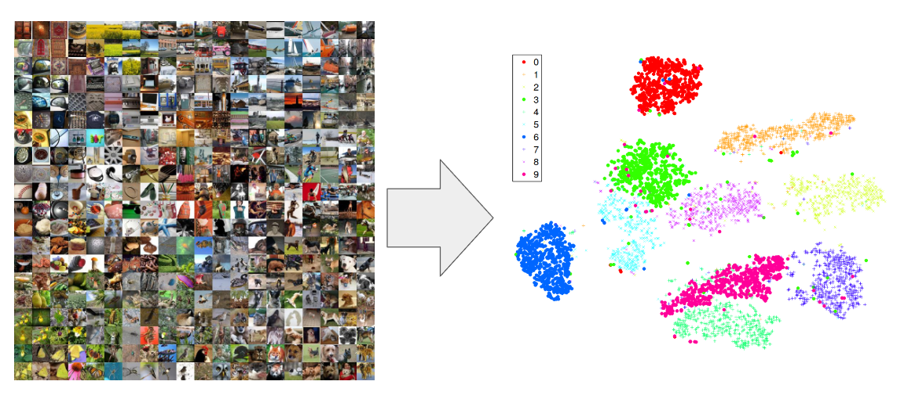
--->

### How can we learn a good representation of the ARC problems?

If we train a model to do tasks that require a good representation of the data, it's likely that the
model will internally develop the required representation.

My insight was that we could use the ARC problems in many different ways to learn that representation,
not just in the original proposed task that asks to generate the output for an image given a few input-output pairs.

### Omni-ARC: Training a single model to do multiple ARC-related tasks

| **examples + input -> output** | **examples -> code** | **code + input -> output** |
|--------------------------------|----------------------|----------------------------|
|         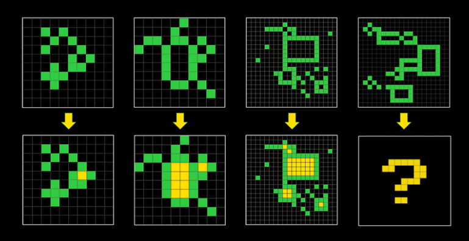                       |         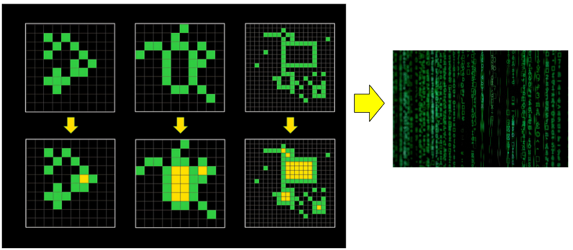             |              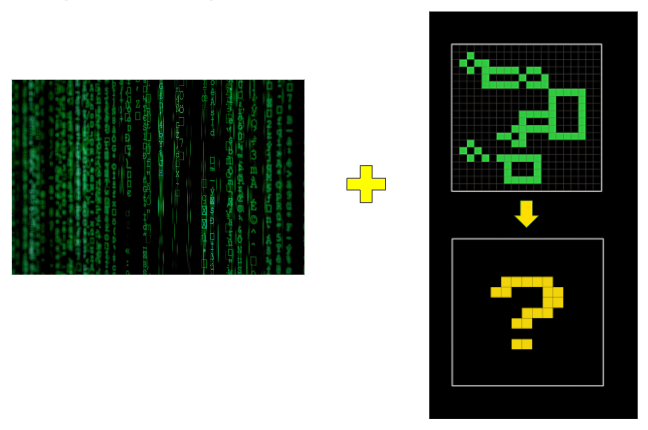              |
| **inputs -> input**            | **code -> inputs**   | **inputs -> code**         |
|              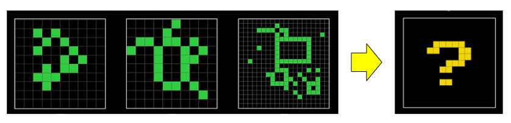                  |   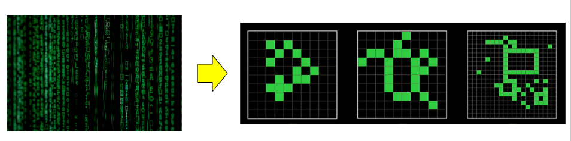                   |        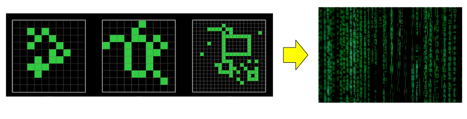                    |

- `examples + input -> output`. The original task of the ARC dataset.
- `inputs -> input`. Generating new inputs requires to understand the distribution of the grids. It could also be done with the outputs, that should also follow some distribution.
- `examples -> code`. This is the approach used by Ryan Greenblat with GPT-4o
- `code + input -> output`. This is equivalent to the first task, but instead of giving examples as input, it gives the code definition of the problem.
- `code -> inputs`. Each input to a task follows some distribution, given a description of the
  distribution the model should be able to generate samples of that distribution.
- `inputs -> code`. We could also do the opposite task, given some inputs write code to generate that distribution.
- `examples + input + output -> is the output correct?`. It is possible to train the model to verify wether a proposed output is correct.
- `examples + input + output options-> select the correct output`. We can train a model to select the correct output between multiple options.

All the listed tasks require that the model learns some useful representation of the ARC image. The idea
behind the Omni-ARC approach is to train a single model to do all the tasks, with the expectation that a shared
representation across all the tasks will generalize better than training the model to do a single task.


_Omni-ARC, a single model that does all the ARC-related tasks (and it has a very cool logo)_

## Prior work

### MindsAI

The most relevant prior work is the information given by the MindsAI team about they approach. On
interviews they have told that they biggest contribution is to do test-time fine-tuning. There was little
information but enough to make educated guesses and replicate their results:

- [Test-Time Augmentation to solve ARC, interview with Jack Cole](https://lab42.global/community-interview-jack-cole/)
- [Machine Learning Street Talk | Chollet's ARC Challenge + Current Winners](https://youtu.be/jSAT_RuJ_Cg?si=-s_XpeeDA2BQYlVy)

> Our ARC solution stands out due to several key elements. Firstly, we fine-tune models on synthetic and augmented data. Secondly, we employ test-time fine-tuning. Lastly, we have developed an approach called AIRV (augment, inference, reverse augmentation, and vote), which is analogous to test-time augmentation. These innovations are crucial, as transformer models perform relatively poorly on ARC without them.

I could summarize my solution as an extension of the MindsAI approach, in addition to the three points
cited above my approach trains the model to perform more tasks around the ARC data. That way we can
improve the data efficiency of the system and get better results for the same amount of data.

### Ryan Greenblatt

> I recently got to 50%1 accuracy on the public test set for ARC-AGI by having GPT-4o generate a huge number of Python implementations of the transformation rule (around 8,000 per problem) and then selecting among these implementations based on correctness of the Python programs on the examples (if this is confusing, go to the next section)2. I use a variety of additional approaches and tweaks which overall substantially improve the performance of my method relative to just sampling 8,000 programs.

The [approach taken by Ryan Greenblatt](https://redwoodresearch.substack.com/p/getting-50-sota-on-arc-agi-with-gpt) was very inspiring because he didn't fine-tuned any model for the ARC challenge.

I tried to emulate his approach using open and smaller LLMs with the aim to combine it with the MindsAI
approach but my efforts failed. However I believe that if I devote more work to this approach it might work.

## Approach

<!--
https://www.kaggle.com/code/ironbar/single-task-test-time-fine-tuning-for-arc24?scriptVersionId=199282752

v2: 20240925_submission_models/01_lora128-Qwen2.5-0.5B-Instruct_lr5e-5_4e4steps_2gpus_8192msl/checkpoint-40000/
v5: 20240925_submission_models/02_continue-lora128-Qwen2.5-0.5B-Instruct_lr5e-5_8e4steps_2gpus_8192msl/checkpoint-80000/
v8: 20240925_submission_models/03_continue-lora128-Qwen2.5-0.5B-Instruct_lr2.5e-5_8e4steps_2gpus_8192msl/checkpoint-80000/
-->

The solution on a nutshell:

1. Take `Qwen2.5-0.5B` and fine-tune it on publicly available ARC datasets. The model was fine-tuned to:
   1. generate the outputs for the test samples
   2. learn the inputs distribution and generate new inputs.
2. Do test-time fine-tuning with the private test data, only for the task of generating the test outputs.
3. Inference with data augmentation, and voting to select the predictions
4. Ensemble with the 2020 public solution


### Training

#### Data

I used the following publicly available datasets for training:

| dataset                                                                                                    | number of unique tasks |
|------------------------------------------------------------------------------------------------------------|------------------------|
| [original ARC dataset](https://www.kaggle.com/competitions/arc-prize-2024/data)                                     | 800                    |
| Michael Hodel's [RE-ARC dataset](https://github.com/michaelhodel/re-arc)                                   | 400                    |
| Simon Strandgaard's [PQA dataset](https://github.com/neoneye/arc-dataset-collection/tree/main/dataset/PQA) | 7                      |
| Simon Strandgaard's [Tama dataset](https://github.com/neoneye/arc-dataset-tama)                            | 50                     |
| [Mini-ARC](https://github.com/ksb21ST/Mini-ARC)                                                            | 149                    |
| [nosound's hand crafted ARC tasks](https://www.kaggle.com/datasets/zaharch/arc-nosound-tasks)              | 9                      |
| [Andy Penrose's tasks](https://www.kaggle.com/datasets/andypenrose/extra-arc-tasks-for-testing)            | 5                      |
| TOTAL                                                                                                      | 1420                   |

For all the datasets I trained the model to do two tasks:

- `examples + input -> output`. The original task of the ARC dataset.
- `inputs -> input`. Generating new inputs requires to understand the distribution of the grids. It could also be done with the outputs, that should also follow some distribution.

#### Data augmentation

For each problem the same data augmentation was applied to all the inputs and outputs. Data augmentation
was a composition of the following augmentations:

- Rotations
- Flips
- Color changes
- Swap between train and test examples

#### Problem augmentation

In addition to the data augmentation I also did problem augmentation by applying a transformation
only to the inputs or to the outputs. This transformation created new ARC problems by composing the
original ARC transformation with randomly chosen new ones.

These new transformations needed to be reversible, otherwise the new generated problems might not
be solvable. I used the following additional transformations:

- Rotations and/or flips
- Padding the image
- Upscale
- Mirror

??? note "Click to see examples of problem augmentation"

    Original task:

    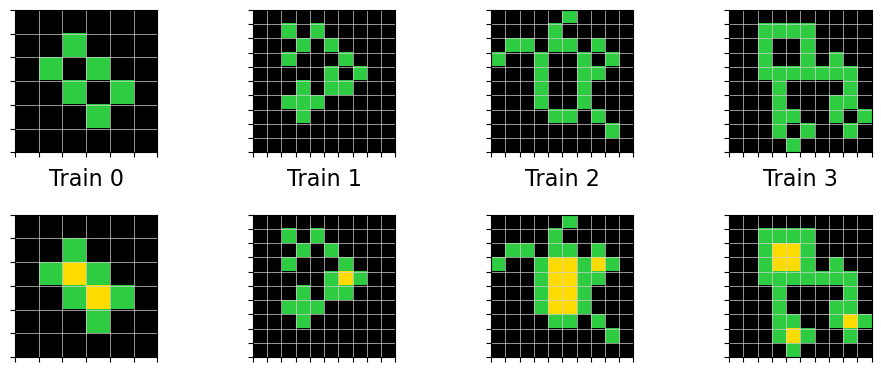

    Rotate the inputs:

    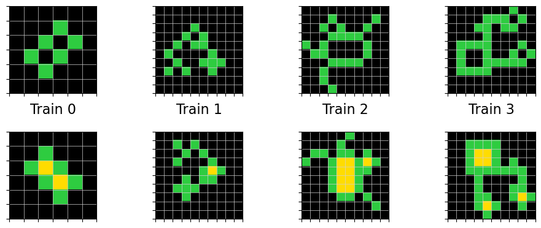

    Upscale x2 the outputs:

    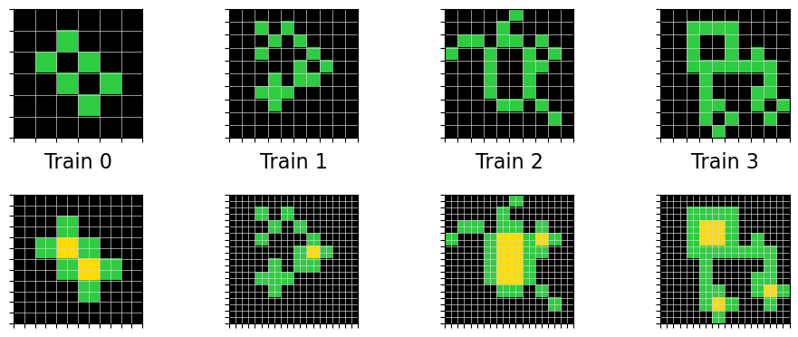

    Add padding to the inputs:

    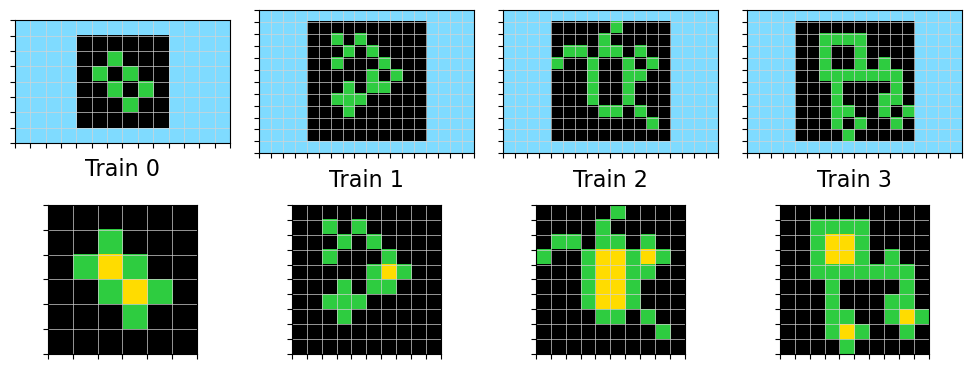

    Mirroring the outputs:

    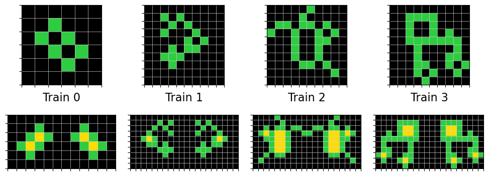

#### Problem representation

I used a very simple text representation of the ARC grids as an input to the LLMs. The grid was enclosed
on a Markdown code snippet, the shape was defined at the first line and each row was numbered.

    ```grid shape: 3x3
    1 100
    2 010
    3 001
    ```

#### Training hyperparameters

The model was fine-tuned using LoRA. No significative improvement was found when doing full model fine-tuning and
also on test-time fine-tuning it seemed to be beneficial to just fine-tune the already trained LoRA adapter
instead of creating a fresh new adapter.

- Model: `Qwen2.5-0.5B`
- LoRA rank: 128
- Learning rate: 5e-5, with a linear schedule with warmup
- Batch size: 16
- Training steps: 2e5
- Max sequence length: 8196
- Trained on 2xA6000 GPUs

I used huggingface's trl and accelerate libraries for the training.

### Test-time fine-tuning

Fine-tuning a model on ARC tasks is not enough to do well on the private test set. By applying test-time fine-tuning we could improve the number of solved problems from 11 to 33 for one of the models that I trained along the challenge.

This is my interpretation of the test-time fine-tuning:

- For each test problem that had `n` train samples, I fine-tuned the model using `n-1` train samples and
  using the remaining sample as a test sample. The selection of the test sample was done randomly on the fly during training.
- I used [data augmentation](#data-augmentation) just like in the previous training
- I fine-tuned a model for each of the test problems, so 100 fine-tuned models were generated on each submission.
- I used batch size 1 in the test-time fine-tuning to be able to learn the new problems as fast as possible.
- The model was fine-tuned for ~300 steps on each problem
- Suprisingly the best learning rate for test-time fine-tuning was 8e-5, higher than the one used for
  training (5e-5). It's very likely that better results could be obtained if more computation was
  available, training with a slower learning rate, with higher batch size and for longer.

Due to the limited submission time test-time fine-tuning was only applied to the canonical ARC task
of predicting the test outputs. But it could also be applied to the task of generating new inputs, or
to the tasks of verifying the correctness of the outputs.

The unusual configuration of training a single model for each task with batch size 1 arose due to the
limitations of compute and submission time. It was the configuration that allowed to learn faster the new
test problems.

### Inference

Data augmentation was applied also at inference, and the data augmentation was reverted from the prediction to get the original output. 96 predictions were done for each problem and voting was used to select the most
promising predictions. So just like MindsAI's AIRV (augment, inference, reverse augmentation, and vote).

Inference was done using a temperature of 0.

VLLM was used to generate the predictions. Each fine-tuned model was used to generate predictions for its problem.

### Ensemble

I ensembled my model predictions with the [2020 solution](https://www.kaggle.com/code/mehrankazeminia/3-arc24-developed-2020-winning-solutions). Since the 2020 solution only requires CPU, I managed to run
it on the background while I used the GPU for fine-tuning and inference with my model. I only had to
be careful with the RAM usage because both jobs had to share the same memory.

The ensemble strategy was very simple, just take the first attempt from each solution.

### Results

This approach scored 40 on the ARC leaderboard.


The same approach (without test-time fine-tuning) could solve 32% of the evaluation tasks, and when using voting with 32 predictions
it achieved a top_2 accuracy of 22%. Due to limited hardware resources I didn't usually evaluated
the models with test-time fine-tuning on the evaluation dataset. Kaggle provides 30 hours of GPU each week,
but we could make 3 submissions a day which is equivalent to 36 hours of compute. Thus it was much
cheaper to use the submissions to see the performance of the test-time fine-tuning where we had 7 times
more compute available per week.

## Learnings

### Prompting is not enough, test-time fine-tuning is needed

Clearly this competition has shown that LLMs need test-time fine-tuning to do new tasks. Few-shot prompting is not enough for the model to learn novel tasks.

### It's possible to train the model to verify the correctness of the tasks

During the last weeks of the challenge I tried to continue with the Omni-ARC approach and train the model to:

1. Verify if an output is correct
2. Select the correct output between two options

The idea was that we could improve the LB score if we replaced the voting selection mechanism by a more accurate one.
Using trained models I generated wrong predictions for the original ARC dataset using a sampling temperature close to 1.

| method       | top 1 accuracy | top 2 accuracy |
|--------------|----------------|----------------|
| voting       | 60.0%          | 70.0%          |
| verification | 59.3%          | 77.4%          |
| selection    | **68.7%**      | **81.0%**      |

As the table above shows I was able to achieve promising results on the evaluation dataset. Those numbers are for 32 predictions.

However I was not able to improve the LB score using this approach. My hypothesis is that the distribution
of the predictions of a test-time fine-tuned model is different from the distribution of a frozen model. Thus
the accuracy of voting for a test-time fine-tuned model might be much higher than the shown in the table
for a frozen model.

This verifier models could benefit from test-time fine-tuning, but I could not test the hypothesis due
to the limited submission time.

More information on [Iteration 47](modeling/Iteration_47_select_instead_of_verify.md) and [Iteration 45](modeling/Iteration_45_improve_verifier.md).

### Solving the tasks using code did not worked for me

I also tried to expand on the Omni-ARC approach by training the model to do the additional tasks:

- `examples -> code`. This is the approach used by Ryan Greenblat with GPT-4o
- `code + input -> output`. This is equivalent to the first task, but instead of giving examples as input, it gives the code definition of the problem.

To do so I build a small domain specific language (DSL) and recreated 285 of the ARC training tasks
with python code. This was a laborious process that took around 3 weeks.

Unfortunately the model did not generalize well. It could only solve 5% of the evaluation tasks, and those
tasks were very similar to the training tasks. On the private test set a lucky submission was able to
solve 1 task.

I believe this approach has great potential, but I had to change to other approaches because the end
of the challenge was close and other teams were improving in the leaderboard.

More info on [Iteration 26](modeling/Iteration_26_dawn_of_omni_arc.md), [Iteration 40](modeling/Iteration_40_try_coding_models.md) and [Iteration 42](modeling/Iteration_42_improve_omniarc.md).

### The quality of the datasets is relevant

On the last weeks of the challenge I tried adding the [BARC datasets](https://huggingface.co/collections/barc0/synthetic-arc-dataset-6725aa6031376d3bacc34f76) to the training data. Surprisingly despite the enormous
claimed number of different tasks (400k) I did not see any significative improvement either on the
evaluation dataset or in the leaderboard. More information on [Iteration 48. More external data](modeling/Iteration_48_more_external_data.md).

This is surprising because the original ARC dataset shows a clear trend when increasing the number
of training tasks:

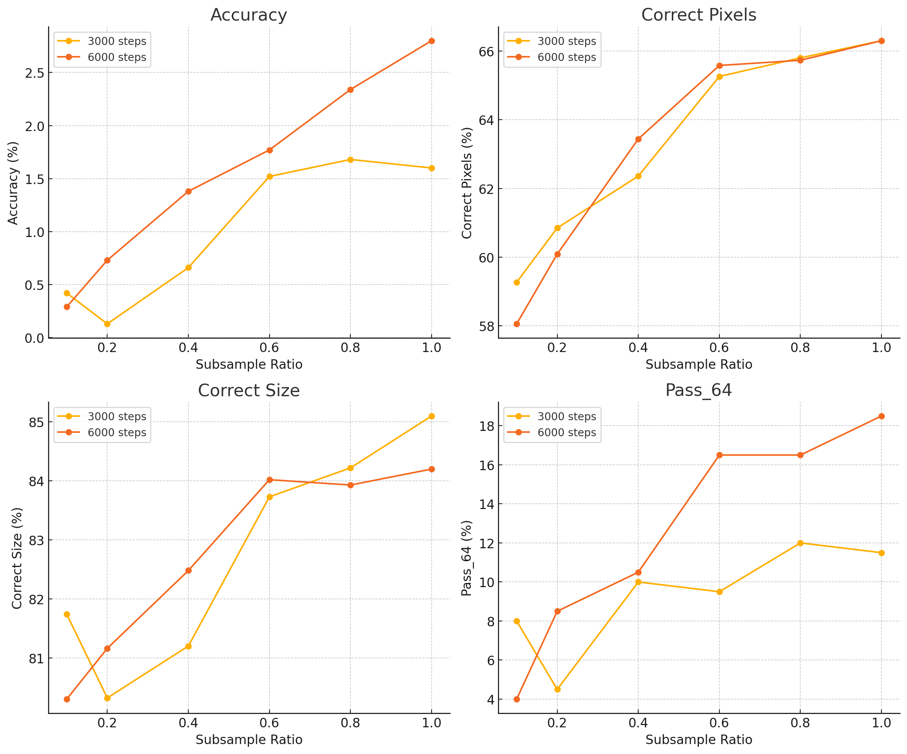

My guess is that the automatically generated tasks by GPT4 did not have too much novelty respect
to the original ARC tasks.

### The right model size

`Qwen2.5-0.5B` was the right model size for my approach and the available compute for submission.

On a first step I tried smaller models such as `SmolLM2-135M` and `NanoLM-0.3B` but they did not
achieve the same accuracy as `Qwen2.5-0.5B`. More on [Iteration 46. Revisit small LLMs](modeling/Iteration_46_revisit_small_llms.md)

On my [final attempt](modeling/Iteration_50_last_trainings.md) I also tried bigger models such as `Qwen2.5-1.5B` and `Qwen2.5-7B`.
These models exhibit a higher data efficiency, they reach a smaller training loss for the same amount
of training steps. The problem with these models is that they are slower to fine-tune and inference at submission.
Moreover due to VRAM requirements we have to decrease the length of the training samples. It's very
likely that LB score could be improved with this bigger models if better hardware and more submission
time is given.

## Conclusion

## Future steps

The approach of using a transformer and test-time fine-tuning could likely keep improving and maybe
solve the ARC prize if we generate enough synthetic data to densely cover the space of the ARC problems.
However that kind of solution won't give us more knowledge about how to reach AGI. It might be worth
pursuing that direction just to know where it can get us, but I don't feel it is interesting.

On this year competition I have focused on abstraction, on building the best possible representation
of the ARC problems. But the reasoning part was missing from my solution. When I try to solve the ARC
problems I make an hypothesis of the transformation, see if it works on the train data and fix it if
it doesn't. Finding the solution is typically an iterative process of trial and error.

I believe that we can teach a model to reason, just like OpenAI is developing the new o1 models. First we will
need to have a model that is able to generate code to solve the problems, otherwise we cannot verify
the solution and iterate over the results. Then we will generate many reasoning traces for the training
tasks and the model could learn to iteratively create a python code solution to the problems. The main
obstacle that I see to this approach is that it will require a much bigger context size than the current
MindsAI approach because in addition to the original task the prompt will also have the different
code iterations and the outputs. So we could be talking about using up to 50k tokens instead of the
current 10k tokens. That requires better hardware both for training and inference.

Finally I'm going to buy an [Omni-man funko pop figure](https://amzn.eu/d/efqVvEh) to celebrate the prize.

## Links

- Repo
- Notebooks

## Acknowledgments

- [Veridas](https://veridas.com/en/) for providing me access to its compute cluster during all the challenge. Most of the experiments were done on Veridas cluster, using A6000 GPUs with 48GB of VRAM.
- [Strong Compute](https://strongcompute.com/) for providing compute for training the last models for
  the challenge. They gave me access to A100 GPUs with 80GB of VRAM, which allowed me to train bigger models.
- [Qwen](https://huggingface.co/Qwen) for training and releasing a family of very capable LLMs with
  many different sizes.
- [Weigths and bias](https://wandb.ai/home) I used it to track all the experiments in a single place.
  It's an amazing tool and free for individuals.
- [Lambdalabs](https://lambdalabs.com/). I did some short (but expensive) experiments on the last
  week of the challenge in Lambdalabs. They provide me with some free credits that partially covered
  this experiments.
- ARC team. It's been a pleasure to work in this super interesting challenge for a few months. Thanks
  for creating the challenge and specially to Chollet for all his wisdom and teachings.
- Family. I couldn't have done all this work without the help of my wife and the appreciation from
  my children. My family followed my progress during the challenge and cheered me up when I advanced in the leaderboard.
