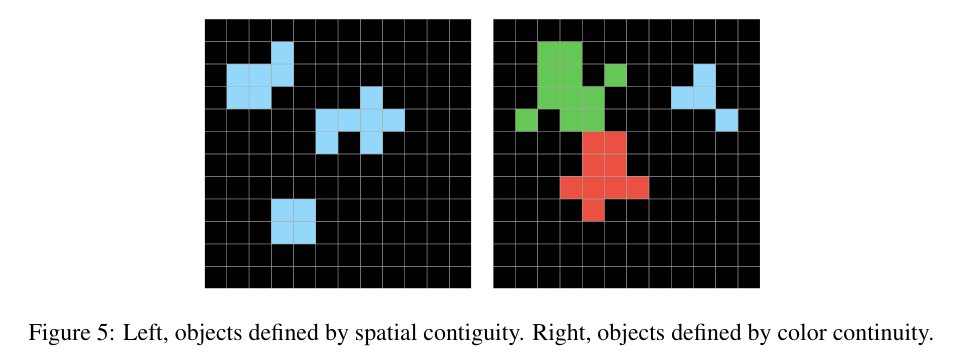
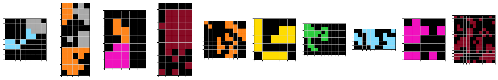
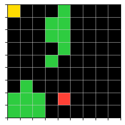
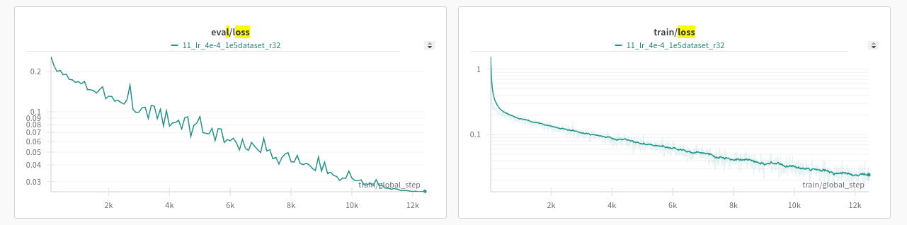

# Iteration 2. Learn to count

_22-07-2024_

## Goal

Can we teach a model to learn a to count objects in a grid?

## Motivation

A good representation is crucial for abstraction. We need to teach the model
the priors needed to solve the ARC challenge.

This could be a paper titled: `Learning priors via Visual Question Answering to solve the ARC challenge.`
To solve the challenge the model needs to build a representation with the core knowledge priors.
This iteration will show if an LLM is able to learn a representation of a single grid. If it works
I could move on to learn other concepts that need two grids.

Recent winners from [AIMO challenge](https://www.kaggle.com/competitions/ai-mathematical-olympiad-prize/discussion/519303) have created a huge dataset to solve the challenge. Data is really
important. If I'm able to create a good grid synthesizer that would be an advantage.

## Development

### Priors to learn

#### Core Knowledge priors from Chollet's paper

Which are the priors we can learn from a single grid? I have copied the priors from Chollet's paper
excluding the priors that need two grids to be learned.

> **Object cohesion**: Ability to parse grids into “objects” based on continuity criteria including color continuity or spatial contiguity (figure 5), ability to parse grids into zones, partitions.



I believe there is some ambiguity regarding the diagonals, f.e. the blue object in the right image is a single object or 2 objects?

I have been visualizing many train examples and could not find an example where the diagonal continuity was
harmful. What I have find is that we might have to look at the images from the color and spatial perspectives, because they both are useful.

> **Numbers and Counting priors** : Many ARC tasks involve counting or sorting objects (e.g. sorting by size), comparing numbers (e.g. which shape or symbol appears the most (e.g. figure 10)? The least? The same number of times? Which is the largest object? The smallest? Which objects are the same size?). All quantities featured in ARC are smaller than approximately 10.

<!--- --->

> **Basic Geometry and Topology priors**: ARC tasks feature a range of elementary geometry and topology concepts, in particular:
>
> - Lines, rectangular shapes (regular shapes are more likely to appear than complex shapes).
> - Symmetries
> - Containing / being contained / being inside or outside of a perimeter.

#### Summary of priors to learn

- Parse grids into objects based on continuity criteria (color continuity or spatial contiguity)
- Parse grids into zones or partitions
- Count
- Sort objects by size
- Comparing numbers (e.g. which shape or symbol appears the most (e.g. figure 10)? The least? The same number of times? Which is the largest object?)
- Recognize lines, rectangular shapes
- Symmetries
- Containing / being contained / being inside or outside of a perimeter.

#### Questions to ask the model

- General description, name all the objects, color, size, type of the object (square, rectangular, line...)
- Color of the background
- Number of objects
- Area/count for some color
- Is there some symmetry?
- Questions about different grids, do not just give one grid as input but give many and ask about certain grid. This will ensure that it is able to create individual representations for the grids.

The grid creator should return some metadata that will be used later to create the questions and answers.

### Learn to count

In this iteration we are going to focus in generating data to teach a model to count. Learning to count
will imply that the model has builtin the prior of objectness and also to count.

The idea is to create a random grid generator that also generates questions and answers about the objects
in the grid. The generator should generate objects of arbitrary sizes, colors and shapes. The background color should
be predominantly black, but less frequently the other colors should be allowed. To make it a little bit
more complex it should ask for the number of objects of certain color, and maybe for the area of a certain object.

I have prepared a [Kaggle notebook](https://www.kaggle.com/code/ironbar/learn-to-count) to generate the grids and the question-answer pairs.

These are some random samples from the generated grids:



And this is a sample grid along with questions and answers.



```markdown
- How many objects are there in the grid? 4
- Please list the area of all the objects in the grid, in ascending order and separated by commas 1, 1, 7, 7
- What is the area of the biggest object in the grid? 7
- What is the area of the smallest object in the grid? 1
- How many objects with color 2 are there in the grid? 1
- How many objects with color 3 are there in the grid? 2
- How many objects with color 4 are there in the grid? 1
```

I estimate that I can generate around 1M grids in less than one hour. That is probably enough to train a good model.

I have generated the grids following a kind of curriculum learning approach: there are more small grids (easier) than big grids (more difficult).

### Fine-tuning

On a first step I could try doing some parameter efficient fine-tuning such as LoRA or DoRA.
But I believe I should also try with a full fine-tuning which was done by Numina team
on the AIMO competition.

The training data should be masked so that the model only has to learn the answers to the responses. I believe
the best way to do it is to frame all the questions-answers as a chat with different turns.

Resources:

- [LoRA conceptual guide](https://huggingface.co/docs/peft/main/en/conceptual_guides/lora)
- [Tutorial for full fine-tuning](https://huggingface.co/docs/transformers/en/training)
- [PEFT lora methods](https://huggingface.co/docs/peft/en/task_guides/lora_based_methods)
- [DoRA is supported now on PEFT](https://huggingface.co/docs/peft/en/developer_guides/lora#weight-decomposed-low-rank-adaptation-dora)
- [Fine-tuning Llama 3, wandb](https://wandb.ai/byyoung3/mlnews2/reports/Fine-Tuning-Llama-3-with-LoRA-TorchTune-vs-HuggingFace--Vmlldzo3NjE3NzAz#fine-tuning-llama-3:-torchtune-vs-hugginface)
- [My notebook where I fine-tune Llama with QLoRa for prompt recovery](https://github.com/ironbar/prompt_recovery/blob/main/notebooks/012_fine-tune_llama.ipynb)
- [Train on completions only](https://huggingface.co/docs/trl/en/sft_trainer#train-on-completions-only)
- [Alejandro Vaca discussing LoRA parameters](https://www.youtube.com/live/458UWBlBdtI?si=Us2YQmdacm5rEO1L&t=2283)

#### First trainings

[Wandb plots](https://wandb.ai/guillermobarbadillo/20240724_first_trainings?nw=nwuserguillermobarbadillo)

I have been able to train a Phi-3 model using LoRA with 1e5 train samples for 2 epochs. It has taken around 8 hours.
The train and validation loss look very good, there is no sign of overfitting and the validation loss decreases steadily.



Looking at the training metrics it seems that the model is learning to count. I have to evaluate it to
verify that it works correctly.

I did some smaller experiments with the learning rate and seems that the sweet spot is around 4e-4 for Phi-3.
There might be room for improvement in train speed if using cosine schedule with restarts.

I have also done a quick fine-tuning with Llama 3 8b that took 65 minutes compared to same experiment with Phi-3
that took 25 minutes. However Llama achieved a better train and validation loss. (Maybe with the same
LoRA parameters it has more capacity)

27/07/2024. I have continued the training of Phi-3 for an additional 400k samples. It takes around 16 hours.
I want to run a new training with `rslora` and higher `r` to see if having more capacity is useful.

### Evaluation

I have been doing first manual evaluation of the model, I have randomly used some of the validation grids
and see how the model answers. It turns out that the model is not perfect, but it counts the true
number of objects almost all the times.

## Results

## Conclusion

## Next steps

- Once the grid representation is learned, we need to teach the model to learn transformation between grids. Some priors are change-related and cannot be learned from a single grid

## TODO

- [ ] How to evaluate the representation of the models? Phi-3, Llama3, Gemma2
- [ ] Curriculum learning might be helpful to do cause attribution
- [ ] LoRA parameters
  - [ ] Read the full huggingface documentation
  - [ ] Does DoRA get better results?
  - [ ] Can I measure the effect of r in LoRA? Probably I need a big r because the task is pretty new for this LLMs
  - [ ] `use_rslora` is said to work better in the documentation, maybe needed for larger r values.
  - [ ] See Vaca video.
- [ ] ARC tasks fine-tuning, maybe using Michael Hodel augmentations. That would be a good way to see if
      learning to count is useful or not. If I find that is useful then I should create other tasks.
- [ ] Llama vs Phi
- [ ] Does learning to count improve the solving of ARC tasks?
