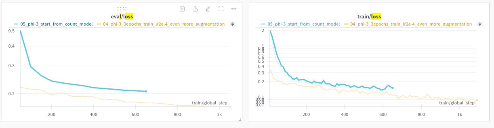
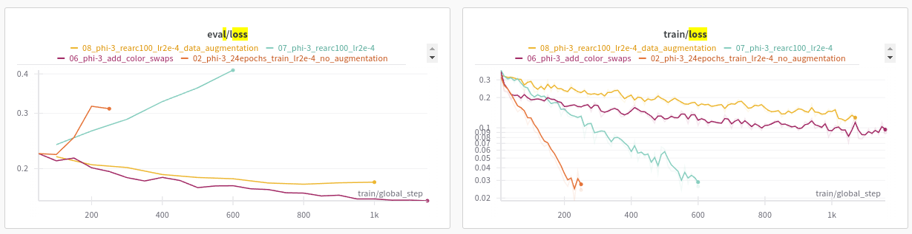

# Iteration 3. Fine-tune on ARC tasks

_29-07-2024_

<!---
The work is done using short iterations. Each iteration needs to have a very
clear goal. This allows to gain greater knowledge of the problem on each iteration.
--->

## Goal

Let's fine-tune an LLM on ARC tasks and see if:

1. Can I learn/overfit the train and eval tasks?
2. Does learning the train or eval tasks improves the accuracy of the model on the other dataset?
3. Does training on train/eval tasks improves the results on test dataset?
4. Does it help to start from a model that learned to count?

## Motivation

On the previous iteration I have fine-tuned a Phi-3 model to learn to count. However it seemed that
the capacity to solve ARC tasks was worsened due to that fine-tuning. I still believe that learning
core knowledge priors is important, but maybe we have to do a multi-step learning process: first learn
the priors and second learn to solve the training tasks.

## Development

### Iterable dataset

I have tried implementing an Iterable dataset for the train dataset, which would be more memory efficient
and training will start faster. However it seems that `SFTTrainerSFTTrainer` is not ready for it.

### Train script

I'm going to copy and adapt the script that was used to teach the models to count. It's a little bit
dirty but that will allow to start training quickly. Later I could think about refactoring a single
training script.

I'm going to apply rotations and flips to augment the train samples by x8. I also believe I could
swap some of the train samples by the test sample to increase the dataset by an additionally x4 (estimated)
Thus in the best case I will take the 400 train samples and get 12800.

I have concerns about the memory usage. When training to learn to count the number of tokens was below 1k, but here it might grow to 8k.

TODO: color swap (does it have sense?) or to remap the colors on each task

### GPU memory requirements

With 2x24GB of gpu memory I can only fit one sample of 4096 tokens

### Going to the cloud

#### AWS

P5 instances have 8xH100 GPUs and P4 instances have 8xA100 GPUs. There does not seem to be an option
with a smaller number of GPUs.

#### Google Cloud

Google cloud allows to create machines with [1 or more A100 GPUs](https://cloud.google.com/compute/docs/gpus#a100-gpus), f.e. `a2-highgpu-1g`, `a2-ultragpu-1g`, `a2-highgpu-2g`... Ultra machines have 80GB of GPU memory, the others have 40GB.

When it comes to [H100 GPUs](https://cloud.google.com/compute/docs/gpus#h100-gpus) we have to use 8, there are no smaller options.

I don't see any other available option in Google Cloud with 40GB or more.

#### [Vast.ai](https://vast.ai/)

The prices here are also much better than in Google Cloud.

#### [Lambdalabs](https://lambdalabs.com/service/gpu-cloud#pricing)

After a quick comparison the prices on Lambdalabs seem to be much better than Google Cloud. So I'm probably starting here.

#### Veridas cluster

### RE-ARC

I have published a [notebook](https://www.kaggle.com/code/ironbar/generate-training-samples-using-re-arc) to generate training data in the same format as ARC tasks.

## Results

### Can we overfit to the train set?

| experiment                          | accuracy |
|-------------------------------------|----------|
| Phi-3 baseline                      | 1.6%     |
| Phi-3 baseline dialog               | 6.4%     |
| Fine-tune with data augmentation    | 39.3%    |
| Fine-tune without data augmentation | 60.20%   |

We can improve the accuracy of the train set if we fine-tune on the train set. However the accuracy
is not as high as expected, the model makes mistakes in the inference.

To achieve the 60% accuracy I had to train for 36 epochs (3x12 epochs), lowering the learning rate on
each training.

The training with data augmentation was trained for around 250 epochs (6250 steps = 2800+1150+2300)
and notice that the accuracy on the train dataset is smaller than the current best accuracy on the
private test set (43%)

**Thus overfit is possible but it is not easy, at least with Phi-3**

TODO: there might be some discrepancy between train and test?

### Can we improve eval accuracy if we fine-tune on the train set?

| experiment                       | accuracy |
|----------------------------------|----------|
| Phi-3 baseline                   | 0.0%     |
| Phi-3 baseline dialog            | 2.5%     |
| Fine-tune with data augmentation | 6.2%     |

The table shows a clear improvement after fine-tuning the model on the train data. Thus we can
see that there is some generalization.

By training on the train dataset the validation loss is decreased. Data augmentation is helpful to decrease the validation loss

Could I try with test time fine-tuning to improve the accuracy?

### Does it help to start from a model that learned to count?

Starting from the model that was taught to count is not helpful, starting loss is higher and also final.
This follows the bad results observed when trying to solve arc tasks with that model. Thus it seems
that doing a previous fine-tuning in count tasks is not helpful. Maybe a single stage fine-tuning
could be better.

### Dimensions of the data

Training with re-arc allows me to learn how the different dimensions help to generalize:

- number of tasks
- different examples per task

The plot below shows the train and validation loss for different experiments. The validation dataset
is fixed, but the train dataset is different and data augmentation is also changed.

This plots suggest that the number of different tasks is more important than having different examples
per task. When using the re-arc dataset that has 100 different variations of the same task (`07_phi-3`)
we can see that the training has a similar dynamic to using the train dataset without data augmentation:
the model does not generalize to the eval dataset and the train loss decreases fast.
The effect of having x100 more data is seen in the fact that it is harder to decrease the train loss
and the divergence in the eval dataset is slower, but the dynamic is the same.

In the other hand if we apply data augmentation to the re-arc dataset we see that the eval loss improves (`08_phi-3`)
and decreasing the train loss is more difficult. When we apply data augmentations such as geometric transformations
or color swaps we can transform the task (sometimes the task won't be changed, it depends on symmetries).
This is a very strong evidence that the number of different tasks is much more important than the number of
variations of the same task. Thus if I could create a task generator it would be valuable, or if I get other arc-like datasets. This has sense because the model is evaluated on new tasks, so ideally it would be trained
in all different tasks.

## Conclusion

## Next steps

- Could I frame the problem as a 2 player game where the first player needs to describe in text the
  transformation and the second player needs to implement it given the text description and the input?
- I need more computing power
- I could study different active inference techniques on the eval dataset. F.e. n-1 train. Eval loss should be a good proxy to see if the different techniques are useful
- [smollm](https://huggingface.co/blog/smollm)
- The number of different tasks is the more important factor during training. Thus downloading ARC like datasets
  or creating a task synthesizer would be valuable. Maybe the MindsAI team knows this and is simply
  working to implement new tasks, train a model on them and use test time inference. This hypothesis
  seems very plausible to me: they would have the advantage of using more data and the new test inference
  technique.

## TODO

- [ ] Verify that training and evaluation is the same
- [x] Evaluate fine-tuned model on arc tasks
- [ ] Does predicting the grid shape helps?
- [x] Prepare hodel data
- [ ] Try again with the iterable dataset: https://huggingface.co/docs/trl/en/sft_trainer#trl.trainer.ConstantLengthDataset
- [ ] What if I first fine-tune with augmentation and then without augmentation