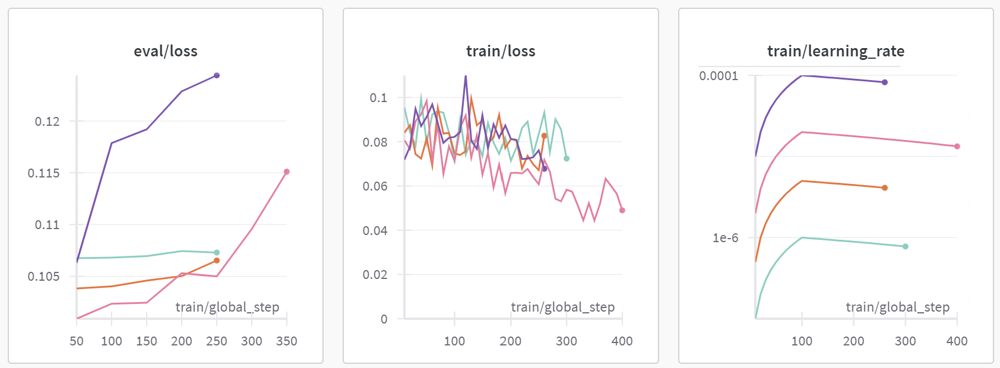

# Iteration 5. Search for smaller LLMs

_09-08-2024_

<!---
The work is done using short iterations. Each iteration needs to have a very
clear goal. This allows to gain greater knowledge of the problem on each iteration.
--->

## Goal

Search an LLM that is smaller than Phi-3 and is fast enough to be fine-tuned on Kaggle within the submission time (12 hours)

Can I get a better result than Phi-3 by using a smaller model with test time fine-tuning?

## Motivation

In the previous iteration I have seen that test time fine-tuning works. However when doing a proof of concept
on Kaggle's hardware I have found that to be able to fine-tune Phi-3 with a sequence length of 4096 first I have
to use int4 quantization and second the fine-tuning would take 56 hours for 1k steps.

## Development

### Candidate search

- I could try with previous versions of Phi-3 that I believe were smaller.
- I have also read recently about [smollm](https://huggingface.co/blog/smollm)
- [MobileLLM](https://github.com/facebookresearch/MobileLLM) is cited by smollm, seems to be developed by Facebook but the models do not seem to be available.

However Smollm models have only 2k context length.

## Results

### Test time fine-tuning on Kaggle

| Model                    | parameters (M) | max context length (k) | seq_len | 10 steps time (min) | 1000 steps time (hours) |
|--------------------------|----------------|------------------------|---------|---------------------|-------------------------|
| Phi-3 (3.8B)             | 3800           | 128                    | 1024    | 3                   | 5.0                     |
| Phi-3 int4 (3.8B)        | 3800           | 128                    | 4096    | 30                  | 50.0                    |
| Qwen/Qwen2-1.5B-Instruct | 1500           | 32                     | 3584    | 2                   | 3.3                     |
| Qwen/Qwen2-0.5B-Instruct | 500            | 32                     | 4096    | 1                   | 1.7                     |

So far Phi-3 and Qwen2 are the only small LLMs that I have found that have enough context lenght to deal with ARC tasks. However
Phi-3 requires too much memory for fine-tuning and if I use int4 quantization it is very slow.

The option of using Qwen2 seems to be the best one given the current hardware limitations.

This inference times are measured when using `float16` type, I have found that it is 4 times faster than `bfloat16` on the T4 GPU. The next section shows
the same measurements with more models and `bfloat16` for reference.

#### Slower previous results with `bfloat16`

| Model                        | parameters (M) | max context length (k) | seq_len | 10 steps time (min) | 1000 steps time (hours) |
|------------------------------|----------------|------------------------|---------|---------------------|-------------------------|
| Phi-3 (3.8B)                 | 3800           | 128                    | 1024    | 16                  | 26.7                    |
| Phi-3 int4 (3.8B)            | 3800           | 128                    | 4096    | 34                  | 56.7                    |
| Phi-2 (2.7B) int4            | 2700           | 2                      | 4096    | 15                  | 25.0                    |
| **Phi-1.5 (1.3B)**           | 1300           | 2                      | 3072    | 7                   | 11.7                    |
| **Phi-1.5 (1.3B) int4**      | 1300           | 2                      | 4096    | 7                   | 11.7                    |
| SmolLM-1.7B-Instruct         | 1700           | 2                      | 2048    | 11                  | 18.3                    |
| SmolLM-1.7B-Instruct int4    | 1700           | 2                      | 4096    | 15.5                | 25.8                    |
| **SmolLM-360M-Instruct**     | 360            | 2                      | 4096    | 3.75                | 6.3                     |
| **SmolLM-135M-Instruct**     | 135            | 2                      | 4096    | 1.5                 | 2.5                     |
| **Qwen/Qwen2-0.5B-Instruct** | 500            | 32                     | 3072    | 4                   | 6.7                     |

- To be able to run the code on Kaggle I have a limit of 12 hours. The table above shows that many of the tried models cannot be fine-tuned as fast as necessary to be able to make a submission.
- `SmolLM` models only have a context length of 2k tokens, that is not enough for the ARC challenge
- `Qwen2-0.5B-Instruct` is a good candidate because it has a context length of 32 and I should be able to train in 7h which is enough to make a submission.

### Role of the rank of LoRA

I have made experiments with different values for the rank of LoRA. It has a clear effect on the train loss: when we use a higher rank we get a lower train loss. However the effect on the validation loss is not clear, it seems that using a very small rank such as 4 is harmful but other than that the differences do not seem to be significative.

### Kaggle runtimes for reference

- `qwen2-0.5b-instruct` Eval set evaluation: 1h15
- `qwen2-0.5b-instruct` 1k steps fine-tuning: 2h19

### 2 stage test-time fine-tuning

I had the intuition that maybe doing the fine-tuning in two stages could improve the validation loss: a first one with data augmentation and a second one without data augmentation.

However I have tried with a wide range of learning rates for fine-tuning and no consistent improvement was seen.

### float16 vs bfloat16

I have already seen that in Kaggle fine-tuning with float16 is 4 times faster than with bfloat16.
Let's see if that is the case for my computer (2x3090):

- `bfloat16` 50 steps fine-tuning: 2m45, 2m48
- `float16` 50 steps fine-tuning: 2m43, 2m46

Memory use is the same and speed is the same. Maybe it is using `bfloat16` internally all the time, I remember listening something like that long ago.

## Conclusion

## Next steps

- Decomposing the task into step by step could be helpful. That is, creating multiple grids until creating the final output.
- [ ] What is the effect of changing the train data? Keep the same train configuration and just change the data.
    - [ ] How the test accuracy changes if I train in the eval set?
    - [ ] How the test accuracy changes if I train in both the train and eval set?
    - [ ] What if I use the train dataset and n-1 eval dataset?

## TODO

- [x] Can I run Smollm models with VLLM? The architecture is supported... https://docs.vllm.ai/en/latest/models/supported_models.html
- [ ] Long context fine-tuning https://huggingface.co/blog/wenbopan/long-context-fine-tuning
- [x] What is the role of LoRA `r`?
- [ ] Read about previous editions of the ARC challenges to see if any other data augmentation is used.
- [ ] Make a submission with test fine-tuning
- [ ] Remember that the test is 4 times smaller than the eval set
- [x] 2 stage test-time fine-tuning
- [x] Bfloat vs float
- [ ] Qwen/Qwen2-1.5B-Instruct
- [ ] What is the number of steps in the test-time fine-tuning where overfitting starts to happen? On previous experiments it seemed to be above 5k steps
- [x] Document Kaggle training and inference speeds.