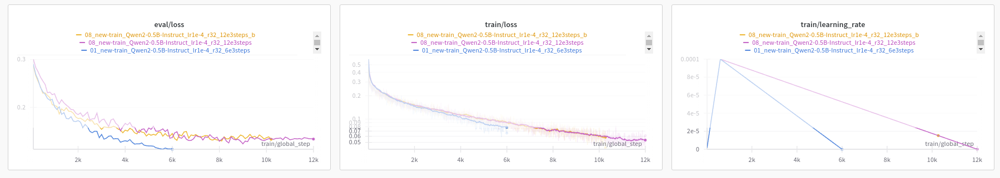
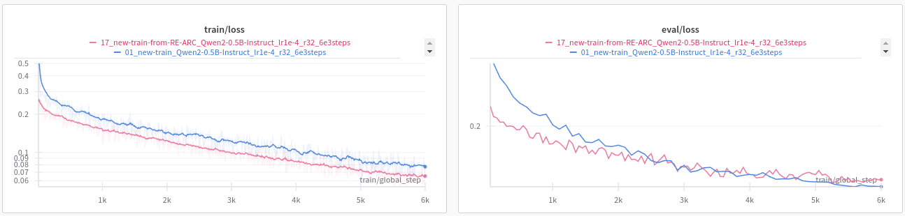

# Iteration 7. Training data

_15-08-2024_

<!---
The work is done using short iterations. Each iteration needs to have a very
clear goal. This allows to gain greater knowledge of the problem on each iteration.
--->

## Goal

Try different configurations of training data and see how the validation loss is affected.

## Motivation

## Development

### Create new train-val partition

On the notebook [005_create_new_data_partititions](../../notebooks/005_create_new_data_partititions.ipynb) I have prepared a function
that given a random seed creates a new train-val partition. It will take 100 random eval tasks for validation and the rest for training.

### Prepare arc-like datasets for training

There are some arc-like datasets that could be useful for fine-tuning an LLM. They are listed [here](../02_Data_Understanding.md#external-data)

## Results

### Train loss is reproducible, val loss isn't

If I run the same experiment multiple times I get very similar train loss, but validation loss could be different.
This makes harder to observe improvements.

What are the sources of randomness?

- Data augmentation
- LoRA initialization

Maybe cyclic learning rate schedule might allow to escape from poor local optima, but the problem might
be just a generalization one (because training loss is good).

### What are the best datasets for fine-tuning?

| dataset                                      | tasks | tasks variations | best val loss | best val step |
|----------------------------------------------|-------|------------------|---------------|---------------|
| combo-v2 (new train + val n-1)               | 800   |                  | 0.1145        | 6000          |
| new train                                    | 700   |                  | 0.1406        | 6000          |
| combo-v1 (new train + ConceptARC + Mini-ARC) | 0     |                  | 0.1551        | 6000          |
| val n-1                                      | 100   |                  | 0.164         | 1600          |
| train                                        | 400   |                  | 0.1831        | 3100          |
| RE-ARC                                       | 400   | 40000            | 0.25          | 1100          |
| ConceptARC                                   | 176   | 528              | 0.2784        | 400           |
| Mini-ARC                                     | 149   | 149              | 0.3           | 100           |
| 1D-ARC                                       | 901   | 901              | 0.34          | 100           |

- Although we have seen that validation losses are not reproducible we can see a big improvement
  when using the new train set compared to the old one.
- External datasets do not get good validation losses and quickly overfit.
- Making a combo with new train and val n-1 is the best option.

### What is the best strategy for test-time fine-tuning?

TODO: try different learning rates, try with combo-v2

### Is it helpful to first train on RE-ARC?

It is unclear that training in two stages (first with RE-ARC and second with ARC) is positive. Training loss
is lower as expected because initialization is better, but validation loss ends up being worse. However
we have seen that validation loss is volatile, so in other experiment might be better.

## Conclusion

## Next steps

- [ ] Unify training scripts
- [ ] Iterable for data augmentation will be much better
- [ ] Load the state of the optimizer when fine-tuning in multiple stages? https://chatgpt.com/c/ce6a4f9c-7a50-4c19-a6f3-83793fe6a11d
- [ ] There might be room for improvement if using a generator instead of a fixed dataset. F.e. better use of RE-ARC dataset
- [ ] I need much better results when doing test-time fine-tuning. I could iterate faster if I focus on a single example or a few examples.
- [ ] Try using beam search, does it improve the results? https://docs.vllm.ai/en/latest/dev/sampling_params.html
- [ ] It seems we are hitting a ceiling, probably we need a better data formatting or more data

## TODO

- [ ] What is the effect of changing the train data? Keep the same train configuration and just change the data.
  - [x] What if I use the train dataset and n-1 eval dataset?
  - [x] What if I only do test-time fine-tuning?
  - [x] Is it helpful to first train with re-arc?
  - [x] Use other arc-like datasets for training
  - [ ] What is the effect of using more training data? Can I estimate how the loss will decrease if generating more tasks?
- [ ] Check for more datasets on: https://docs.google.com/spreadsheets/d/1fR4cgjY1kNKN_dxiidBQbyT6Gv7_Ko7daKOjlYojwTY/edit?gid=658867951#gid=658867951
- [x] If I can easily swap train and test on fine-tuning, don't do it when creating the n-1 dataset. That will make configuration easier.
- [x] Why training with combo-v2 diverges? Try using batch size 32 instead of 16, other option is gradient clipping. Bfloat16 vs float16, explained on next iteration.
- [ ] Train 1.5B model with the best configuration