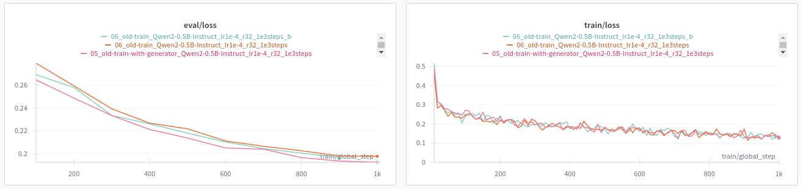

# Iteration 8. Code improvements

_17-08-2024_

## Goal

Improve the code so I can experiment faster in the future.

## Motivation

I have rushed on the previous weeks and now I have to stop, unify and improve the code before trying new approaches.

## Development

### Iterable dataset

Using an iterable dataset will give more control over the data generation. It will also speedup
the start of the training, because currently all the data augmentation is done previously. Additionally
RAM usage will be lower.

Possibly useful links:

- https://huggingface.co/docs/datasets/en/about_mapstyle_vs_iterable#creating-map-style-datasets-and-iterable-datasets
- https://huggingface.co/docs/datasets/en/about_mapstyle_vs_iterable#eager-data-processing-and-lazy-data-processing
- https://huggingface.co/docs/trl/en/sft_trainer#dataset-format-support
- https://huggingface.co/docs/trl/en/sft_trainer#datasets
- [Feature: IterableDataset support for SFTTrainer #1695](https://github.com/huggingface/trl/issues/1695)

> In the SFTTrainer we smartly support datasets.IterableDataset in addition to other style datasets. This is useful if you are using large corpora that you do not want to save all to disk. The data will be tokenized and processed on the fly, even when packing is enabled.

#### Experiments

```python
train_dataset = train_dataset.to_iterable_dataset()
Traceback (most recent call last):
  File "/mnt/hdd0/MEGA/AI/22_Kaggle/arc24/scripts/fine-tuning.py", line 754, in <module>
    trainer = SFTTrainer(
  File "/home/gbarbadillo/miniconda3/envs/arc/lib/python3.10/site-packages/huggingface_hub/utils/_deprecation.py", line 101, in inner_f
    return f(*args, **kwargs)
  File "/home/gbarbadillo/miniconda3/envs/arc/lib/python3.10/site-packages/trl/trainer/sft_trainer.py", line 373, in __init__
    train_dataset = self._prepare_dataset(
  File "/home/gbarbadillo/miniconda3/envs/arc/lib/python3.10/site-packages/trl/trainer/sft_trainer.py", line 519, in _prepare_dataset
    return self._prepare_non_packed_dataloader(
  File "/home/gbarbadillo/miniconda3/envs/arc/lib/python3.10/site-packages/trl/trainer/sft_trainer.py", line 587, in _prepare_non_packed_dataloader
    tokenized_dataset = dataset.map(
TypeError: IterableDataset.map() got an unexpected keyword argument 'num_proc'
```

This is the same error as shown in [Feature: IterableDataset support for SFTTrainer #1695](https://github.com/huggingface/trl/issues/1695)

Apparently it is solved if I install directly from github:

```
pip install git+https://github.com/huggingface/trl.git

ifferent run name by setting the `TrainingArguments.run_name` parameter.
  0%|                                                                                                                   | 0/100 [00:00<?, ?it/s]Detected flash_attn version: 2.6.3
  5%|█████▎                                                                                                     | 5/100 [00:18<05:26,  3.44s/it]Traceback (most recent call last):
  File "/mnt/hdd0/MEGA/AI/22_Kaggle/arc24/scripts/fine-tuning.py", line 773, in <module>
    trainer.train()
  File "/home/gbarbadillo/miniconda3/envs/arc/lib/python3.10/site-packages/trl/trainer/sft_trainer.py", line 444, in train
    output = super().train(*args, **kwargs)
  File "/home/gbarbadillo/miniconda3/envs/arc/lib/python3.10/site-packages/transformers/trainer.py", line 1938, in train
    return inner_training_loop(
  File "/home/gbarbadillo/miniconda3/envs/arc/lib/python3.10/site-packages/transformers/trainer.py", line 2236, in _inner_training_loop
    for step, inputs in enumerate(epoch_iterator):
  File "/home/gbarbadillo/miniconda3/envs/arc/lib/python3.10/site-packages/accelerate/data_loader.py", line 699, in __iter__
    raise ValueError(
ValueError: Batch does not contain any data (`None`). At the end of all iterable data available before expected stop iteration.
Traceback (most recent call last):
  File "/mnt/hdd0/MEGA/AI/22_Kaggle/arc24/scripts/fine-tuning.py", line 773, in <module>
    trainer.train()
  File "/home/gbarbadillo/miniconda3/envs/arc/lib/python3.10/site-packages/trl/trainer/sft_trainer.py", line 444, in train
    output = super().train(*args, **kwargs)
  File "/home/gbarbadillo/miniconda3/envs/arc/lib/python3.10/site-packages/transformers/trainer.py", line 1938, in train
    return inner_training_loop(
  File "/home/gbarbadillo/miniconda3/envs/arc/lib/python3.10/site-packages/transformers/trainer.py", line 2236, in _inner_training_loop
    for step, inputs in enumerate(epoch_iterator):
  File "/home/gbarbadillo/miniconda3/envs/arc/lib/python3.10/site-packages/accelerate/data_loader.py", line 699, in __iter__
    raise ValueError(
ValueError: Batch does not contain any data (`None`). At the end of all iterable data available before expected stop iteration.
```

It seems that the iterator finished, let's try to create an infinite dataset.

```python
def my_generator(dataset):
    while True:
        for item in iter(dataset):
            yield item
train_dataset = IterableDataset.from_generator(my_generator, gen_kwargs={"dataset": train_dataset})
```

This seems to be working!

#### Enabling data augmentation on a generator

Now that I'm able to train with an IterableDataset, I have to create a generator that uses data augmentation.

I have made a first implementation and seems to be working at a smaller scale. I need to verify with a long train.

### Divergence in trainings caused by float16

After experiment `12_combo-v2_Qwen2-0.5B-Instruct_lr1e-4_r32_12e3steps` on `August 17th, 2024 at 8:29:10 pm`
I have experienced divergence when training with `combo-v2` or `train_rs7`. After 60-120 minutes the training
suddenly diverges.

I have tried without success:

- Increasing the batch size from 16 to 32
- Decreasing `max_grad_norm` from default 1.0 to 0.1
- Changing the optimizer from `paged_adamw_8bit` to `adamw_torch`
- It also happens with the old-train dataset

Currently I'm trying to train on the canonical train dataset to see if the problem arises.

¿Maybe it is related to updating the library? But the problem started yesterday when the library was not updated.

I have run a train with the old script and it run smoothly, so it seems it is a problem of the new script.

¿Could it be related to `bloat16` and `float16`? YES! Switching to `float16` on my computer resulted
on unstable trainings, I should be careful on Kaggle because there using `float16` is 4 times faster.

### Unstable validation loss

In this situations the loss is unstable:

- batch 2, shuffle validation set at start

In this situations the loss is stable:

- batch 2, do not shuffle validation set at start
- batch 1, wether I shuffle or not at start

I believe it is something related to the batch. Because there are 94 validation prompts, so there is no prompt leave out. Shuffling will influence the pairs and the pairs are influencing the loss. Maybe is related to padding?

I will be using a batch size of 1 from now on.

### Scale compute

- To run wandb on a server without login I have to setup the `WANDB_API_KEY` environment variable.
- CUDA version seems to be `12.1.105` and cudnn `8.9.2.26` when I look with `conda list | grep nvidia`
- Python version is `3.10`
- I need to create a `requirements.txt` file
- `huggingface/transformers-pytorch-gpu:4.41.3` might be a good candidate docker image. [Link to docker hub](https://hub.docker.com/r/huggingface/transformers-pytorch-gpu)

```bash
#docker run --gpus all -v /mnt:/mnt -it huggingface/transformers-pytorch-gpu:4.41.3
docker run --gpus all -v /mnt:/mnt -it cuda-python:python3.10-cuda12
cd /mnt/hdd0/MEGA/AI/22_Kaggle/arc24
#/usr/bin/python3
pip3 install -r requirements.txt; python3 scripts/fine-tuning.py --help
pip3 install -r requirements.txt --index-url https://download.pytorch.org/whl/cu120

pip install -r requirements.txt; python scripts/fine-tuning.py --help
```

So far everything is working on my computer. I have been able to run a training successfully.

Creating the docker images

```bash
docker build -t cuda-python:python3.10-cuda12 .
docker tag cuda-python:python3.10-cuda12 gbarbadillo/cuda-python:python3.10-cuda12
docker push gbarbadillo/cuda-python:python3.10-cuda12
```

## Results

### IterableDataset results

I have verified that when not using data augmentation the IterableDataset yields the same results as the Dataset.

Then I have run a 1k steps experiment using data augmentation and the results suggest that there is no difference.



The train loss is almost the same. We see variations in the validation loss as in other experiments, but the iterable dataset
is not worse so we can validate the implementation.

### Load optimizer

So far I have implemented a method to load the optimizer, but it seems to load the learning rate as well.
TODO: I need to work deeper on that.

## Conclusion

## Next steps

## TODO

- [x] Unify the train scripts
- [ ] Unify the evaluation scripts
- [ ] Refactor code such as data augmentation to remove duplications
- [x] Use an iterable dataset to avoid doing all the augmentations before training. This will create
  a better augmented distribution and give more control over the data.
- [ ] I need to validate that the iterable works equal or better, to do that I will use old train and val sets for better reproducibility.
- [ ] Better control over the prompt templates, I would like to try new approaches in the future
- [x] Implement option to load the optimizer when fine-tuning
- [ ] Check if loading an optimizer is helpful for fine-tuning
- [x] Problem with wandb rate limits:
  - https://docs.wandb.ai/guides/track/limits#rate-limits
  - https://community.wandb.ai/c/w-b-support/36
  - Solved without doing anything, seemed to be a wandb problem
- [x] Diverging trainings, should I decrease `max_grad_norm`?
  - [x] Try decreasing `max_grad_norm`
  - [x] Try increasing the batch size
  - [x] Maybe change the optimizer? `optim="paged_adamw_8bit"`
  - [x] It was for using float16 instead of bfloat16
