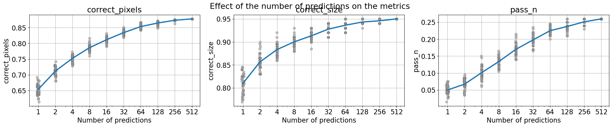
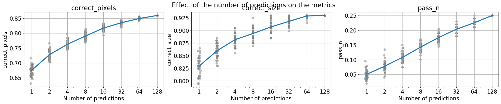
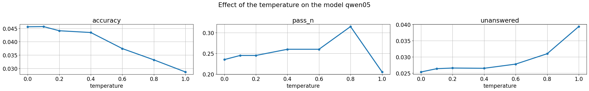
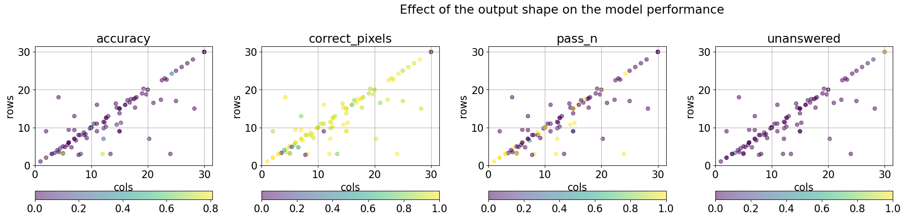

# Iteration 9. Improve inference

_21-08-2024_

## Goal

Can we improve the accuracy of the LLM by using a more advanced inference?

## Motivation

> MindsAI team uses AIRV (augment, inference, reverse augmentation, and vote)

This simply means that they make multiple inferences for each task and then vote. Voting can be done
at the grid level or we could vote by cell. I have to visualize the predictions to see if we could
increase the accuracy by using some of this techniques.

Another option to try to improve the accuracy is to use beam-search. Instead of using the naive approach of doing greedy generation we could try different options and create an answer that has an overall higher probability.

## Development

It's a good opportunity to refactor the inference code and make it more flexible. I would save all the predictions
in a file and then have a function to take a decision. I will have to create a notebook to visualize the predictions, probably sorted by some metric.

So far I'm only doing geometric augmentations, but I could also do color swaps and change the order of the train samples. That will increase the compute used at inference, but I could probably optimize the inference speed.

### Beam search

- [What is Beam Search? Explaining The Beam Search Algorithm](https://www.width.ai/post/what-is-beam-search)
- [VLLM sampling params](https://docs.vllm.ai/en/latest/dev/sampling_params.html)

> **use_beam_search** – Whether to use beam search instead of sampling.  
> **best_of** – Number of output sequences that are generated from the prompt. From these best_of sequences, the top n sequences are returned. best_of must be greater than or equal to n. This is treated as the beam width when use_beam_search is True. By default, best_of is set to n.

I have been playing with beam search and it generates a sequence with higher probability than simply greedy decoding.


```
## Best of 1 (logprob: -51.21, runtime: 2.06s)
Alexander the Great was a legendary conqueror who ruled over a vast empire that
stretched from Greece to India. One of his most famous conquests was the city of
Tyre, which was located on the coast of Lebanon. Alexander had heard of Tyre's
wealth and power, and he was determined to conquer it. He sent a fleet of ships
to attack the city, and they were successful in capturing it. Alexander then
spent several years building up the city and making it his own. However, Ty

## Best of 2 (logprob: -37.66, runtime: 1.90s)
Alexander the Great, the son of Philip II of Macedon, was one of the most famous
conquerors in history. He was born in 356 BC and died in 323 BC, but his legacy
lives on to this day. Alexander was known for his military prowess and his
ability to conquer vast territories. One of the most famous battles that
Alexander fought was against the city of Tyre. Tyre was a powerful city-state in
the eastern Mediterranean, and it had been a

## Best of 128 (logprob: -31.82, runtime: 12.52s)
Alexander the Great was one of the most famous conquerors in history. He was
born in 356 BC and died in 323 BC, but his legacy lives on to this day. One of
the most famous battles he fought was the Battle of Tyre, which took place in
332 BC. The city of Tyre was one of the most powerful cities in the world at the
time. It was located on the coast of the Mediterranean Sea and was known for its
```

Thus it seems reasonable that we could improve the accuracy of the predictions by using beam search.

### Update inference script

The table shows inference time for 100 evaluation tasks with `Qwen-0.5B` and 8 predictions per task.

| implementation         | inference time | speedup |
|------------------------|----------------|---------|
| baseline               | 54m            | -       |
| batch all task prompts | 7m             | 7.7     |
| batch all prompts      | 1m50s          | 29.5    |

By batching the prompts I have been able to speedup inference by ~30 times. This is a valuable lesson for the future: always batch the LLM predictions if we are not interested in latency but in throughput.

This speedup opens the door to generating many more predictions per task and later do voting or other more advanced selection process.

## Results

### Beam search results

This are the results of using `Qwen-0.5B` and making 8 predictions per task.

| best_of | pass_n | accuracy | correct_pixels | correct_size | runtime |
|---------|--------|----------|----------------|--------------|---------|
| 1       | 12%    | 4.40%    | 77%            | 88%          | 7m      |
| 2       | 13.50% | 5.90%    | 78.70%         | 90%          | 50m     |
| 4       | 13.50% | 6%       | 77.50%         | 89%          | 1h30    |

We can see that the results improve, but at the cost of much bigger runtime.

GPU utilization is much lower when using beam-search. [Likely related issue](https://github.com/vllm-project/vllm/issues/1646),
maybe it is not optimized because they were [considering to remove the beam search feature](https://github.com/vllm-project/vllm/issues/6226).

### Increasing the number of predictions

#### Qwen-0.5B



```
Maximum number of predictions: 512
Number of predictions: 1 accuracy: 5.0%	correct_pixels: 65.3%	correct_size: 81.0%	pass_n: 5.0%	unanswered: 2.5%	
Number of predictions: 2 accuracy: 4.4%	correct_pixels: 71.2%	correct_size: 85.6%	pass_n: 6.7%	unanswered: 2.7%	
Number of predictions: 4 accuracy: 4.6%	correct_pixels: 75.2%	correct_size: 88.3%	pass_n: 10.1%	unanswered: 2.6%	
Number of predictions: 8 accuracy: 4.7%	correct_pixels: 78.6%	correct_size: 90.0%	pass_n: 13.4%	unanswered: 2.7%	
Number of predictions: 16 accuracy: 4.5%	correct_pixels: 81.2%	correct_size: 91.3%	pass_n: 17.0%	unanswered: 2.7%	
Number of predictions: 32 accuracy: 4.5%	correct_pixels: 83.4%	correct_size: 92.8%	pass_n: 19.8%	unanswered: 2.6%	
Number of predictions: 64 accuracy: 4.6%	correct_pixels: 85.3%	correct_size: 93.6%	pass_n: 22.5%	unanswered: 2.6%	
Number of predictions: 128 accuracy: 4.5%	correct_pixels: 86.5%	correct_size: 94.3%	pass_n: 23.8%	unanswered: 2.7%	
Number of predictions: 256 accuracy: 4.5%	correct_pixels: 87.4%	correct_size: 94.6%	pass_n: 25.1%	unanswered: 2.7%	
Number of predictions: 512 accuracy: 4.5%	correct_pixels: 87.8%	correct_size: 95.0%	pass_n: 26.0%	unanswered: 2.7%
```

We went from a model that on average only solves 6.7% of the tasks with 2 predictions to solving 26% by making 512 predictions. Would we be able to select the correct prediction among 512 options?

#### Qwen-1.5B



```
Maximum number of predictions: 128
Number of predictions: 1 accuracy: 5.0%	correct_pixels: 67.5%	correct_size: 82.9%	pass_n: 5.0%	unanswered: 3.2%	
Number of predictions: 2 accuracy: 4.9%	correct_pixels: 72.8%	correct_size: 86.0%	pass_n: 7.8%	unanswered: 3.3%	
Number of predictions: 4 accuracy: 5.0%	correct_pixels: 76.3%	correct_size: 88.2%	pass_n: 10.8%	unanswered: 3.4%	
Number of predictions: 8 accuracy: 5.0%	correct_pixels: 79.1%	correct_size: 89.4%	pass_n: 14.3%	unanswered: 3.5%	
Number of predictions: 16 accuracy: 5.1%	correct_pixels: 81.7%	correct_size: 90.7%	pass_n: 17.5%	unanswered: 3.4%	
Number of predictions: 32 accuracy: 5.0%	correct_pixels: 83.5%	correct_size: 91.8%	pass_n: 20.3%	unanswered: 3.4%	
Number of predictions: 64 accuracy: 5.0%	correct_pixels: 85.0%	correct_size: 92.9%	pass_n: 22.5%	unanswered: 3.4%	
Number of predictions: 128 accuracy: 5.0%	correct_pixels: 86.0%	correct_size: 93.0%	pass_n: 25.0%	unanswered: 3.4%
```

We see the same tendency, maybe more linear with this model.

### Effect of the temperature




Increasing the temperature makes the model more creative: pass_n increases, but overall accuracy decreases. Unanswered also increases, likely due to errors when generating the grids.

### How good is voting?

| model           | predictions | pass_n | random2 | voting | attempt_1 | voting accuracy |
|-----------------|-------------|--------|---------|--------|-----------|-----------------|
| Qwen-0.5B       | 512         | 26.0%  | 6.7%    | 12.5%  | 7.5%      | 48%             |
| Qwen-0.5B T=0.8 | 128         | 31.5%  | 6.7%    | 9.5%   | 9.5%      | 30%             |
| Qwen-1.5B       | 128         | 25.0%  | 7.8%    | 10.5%  | 9.5%      | 42%             |

We can see that the voting selection mechanism has an accuracy between 30-50% to select the correct answer. It is much better than random, but at the same time we are leaving more than half of the correct answers. Could we use the model to select the best answer?

### Submission results

| experiment                   | old LB score | new LB score |
|------------------------------|--------------|--------------|
| qwen2-0.5b-instruct/2        | 2%           | 6%           |
| qwen2-0.5b-instruct/2 + ttft | 4%           | 5%           |
| qwen2-1.5b-instruct/2        | 4%           | 5%           |
| qwen2-1.5b-instruct/2 + ttft | 4%           | 7%           |

### How does the output size affect the results?



I don't see a clear relation between output size and results.

## Conclusion

By improving the inference speed and the answer selection we now are scoring 7 using LLMs instead of the previous
best leaderboard score of 5.

- Beam search might be helpful, but it is not efficiently implemented in VLLM yet
- By batching the prompts I have been able to speedup inference by ~30 times
- If we increase the number of predictions we got a correct answer for more tasks, but the challenge is how to select the correct answer
- Voting can select the correct answer between 30-50% of the times for the current models. I guess that this accuracy would improve for better models
- It's possible to use the temperature to trade accuracy for pass_n, the model becomes more creative and can solve more tasks

## Next steps

- [ ] Can I use the model to judge which predictions are the best? https://github.com/vllm-project/vllm/issues/5234
- [ ] The improvement of using test time fine-tuning is not that big. What if I fine-tune for each task independently?
- [ ] Could I try an imitation of beam-search by setting a non-zero temperature, creating multiple predictions for the same prompt and collecting only the one with the highest logprob? Prefix caching might help, but probably the generation is already doing that if requiring more than one response.

## TODO

- [x] Modify generation script to allow generating an arbitrary number of solutions
- [x] Create a function to select the solution (by voting f.e.)
- [x] Create a notebook to understand how beam search works, first using text
- [x] Can I speedup inference? There is evidence that batching could make a great speedup.
- [x] Can I speedup inference even more? Group all the prompts together
- [x] Does beam-search increase the accuracy of the model?
- [x] Does it help to add more data augmentations? (train samples reorder, color swap)
- [x] Document how good the voting script is compared to random selection
- [x] What is the effect of using T!=0?
- [x] What is the influence of the shape in the accuracy?
- [x] Add submission results
- [x] Add conclusions
