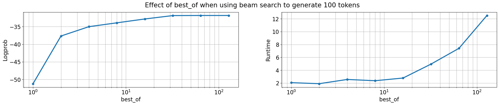

# Iteration 9. Improve inference

_21-08-2024_

## Goal

Can we improve the accuracy of the LLM by using a more advanced inference?

## Motivation

> MindsAI team uses AIRV (augment, inference, reverse augmentation, and vote)

This simply means that they make multiple inferences for each task and then vote. Voting can be done
at the grid level or we could vote by cell. I have to visualize the predictions to see if we could
increase the accuracy by using some of this techniques.

Another option to try to improve the accuracy is to use beam-search. Instead of using the naive approach of doing greedy generation we could try different options and create an answer that has an overall higher probability.

## Development

It's a good opportunity to refactor the inference code and make it more flexible. I would save all the predictions
in a file and then have a function to take a decision. I will have to create a notebook to visualize the predictions, probably sorted by some metric.

So far I'm only doing geometric augmentations, but I could also do color swaps and change the order of the train samples. That will increase the compute used at inference, but I could probably optimize the inference speed.

### Beam search

- [What is Beam Search? Explaining The Beam Search Algorithm](https://www.width.ai/post/what-is-beam-search)
- [VLLM sampling params](https://docs.vllm.ai/en/latest/dev/sampling_params.html)

> **use_beam_search** – Whether to use beam search instead of sampling.  
> **best_of** – Number of output sequences that are generated from the prompt. From these best_of sequences, the top n sequences are returned. best_of must be greater than or equal to n. This is treated as the beam width when use_beam_search is True. By default, best_of is set to n.

I have been playing with beam search and it generates a sequence with higher probability than simply greedy decoding.



```
## Best of 1 (logprob: -51.21, runtime: 2.06s)
Alexander the Great was a legendary conqueror who ruled over a vast empire that
stretched from Greece to India. One of his most famous conquests was the city of
Tyre, which was located on the coast of Lebanon. Alexander had heard of Tyre's
wealth and power, and he was determined to conquer it. He sent a fleet of ships
to attack the city, and they were successful in capturing it. Alexander then
spent several years building up the city and making it his own. However, Ty

## Best of 2 (logprob: -37.66, runtime: 1.90s)
Alexander the Great, the son of Philip II of Macedon, was one of the most famous
conquerors in history. He was born in 356 BC and died in 323 BC, but his legacy
lives on to this day. Alexander was known for his military prowess and his
ability to conquer vast territories. One of the most famous battles that
Alexander fought was against the city of Tyre. Tyre was a powerful city-state in
the eastern Mediterranean, and it had been a

## Best of 128 (logprob: -31.82, runtime: 12.52s)
Alexander the Great was one of the most famous conquerors in history. He was
born in 356 BC and died in 323 BC, but his legacy lives on to this day. One of
the most famous battles he fought was the Battle of Tyre, which took place in
332 BC. The city of Tyre was one of the most powerful cities in the world at the
time. It was located on the coast of the Mediterranean Sea and was known for its
```

Thus it seems reasonable that we could improve the accuracy of the predictions by using beam search.

### Update inference script

It takes 13 minutes to do inference in 100 evaluation tasks.
54 minutes to do inference with 8 predictions per task.
After improving inference it takes 8 minutes, so it is 7x faster. Maybe it can be even faster by
grouping all the prompts.

## Results

### Beam search results

| best_of | pass_n | accuracy | correct_pixels | correct_size | runtime |
|---------|--------|----------|----------------|--------------|---------|
| 1       | 12%    | 4.40%    | 77%            | 88%          | 7m      |
| 2       | 13.50% | 5.90%    | 78.70%         | 90%          | 50m     |
| 4       | 13.50% | 6%       | 77.50%         | 89%          | 1h30    |

We can see that the results improve, but at the cost of much bigger runtime. I have the feeling that
beam search is not as efficient as normal generation.

## Conclusion

## Next steps

- [ ] Can I use the model to judge which predictions are the best? https://github.com/vllm-project/vllm/issues/5234

## TODO

- [x] Modify generation script to allow generating an arbitrary number of solutions
- [ ] Create a function to select the solution (by voting f.e.)
- [x] Create a notebook to understand how beam search works, first using text
- [x] Can I speedup inference? There is evidence that batching could make a great speedup.
- [x] Can I speedup inference even more? Group all the prompts together
- [x] Does beam-search increase the accuracy of the model?
- [ ] Does it help to add more data augmentations? (train samples reorder, color swap)
