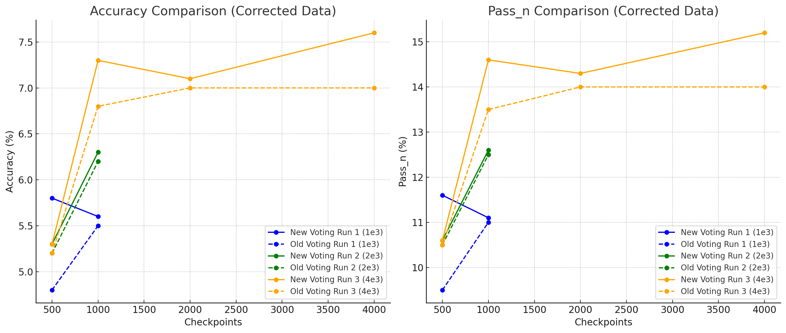

# Iteration 10. Improve response selection

_24-08-2024_

## Goal

Can I use an LLM to improve the selection of responses over voting?

## Motivation

On the previous iteration we have seen that voting is able to select the correct answer with an accuracy of 30-50%.
If we can find a more accurate method that will make a direct improvement in system accuracy.

We already know that using beam search is able to create better answers, but the implementation is not
efficient and it is much slower than normal generation. My intuition is that we can use the model to estimate
the likelihood of an answer once it has been created. And maybe that can be used to select the right answer.

## Development

### Measuring likelihood of a prompt

I'm going to create a notebook to do a proof of concept of the idea using VLLM. If it works I will
convert it to a script that can replace the current voting script.

I have found that when requiring VLLM to compute the logprobs of the prompt it causes OOM error if the prompt length is not small.
Thus we cannot use that feature. I'm going to try instead to use the logprob of the generated grids.

Links:

- [Github issue: Add efficient interface for evaluating probabilities of fixed prompt-completion pairs](https://github.com/vllm-project/vllm/issues/5234)
- [prompt_logprobs](https://docs.vllm.ai/en/latest/dev/sampling_params.html) – Number of log probabilities to return per prompt token.

## Results

### Using logprob as a secondary sorting factor is the best option

|                       |        |           | naive              |                         | aggregate          |                         | combine voting and logprob |                         |
|-----------------------|--------|-----------|--------------------|-------------------------|--------------------|-------------------------|----------------------------|-------------------------|
| number of predictions | pass_n | voting    | cumulative_logprob | mean_cumulative_logprob | cumulative_logprob | mean_cumulative_logprob | cumulative_logprob         | mean_cumulative_logprob |
| 8                     | 16.0%  | **10.5%** | 8.7%               | 10.2%                   | 9.20%              | 9.70%                   | 9.20%                      | 10.20%                  |
| 32                    | 23.0%  | 12.5%     | 12.2%              | 13.3%                   | 12.20%             | 12.20%                  | **13.80%**                 | **13.80%**              |
| 128                   | 23.5%  | 12.5%     | 10.7%              | 10.7%                   | 12.20%             | 11.20%                  | **12.80%**                 | **12.80%**              |

The logprobs of the predictions do not have better sorting capabilities than voting. However we can
use voting to sort the predictions, and use the logprobs to solve the ties. That improves over random choosing when there is a tie.

To find the best algorithm I used the metric below:

```
voting_mean_logprob mean_cumulative_logprob mean correct position: 2.2 ([1, 5, 1, 0, 0, 3, 1, 0, 3, 27, 1, 3, 11, 0, 1, 0, 0, 0, 1, 0, 2, 3, 6, 3, 4, 0])
voting_lower_bound_constant_std mean_cumulative_logprob mean correct position: 2.2 ([1, 5, 1, 0, 0, 3, 1, 0, 3, 27, 1, 3, 11, 0, 1, 0, 0, 0, 1, 0, 2, 3, 6, 3, 4, 0])

voting_mean_logprob cumulative_logprob mean correct position: 2.3 ([1, 5, 1, 0, 0, 3, 1, 0, 3, 29, 1, 4, 11, 0, 1, 0, 0, 0, 1, 0, 2, 3, 6, 3, 4, 0])
voting_lower_bound_constant_std cumulative_logprob mean correct position: 2.3 ([1, 5, 1, 0, 0, 3, 1, 0, 3, 29, 1, 4, 11, 0, 1, 0, 0, 0, 1, 0, 2, 3, 6, 3, 4, 0])

there is no difference here.


voting mean_cumulative_logprob mean correct position: 2.4 ([1, 7, 1, 0, 0, 3, 1, 0, 4, 35, 1, 4, 14, 0, 1, 0, 0, 0, 1, 0, 2, 3, 6, 3, 4, 0])
voting cumulative_logprob mean correct position: 2.4 ([1, 7, 1, 0, 0, 3, 1, 0, 4, 35, 1, 4, 14, 0, 1, 0, 0, 0, 1, 0, 2, 3, 6, 3, 4, 0])

lower_bound_constant_std cumulative_logprob mean correct position: 2.8      ([17, 5, 0, 0, 0, 2, 2, 1, 3, 24, 0, 16, 5, 0, 9, 0, 0, 0, 0, 0, 0, 7, 2, 3, 5, 0])
lower_bound_constant_std mean_cumulative_logprob mean correct position: 2.8 ([14, 12, 0, 0, 0, 2, 2, 1, 3, 22, 0, 5, 5, 0, 9, 0, 0, 0, 0, 0, 0, 7, 2, 2, 5, 0])


lower_bound mean_cumulative_logprob mean correct position: 3.0 ([15, 18, 0, 0, 0, 2, 2, 0, 3, 21, 0, 9, 3, 0, 9, 0, 0, 0, 0, 0, 1, 7, 5, 3, 5, 0])
lower_bound cumulative_logprob mean correct position: 3.0 ([17, 11, 0, 0, 0, 2, 1, 0, 3, 24, 0, 17, 3, 0, 9, 0, 0, 0, 0, 0, 1, 7, 5, 3, 5, 0])


mean_logprob cumulative_logprob mean correct position: 3.3 ([19, 6, 1, 0, 0, 1, 2, 5, 3, 22, 0, 17, 3, 0, 15, 2, 0, 0, 0, 0, 2, 11, 3, 3, 5, 0])
mean_logprob mean_cumulative_logprob mean correct position: 3.3 ([20, 15, 1, 0, 0, 1, 2, 5, 3, 20, 0, 7, 3, 0, 15, 2, 0, 0, 0, 0, 2, 11, 3, 3, 5, 0])

naive mean_cumulative_logprob mean correct position: 4.3 ([82, 4, 1, 0, 0, 40, 3, 5, 101, 25, 0, 29, 15, 0, 14, 0, 0, 0, 3, 0, 0, 80, 1, 6, 42, 0])
naive cumulative_logprob mean correct position: 4.4 ([83, 5, 1, 0, 0, 40, 3, 5, 101, 27, 0, 86, 15, 0, 14, 0, 0, 0, 3, 0, 0, 79, 1, 6, 42, 0])
```

### Improvements on multiple evaluations

I have done multiple evaluations as part of other iteration, the following plot shows how the new voting algorithm improves
almost in all situations to the old voting.



## Conclusion

We have developed a new grid selection algorithm that uses voting and logprobs as the metric to solve the ties. This method does not require extra computation (we use the logprobs from inference) and improves the results slightly.

## Next steps

I might develop a script to measure the likelihood of a response using torch, because VLLM is not
optimized to do that. That may allow to improve the results.

## TODO

- [x] Create new script to select grids
