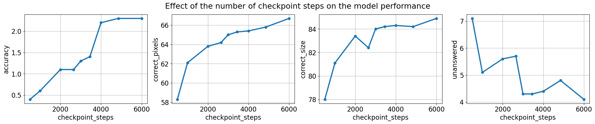
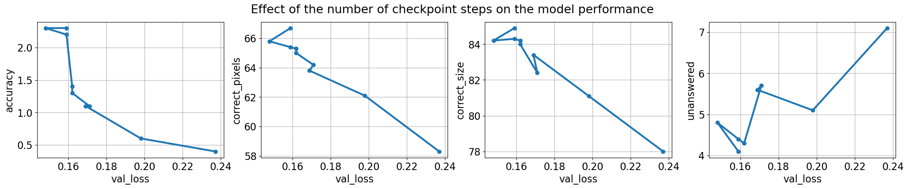
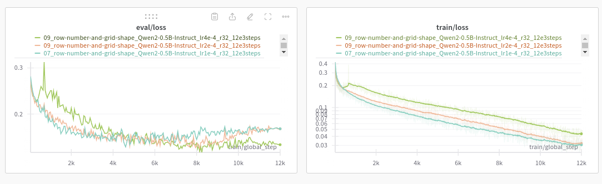
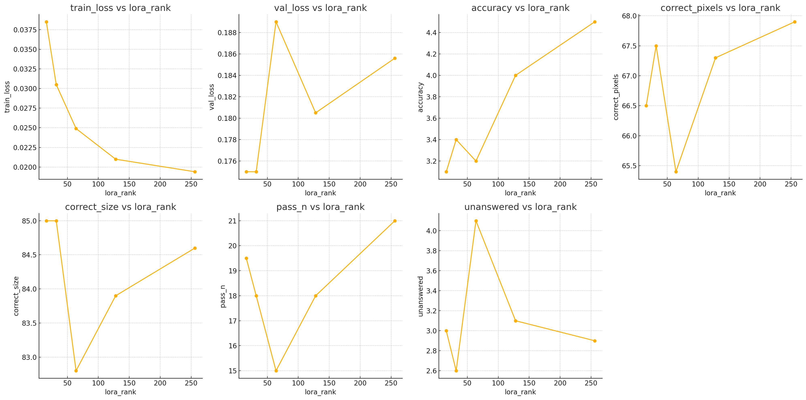
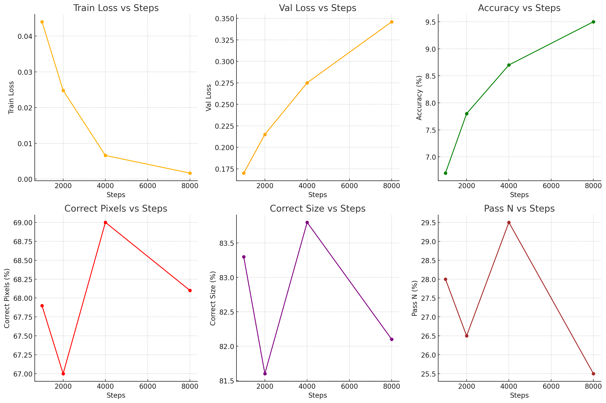

# Iteration 12. Grid representation

_26-08-2024_

## Goal

Can I improve the accuracy of the models by using a better grid representation?

## Motivation

Before going to generate synthetic data to learn the priors I want to know what is the best representation
of the problem for an LLM. LLMs typically deal with 1d data, not 2d data. Thus trying different representations
makes a lot of sense. This can have a big impact on the accuracy of the model.

The grid representation should not use too many tokens, otherwise hardware requirements grow.

## Development

### Fine-tuning script refactor

I need to refactor the fine-tuning script to make it very easy to try new representations and prompts.
Code should be shared between train and evaluation.

My idea will be to run a very short train with a fixed seed, refactor the code and verify that it still works the same way.

### Finding a set of symbols to replace the numbers

Using the Llama and Qwen tokenizers I have been able to find a set of symbols that are unique (do not form part of other words in the vocabulary)
Using this symbols the model should receive a representation that is equivalent to the current numbers one.
But maybe the model can work better with that set of symbols.

```
selection = ['ñ', 'ò', '÷', 'û', 'ą', 'ć', 'ď', 'ę', 'Ě', 'Ğ']
```

### Create a simple evaluation script

Currently I have a notebook to merge weights of the model and lora, a script to do inference and a notebook
to evaluate. That works if I only have to evaluate a single model, but does not scale to evaluating many models.

Thus I have to create either a script or a notebook that simply takes the path of the checkpoint
that I want to evaluate, and does all the job.

### Cosine with restarts learning rate schedule

I have updated the fine-tuning to support cosine with restarts learning rate scheduler.

- https://huggingface.co/docs/transformers/en/main_classes/trainer
- https://github.com/huggingface/transformers/blob/v4.44.2/src/transformers/trainer_utils.py#L410
- https://huggingface.co/transformers/v4.2.2/_modules/transformers/optimization.html

Maybe I could use another scheduler directly, that decreases the amplitude of the cosine restart
over the train duration. The experiment with cosine learning rate seems to be increasing the learning rate to a too high value.

- https://pytorch.org/docs/stable/generated/torch.optim.lr_scheduler.CyclicLR.html#torch.optim.lr_scheduler.CyclicLR
- https://github.com/huggingface/transformers/blob/746104ba6f0514159d58dc2fb09c887d0e9d4863/src/transformers/trainer.py#L1249C22-L1249C34
- https://github.com/bitsandbytes-foundation/bitsandbytes/blob/main/bitsandbytes/optim/adamw.py

4 cycles, 0.707, warmup ratio in the cycle.
It seems I would need to give both the optimizer and scheduler as input to the train function.

Study of how the [Trainer](https://huggingface.co/docs/transformers/en/main_classes/trainer#trainer) works ([source code](https://github.com/huggingface/transformers/blob/746104ba6f0514159d58dc2fb09c887d0e9d4863/src/transformers/trainer.py#L289)). It has a method `self.create_optimizer_and_scheduler` that calls to `self.create_optimizer` and `self.create_scheduler`. This method is called from `self._inner_training_loop` that is itself called from the `self.train` method.

- `self.train`
  - `self._inner_training_loop`
    - `self.create_optimizer_and_scheduler`
      - `self.create_optimizer`
      - `self.create_scheduler`
        - `optimization.get_scheduler`

I believe the simplest hack is to modify the `self.create_scheduler` function to return the scheduler I want.

## Results

All the presented results are the mean metrics of doing 64 predictions per task.

### Experiment with different grid encoders

[Wandb](https://wandb.ai/guillermobarbadillo/20240826_grid_encoders?nw=nwuserguillermobarbadillo)

| row numbers | grid shape  | other symbols | accuracy | correct_pixels | correct_size | unanswered |
|-------------|-------------|---------------|----------|----------------|--------------|------------|
|             |             |               | 2.0%     | 58.0%          | 74.0%        | **2.2%**   |
| x           |             |               | 2.3%     | 63.9%          | 81.5%        | 3.4%       |
|             | x           |               | **2.8%** | 62.3%          | 79.8%        | **2.8%**   |
| x           | x           |               | **2.8%** | **66.3%**      | **84.2%**    | **2.8%**   |
|             |             | x             | 1.9%     | 59.1%          | 75.5%        | **2.4%**   |
| x           | x           | x             | 2.3%     | **66.7%**      | **84.9%**    | 4.1%       |

- Using row numbers and grid shape increase accuracy, correct pixels and correct size
- There is no evidence that using alternative symbols instead of numbers gives better results.

Thus the best encoder configuration for Qwen would be `GridShapeEncoder(RowNumberEncoder(MinimalGridEncoder()))`.

```
GridCodeBlockEncoder(MinimalGridEncoder())
GridCodeBlockEncoder(RowNumberEncoder(MinimalGridEncoder()))
GridShapeEncoder(MinimalGridEncoder())
GridShapeEncoder(RowNumberEncoder(MinimalGridEncoder()))

GridCodeBlockEncoder(ReplaceNumberEncoder(MinimalGridEncoder()))
GridShapeEncoder(RowNumberEncoder(ReplaceNumberEncoder(MinimalGridEncoder())))
```

### Validation loss is not a perfect proxy

I have evaluated multiple checkpoints of a training, and the following plots show how the metrics change during the training.



We see an almost monotonic improvement during training, however the validation loss shows a different story.



Thus I should probably evaluate the last and the best checkpoint, and launch longer trainings because there might be room for improvement.

**Validation loss is useful when it decreases, but when it diverges it is no longer correlated with model accuracy**

### Experiments training on ARC tasks

#### Longer trainings

Since I have found that the validation loss was not a good metric, I'm going to train the models for longer.

TODO: plot of val loss, train loss, val metrics vs number of training steps for both Qwen models

#### Optimal learning rate

I have tried increasing the default 1e-4 learning rate to see if I could get better results, without success.



| model      | learning rate | train loss | val loss | accuracy | correct_pixels | correct_size | pass_n | unanswered |
|------------|---------------|------------|----------|----------|----------------|--------------|--------|------------|
| Qwen2-0.5B | 1.00E-04      | 0.03       | 0.175    | 3.40%    | 67.50%         | 85.00%       | 18.00% | 2.60%      |
| Qwen2-0.5B | 2.00E-04      | 0.0319     | 0.175    | 2.90%    | 65.50%         | 82.70%       | 19.00% | 3.60%      |
| Qwen2-0.5B | 4.00E-04      | 0.043      | 0.152    | 2.80%    | 65.40%         | 83.00%       | 12.50% | 3.10%      |

#### Effect of lora rank



- Train loss decreases as the lora rank increases, as expected. Given more capacity the loss is reduced more.
- There seems to be a relation between accuracy and lora rank. We get higher accuracy by using higher ranks.
- The relation with the other metrics is unclear

| model      | lora_rank | train loss | val loss | accuracy | correct_pixels | correct_size | pass_n | unanswered |
|------------|-----------|------------|----------|----------|----------------|--------------|--------|------------|
| Qwen2-0.5B | 16        | 0.0385     | 0.175    | 3.10%    | 66.50%         | 85.00%       | 19.50% | 3.00%      |
| Qwen2-0.5B | 32        | 0.0305     | 0.175    | 3.40%    | 67.50%         | 85.00%       | 18.00% | 2.60%      |
| Qwen2-0.5B | 64        | 0.0249     | 0.189    | 3.20%    | 65.40%         | 82.80%       | 15.00% | 4.10%      |
| Qwen2-0.5B | 128       | 0.021      | 0.1805   | 4%       | 67.30%         | 83.90%       | 18.00% | 3.10%      |
| Qwen2-0.5B | 256       | 0.0194     | 0.1856   | 4.50%    | 67.90%         | 84.60%       | 21.00% | 2.90%      |

### Test time fine-tuning

I have done a bunch of experiments with different learning rates and learning rate schedules. The best
learning rate is the same as in training: 1e-4. And the best schedule is linear. I have tried also cosine with restarts, cyclic learning rate and constant learning rate but give worse results.

#### Optimal training steps



We see that the accuracy increases when we fine-tune for longer with test-time fine-tuning. Train loss decreases and validation loss raises. The other metrics do not show a clear relation with the number of training steps.

| steps | train loss | val loss | accuracy | correct_pixels | correct_size | pass_n |
|-------|------------|----------|----------|----------------|--------------|--------|
| 1000  | 0.044      | 0.17     | 6.70%    | 67.90%         | 83.30%       | 28.00% |
| 2000  | 0.0248     | 0.215    | 7.80%    | 67.00%         | 81.60%       | 26.50% |
| 4000  | 0.0066     | 0.275    | 8.70%    | 69.00%         | 83.80%       | 29.50% |
| 8000  | 0.00167    | 0.346    | 9.50%    | 68.10%         | 82.10%       | 25.50% |

Just by fine-tuning for longer we are able to increase accuracy by 3% (from 6% to 9%).

#### Removing train samples to fit on max sequence length

As part of a following iteration I have implemented a feature that if a task is too long to fit into the `max_sequence_length`, it removes train samples until it is small enough.

I wanted to find if it is helpful or not for fine-tuning the model. The effect is is unclear as the results below show. In one case it improves the results and in other it worsens them.
Thus the effect is likely very small.

```
# Experiment 1
/mnt/hdd0/Kaggle/arc24/evaluations/20240828_grid_encoders_ttft/05_shape-and-number-new-model_Qwen2-0.5B-Instruct_lr1e-4_r32_4e3steps/checkpoint-4000/inference_x64.json
accuracy: 8.7%	correct_pixels: 69.0%	max_correct_pixels: 82.6%	correct_size: 83.8%	any_correct_size: 88.0%	pass_n: 29.5%	unanswered: 3.0%	
/mnt/hdd0/Kaggle/arc24/evaluations/20240828_grid_encoders_ttft/06_shape-and-number-new-model-rtstfmsl_Qwen2-0.5B-Instruct_lr1e-4_r32_4e3steps/checkpoint-4000/inference_x64.json
accuracy: 8.7%	correct_pixels: 68.4%	max_correct_pixels: 81.7%	correct_size: 82.7%	any_correct_size: 86.0%	pass_n: 27.0%	unanswered: 2.9%

# Experiment 2
/mnt/hdd0/Kaggle/arc24/evaluations/20240828_grid_encoders_ttft/11_bigger-lora_Qwen2-0.5B-Instruct_lr1e-4_r256_4e3steps/checkpoint-4000/inference_x64.json
accuracy: 10.4%	correct_pixels: 71.0%	max_correct_pixels: 83.2%	correct_size: 84.1%	any_correct_size: 87.5%	pass_n: 28.0%	unanswered: 2.7%
/mnt/hdd0/Kaggle/arc24/evaluations/20240828_grid_encoders_ttft/11_bigger-lora-remove-train-samples_Qwen2-0.5B-Instruct_lr1e-4_r256_4e3steps/checkpoint-4000/inference_x64.json
accuracy: 10.8%	correct_pixels: 71.1%	max_correct_pixels: 83.4%	correct_size: 83.8%	any_correct_size: 87.5%	pass_n: 32.5%	unanswered: 2.1%	
```

### Qwen2-0.5B vs Qwen2-1.5B

TODO: what is the effect of test-time fine-tuning?

## Conclusion

The biggest finding of this iteration is that validation loss is only useful when it decreases, once it starts to diverge it is no longer useful.

It seems that using higher lora ranks gives more accurate models.

## Next steps

- I might have to reconsider the role of lora ranking now that I know that validation loss is not a good proxy.
  Run a series of experiments with different r. Maybe having a higher r could allow for faster ttft.
- Trainings are becoming too long, could I speedup them using libraries such as [unsloth](https://github.com/unslothai/unsloth)?
- Optimize the input prompt
- Does it make sense to fine-tune bigger models such as Phi-3, Llama or the 7B Qwen2?

## TODO

- [x] Does it help to predict the shape of the grid?
- [x] Does it help to add row idx at the start of each line?
- [x] Are the pixel symbols relevant? Or could I replace the number for other symbols?
- [x] How useful is the validation loss?
- [ ] Train for longer, is validation loss really useful?
  - [ ] What is the optimal train steps?
  - [x] I'm using the best learning rate?
  - [x] Can I get better results using a different lora rank?
- [x] Test time fine-tuning, train with different number of steps
  - [x] 1e-4 is the best learning rate
  - [x] So far the best results are obtained training for longer, I have trained up to 4k steps
  - [x] Do I get better results if I train for more than 4k steps?
  - [x] Can the model learn faster using cyclic learning rates? No
  - [x] Does it help to to remove train samples to fit training sequence length? First experiment gives worse results, but not sure if the differences are significative.
  - [x] Could I train faster by changing the batch size?
- [ ] Qwen2-0.5B vs Qwen2-1.5B
- [ ] Do we get improvements in submission?
- [ ] If I make the same submission 3 times, what is the variability of the score? (Using a random seed)
