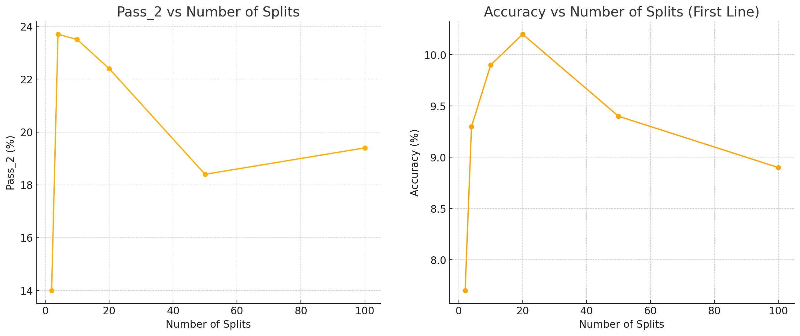

# Iteration 13. Single task test-time fine-tuning

_29-08-2024_

## Goal

Can we improve the accuracy of the model if we fine-tune the model for each task independently?

## Motivation

Jack Cole says the following in the [Machine Learning Street interview](https://youtu.be/jSAT_RuJ_Cg?si=8TuDOeS2ip1YMSyv&t=6452):

> If you train a model on the re-arc dataset you will get like 1% on the test set. But if you apply their
> techniques of active inference the score will increase to 23%

This is not what I'm currently seeing. For example when I improved the inference script to be much
faster and added voting, I get LB scores of 6 and 5 for Qwen2-0.5B and Qwen2-1.5B, when applying test-time fine-tuning the scores were 5 and 7.
Thus my initial score is much better than theirs, but I don't experience that improvement when using
test-time fine-tuning.

On recent experiments with the evaluation dataset I could improve from 9% to 15%. Again not even close to what Jack Cole said.
TODO: this is an ongoing work, maybe using longer trainings or higher learning rates could improve my results.

Maybe the problem is that so far I have been fine-tuning in the whole test set. That might be suboptimal because
the tasks could be contradictory. So maybe it's better to fine-tune for each task independently. Instead of fine-tuning for 1k steps on 100 tasks, fine-tune for 10 steps in each of the 100 tasks.

Other possible explanations:

- It might also be the case that we need a stronger base model, but we leave that for future experiments.
- Maybe my test fine-tuning method is not as good as theirs

## Development

The easier way to test this is to fork the Kaggle notebook and make the following modifications.

1. Decompose the test file into single task files
2. Fine-tune on each of those tasks, generating n saved models
3. Make inference with all of the models, each on its task
4. Concatenate all the predictions on a single file

The drawback of this approach is that the warmup time of fine-tuning and inference will happen 100 times
instead of just one. But I believe there is enough time in the submission to do that.

Another possible problem is that if there is a single task, it might be the case that the training data
is too long for training. I will have to think of how to solve that. Probably the best way is to randomly
get rid of some of the inputs in that case. I could add that option to training. Otherwise the data generator
will be stuck in an infinite loop.
However I have found that if task has both inputs and outputs of 30x30, it might be the case that even
with just one train sample we cannot fit the data in the `max_seq_len`. Thus I have to think of how
to deal with those cases.

### Tasks that are too big for training

No prompt smaller than 4096 tokens for task 25094a63
No prompt smaller than 4096 tokens for task f9d67f8b
No prompt smaller than 4096 tokens for task 981571dc
No prompt smaller than 4096 tokens for task b9630600

## Results

### Experiment about optimal number of splits

TODO: it's already running, maybe each experiment is going to take around 3 hours.
TODO: it looks very promising!



There is a clear positive relation between the number of splits and the accuracy of the model. However we see a decrease after 20 splits. My hypothesis is that if we were using a bigger compute budget we won't see that effect. The total number of training steps is 1000, so for 50 splits that means we will only change the model 20 times.

```
# For a compute budget of 1k steps
# Aggregated metrics:
1 split?

2 splits, 3h12
accuracy: 7.7%	correct_pixels: 69.8%	max_correct_pixels: 82.5%	correct_size: 84.4%	any_correct_size: 87.0%	pass_64: 25.5%	unanswered: 3.0%
accuracy: 7.0%	correct_pixels: 71.3%	max_correct_pixels: 74.7%	correct_size: 85.0%	any_correct_size: 86.0%	pass_2: 14.0%	unanswered: 1.0%

4 splits, 3h18
accuracy: 9.3%	correct_pixels: 70.9%	max_correct_pixels: 84.5%	correct_size: 84.7%	any_correct_size: 89.5%	pass_64: 27.5%	unanswered: 3.8%
accuracy: 11.9%	correct_pixels: 73.3%	max_correct_pixels: 78.6%	correct_size: 85.9%	any_correct_size: 87.9%	pass_2: 23.7%	unanswered: 0.0%

10 splits, 3h22
accuracy: 9.9%	correct_pixels: 70.6%	max_correct_pixels: 82.1%	correct_size: 84.1%	any_correct_size: 87.0%	pass_64: 28.5%	unanswered: 2.9%
accuracy: 11.7%	correct_pixels: 74.2%	max_correct_pixels: 78.2%	correct_size: 86.2%	any_correct_size: 86.7%	pass_2: 23.5%	unanswered: 0.5%

20 splits, 3h34
accuracy: 10.2%	correct_pixels: 71.0%	max_correct_pixels: 84.1%	correct_size: 84.5%	any_correct_size: 89.0%	pass_64: 30.0%	unanswered: 3.5%
accuracy: 11.2%	correct_pixels: 75.2%	max_correct_pixels: 80.8%	correct_size: 86.7%	any_correct_size: 88.8%	pass_2: 22.4%	unanswered: 0.5%

50 splits, 4h12
accuracy: 9.4%	correct_pixels: 71.2%	max_correct_pixels: 81.8%	correct_size: 85.4%	any_correct_size: 88.0%	pass_64: 27.0%	unanswered: 2.8%
accuracy: 9.2%	correct_pixels: 75.7%	max_correct_pixels: 79.1%	correct_size: 88.3%	any_correct_size: 88.8%	pass_2: 18.4%	unanswered: 0.0%

100 splits, 5h10
accuracy: 8.9%	correct_pixels: 70.0%	max_correct_pixels: 82.4%	correct_size: 84.6%	any_correct_size: 88.0%	pass_64: 28.0%	unanswered: 3.1%
accuracy: 9.7%	correct_pixels: 73.5%	max_correct_pixels: 76.9%	correct_size: 87.2%	any_correct_size: 87.8%	pass_2: 19.4%	unanswered: 0.0%

50 splits, constant lr, 4h5
accuracy: 10.4%	correct_pixels: 70.3%	max_correct_pixels: 82.9%	correct_size: 83.9%	any_correct_size: 87.0%	pass_64: 29.5%	unanswered: 4.0%
accuracy: 10.0%	correct_pixels: 72.2%	max_correct_pixels: 76.3%	correct_size: 85.0%	any_correct_size: 87.0%	pass_2: 20.0%	unanswered: 1.0%
```

### Optimization for 50 splits

```
50 splits, 4h12
accuracy: 9.4%	correct_pixels: 71.2%	max_correct_pixels: 81.8%	correct_size: 85.4%	any_correct_size: 88.0%	pass_64: 27.0%	unanswered: 2.8%
accuracy: 9.2%	correct_pixels: 75.7%	max_correct_pixels: 79.1%	correct_size: 88.3%	any_correct_size: 88.8%	pass_2: 18.4%	unanswered: 0.0%

50 splits, constant lr, 4h5
accuracy: 10.4%	correct_pixels: 70.3%	max_correct_pixels: 82.9%	correct_size: 83.9%	any_correct_size: 87.0%	pass_64: 29.5%	unanswered: 4.0%
accuracy: 10.0%	correct_pixels: 72.2%	max_correct_pixels: 76.3%	correct_size: 85.0%	any_correct_size: 87.0%	pass_2: 20.0%	unanswered: 1.0%
```

Using a constant learning rate seems to have a positive effect.

TODO: increase the budget to 2k or 3k steps
TODO: what if I reduce the batch size? That way I will do more modifications to the model

## Conclusion

## Next steps

## TODO

- [x] Add the option to the train script to remove train samples to fit training sequence length
- [x] I have found that sometimes a task would not fit into max seq length. How to detect that case and what to do?
- [x] Measure the effect of using the feature above in a normal training. Done on previous iteration, unclear effect.
- [ ] Optimize the parametrization of single task ttft (stttft) (learning rate and steps) Does it improve over the baseline?
- [x] Try with constant learning rate schedule, might be better for short fine-tunings.
