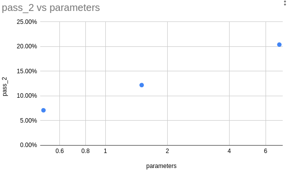

# Iteration 20. Bigger models

_04-09-2024_

## Goal

Study the tendency of using bigger models.

## Motivation

It seems that using bigger models gives better results, I want to dig deeper into that trend.

## Development

I can fine-tune `Qwen2-7B` using 2xA6000 GPUs (80GB of VRAM). I have tried fine-tuning `Qwen2-72B` on 8xA6000 but it
gave OOM error. I only could fine-tune when using int4 quantization, but it was terribly slow, 700s per batch.

## Results

### Train on ARC tasks

| model      | train steps | pass_2 |
|------------|-------------|--------|
| Qwen2-0.5B | 6000        | 7.10%  |
| Qwen2-1.5B | 6000        | 12.20% |
| Qwen2-7B   | 6000        | 20.40% |

Clearly the bigger models generalize better for the same number of training steps.

It seems that the accuracy improves linearly with the log of the parameters. If the trend continues we will get a pass_2 accuracy of 50% if fine-tuning GPT4.

| parameters | pass_2 estimation |
|------------|-------------------|
| 0.5        | 7.10%             |
| 1.5        | 12.58%            |
| 7          | 20.27%            |
| 72         | 31.91%            |
| 2000       | 48.50%            |

  
Click to see more detailed results

| model      | train steps | train loss | val loss | accuracy | correct_pixels | correct_size | pass_64 | unanswered | pass_2 |
|------------|-------------|------------|----------|----------|----------------|--------------|---------|------------|--------|
| Qwen2-0.5B | 6000        | 0.053      | 0.16     | 2.80%    | 66.30%         | 84.20%       | 18.50%  | 2.80%      | 7.10%  |
| Qwen2-1.5B | 6000        | 0.0302     | 0.154    | 5.30%    | 69.60%         | 87.50%       | 26.00%  | 2.80%      | 12.20% |
| Qwen2-7B   | 6000        | 0.0135     | 0.129    | 7.30%    | 71.30%         | 87.70%       | 27.00%  | 3.20%      | 20.40% |

| model      | train steps | train loss | val loss | accuracy | correct_pixels | correct_size | pass_64 | unanswered | pass_2 |
|------------|-------------|------------|----------|----------|----------------|--------------|---------|------------|--------|
| Qwen2-0.5B | 3000        | 0.075      | 0.157    | 1.60%    | 66.30%         | 85.10%       | 11.50%  | 3.40%      | 7.10%  |
| Qwen2-1.5B | 3000        | 0.0505     | 0.138    | 3.70%    | 68.70%         | 86.50%       | 19.50%  | 3.10%      | 11.20% |
| Qwen2-7B   | 3000        | 0.026      | 0.114    | 6.70%    | 70.60%         | 87.00%       | 32.00%  | 3.50%      | 17.30% |

### Test-time fine-tuning

[Already done a comparison on grid representation iteration](Iteration_12_grid_representation.md#qwen2-05b-vs-qwen2-15b)

## Conclusion

## Next steps

## TODO

- [ ] Can I make a submission with Qwen2-7B? Could I make test-time fine-tuning using quantization?
- [ ] Would Qwen2-7B improve if training for 12k or 24k steps?
- [ ] Are there competitive models in the 14B-30B ballpark to try?
