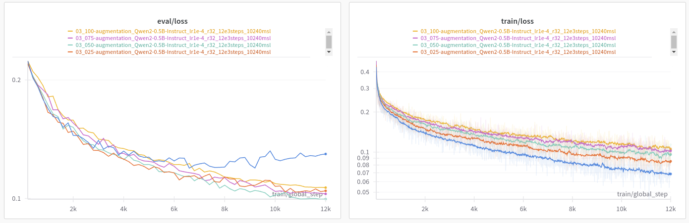

# Iteration 21. More data augmentation

_06-09-2024_

## Goal

Does using more data augmentation improve the accuracy of the model?

## Motivation

When planning about the next steps I identified the opportunity of using [more data augmentation](Iteration_16_next_steps.md#more-data-augmentation).

The idea is to apply extra transformations independently to the input and/or the output. Previously
the same transformation was applied to the input and output.

I believe this extra augmentation should be applied only on the first training, when fine-tuning on ARC tasks.
This extra augmentation will hopefully induce a better representation in the model. But when we are doing
test-time fine-tuning we want to learn the task at hand, so applying extra augmentation isn't likely to
be helpful (at least when we have a small compute budget).

## Development

## Results

### General results

| task data augmentation probability | accuracy | correct_pixels | correct_size | pass_n | vote_2 |
|------------------------------------|----------|----------------|--------------|--------|--------|
| 0%                                 | 5.93%    | 69.74%         | 87.60%       | 21.00% | 14.02% |
| 25%                                | 6.96%    | 70.46%         | 88.27%       | 21.50% | 15.15% |
| 50%                                | 7.02%    | 70.87%         | 88.77%       | 21.62% | 13.51% |
| 75%                                | 6.49%    | 69.82%         | 88.96%       | 20.50% | 15.03% |
| 100%                               | 6.37%    | 69.21%         | 89.06%       | 20.88% | 13.32% |

All experiments that use task data augmentation improve accuracy over the baseline that does not use it.
Probably the best configuration is to use it 50% of the time.

Train and validation metrics show very clearly the effect of using this new data augmentation: train loss gets worse and validation loss improves.

### Ablation study

I used 4 types of task data augmentation: geometric, padding, upscale and mirror.
Let's remove them one by one and measure the effect.

| removed data augmentation | accuracy | correct_pixels | correct_size | pass_n | vote_2 |
|---------------------------|----------|----------------|--------------|--------|--------|
| -                         | 6.37%    | 69.21%         | 89.06%       | 20.88% | 13.32% |
| geometric                 | 6.91%    | 69.88%         | 88.32%       | 22.88% | 15.15% |
| padding                   | 6.43%    | 69.22%         | 88.30%       | 18.62% | 12.34% |
| upscale                   | 6.01%    | 68.54%         | 88.67%       | 18.62% | 13.01% |
| mirror                    | 5.82%    | 68.34%         | 88.75%       | 18.75% | 13.01% |

Removing mirror and upscale have the greatest drop in performance, while removing geometric transformation
results on improved accuracy. I can try new configurations using this knowledge to try to improve the results (`1244`).

### Tune augmentation weights

| task data augmentation probability | accuracy | correct_pixels | correct_size | pass_n | vote_2 |
|------------------------------------|----------|----------------|--------------|--------|--------|
| 0%                                 | 5.93%    | 69.74%         | 87.60%       | 21.00% | 14.02% |
| 50% weights=1111                   | 7.02%    | 70.87%         | 88.77%       | 21.62% | 13.51% |
| 50% weights=1244                   | 7.09%    | 71.12%         | 89.22%       | 22.38% | 15.03% |

If I tune the weights of the different augmentations it seems that I can update slightly the accuracy of the
model. However the improvement is small, maybe the difference is not significative.

### Submission results

The same training with task augmentation scored 19 on LB and without just 14 (v15 vs v17). There is uncertainty on
this scores but it seems that the improvement is clear.

## Conclusion

We observed an improvement in model accuracy on validation and also an improvement in leaderboard score
when using more data augmentation.

## Next steps

## TODO

- [x] Implement new data transformations, visualize them on a notebook
- [x] Add parameters to train configuration to allow to control this new data augmentation
- [x] Run trainings and see if the accuracy improves
- [x] Submission
