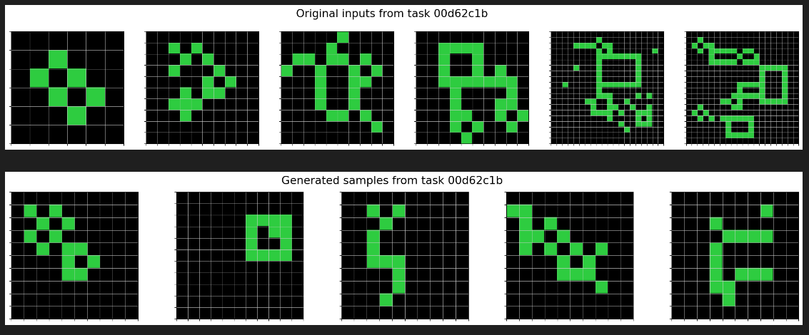
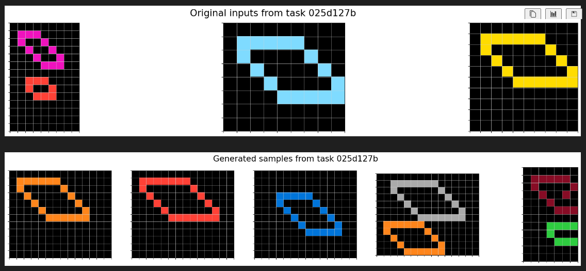
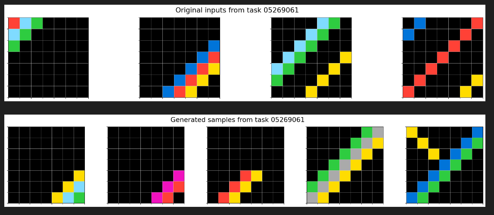
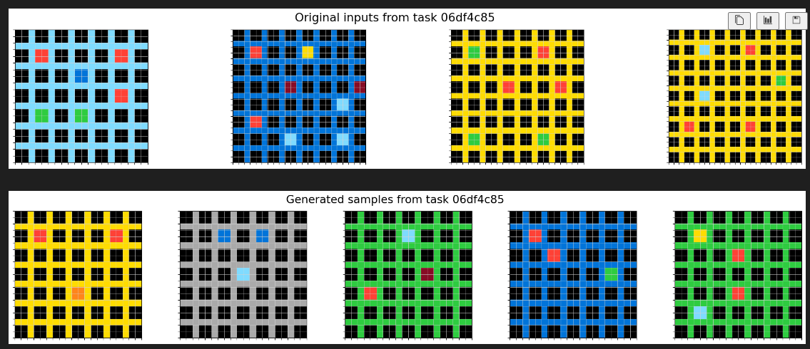
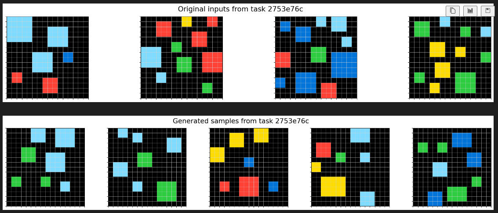

# Iteration 22. Learning the inputs distribution

_10-09-2024_

## Goal

Is it helpful to learn to generate new inputs in addition to learn to solve the tasks?

## Motivation

My intuition is that learning a good representation of the input is the key to solve the challenge. The model will learn the representation by doing tasks that require having a good representation.

One of those tasks is to generate new inputs for a task. The advantage of this approach
is that we don't need to generate new data, we already have it. We just have to make a
better use of it.

## Development

```bash
# Verify that inference does not change
reset; rm -r /mnt/hdd0/Kaggle/arc24/evaluations/20240907_more_data_augmentation/04_100-augmentation-1110_Qwen2-0.5B-Instruct_lr1e-4_r32_12e3steps_10240msl/checkpoint-12000/inference_x008*; python easy_inference_and_evaluation.py /mnt/hdd0/Kaggle/arc24/models/20240907_more_data_augmentation/04_100-augmentation-1110_Qwen2-0.5B-Instruct_lr1e-4_r32_12e3steps_10240msl/checkpoint-12000 --predictions_per_task 8

# Baseline results
accuracy: 3.2%  correct_pixels: 68.8%   max_correct_pixels: 77.4%       correct_size: 90.1%     any_correct_size: 91.0% pass_n: 9.5%    unanswered: 2.0%
accuracy: 3.8%  correct_pixels: 69.7%   max_correct_pixels: 74.7%       correct_size: 90.8%     any_correct_size: 92.3% pass_n: 7.7%    unanswered: 1.5%

# Fix tiny difference between train and inference
accuracy: 3.3%  correct_pixels: 68.9%   max_correct_pixels: 78.2%       correct_size: 90.2%     any_correct_size: 92.0% pass_n: 10.5%   unanswered: 2.0%
accuracy: 3.8%  correct_pixels: 69.7%   max_correct_pixels: 74.5%       correct_size: 90.8%     any_correct_size: 92.3% pass_n: 7.7%    unanswered: 1.5%

# try with prompts v1 (the improvement is very likely chance, but shows we could train with these shorter prompts)
accuracy: 3.2%  correct_pixels: 69.0%   max_correct_pixels: 78.2%       correct_size: 90.3%     any_correct_size: 92.0% pass_n: 10.5%   unanswered: 2.0%
accuracy: 4.3%  correct_pixels: 69.1%   max_correct_pixels: 74.5%       correct_size: 90.3%     any_correct_size: 92.3% pass_n: 8.7%    unanswered: 2.0%

# Verify that fine-tuning works
python fine-tuning.py \
--model_path=Qwen/Qwen2-0.5B-Instruct \
--train_datasets /mnt/hdd0/Kaggle/arc24/data/new_partitions/train_rs7.json output-from-examples-v0 \
--train_datasets /mnt/hdd0/Kaggle/arc24/data/arc-like_datasets/MINI-ARC.json output-from-examples-v0 \
--val_dataset /mnt/hdd0/Kaggle/arc24/data/new_partitions/val_rs7.json output-from-examples-v0 \
--grid_encoder "GridShapeEncoder(RowNumberEncoder(MinimalGridEncoder()))" \
--output_dir /mnt/hdd0/Kaggle/arc24/models/20240910_debug_prompt/01_v0 \
--max_steps=1 \
--logging_steps=1 \
--verbose \
--no-resume_from_checkpoint

python fine-tuning.py \
--model_path=Qwen/Qwen2-0.5B-Instruct \
--train_datasets /mnt/hdd0/Kaggle/arc24/data/new_partitions/train_rs7.json output-from-examples-v1 \
--train_datasets /mnt/hdd0/Kaggle/arc24/data/arc-like_datasets/MINI-ARC.json output-from-examples-v1 \
--val_dataset /mnt/hdd0/Kaggle/arc24/data/new_partitions/val_rs7.json output-from-examples-v1 \
--grid_encoder "GridShapeEncoder(RowNumberEncoder(MinimalGridEncoder()))" \
--output_dir /mnt/hdd0/Kaggle/arc24/models/20240910_debug_prompt/02_v1 \
--max_steps=1 \
--logging_steps=1 \
--verbose \
--no-resume_from_checkpoint

# this should break because there is no v2 version
python fine-tuning.py \
--model_path=Qwen/Qwen2-0.5B-Instruct \
--train_datasets /mnt/hdd0/Kaggle/arc24/data/new_partitions/train_rs7.json predict-output-v2 \
--train_datasets /mnt/hdd0/Kaggle/arc24/data/arc-like_datasets/MINI-ARC.json predict-output-v2 \
--val_dataset /mnt/hdd0/Kaggle/arc24/data/new_partitions/val_rs7.json predict-output-v2 \
--grid_encoder "GridShapeEncoder(RowNumberEncoder(MinimalGridEncoder()))" \
--output_dir /mnt/hdd0/Kaggle/arc24/models/20240910_debug_prompt/03_v2 \
--max_steps=1 \
--logging_steps=1 \
--verbose \
--no-resume_from_checkpoint

python fine-tuning.py \
--model_path=Qwen/Qwen2-0.5B-Instruct \
--train_datasets /mnt/hdd0/Kaggle/arc24/data/new_partitions/train_rs7.json output-from-examples-v1 \
--train_datasets /mnt/hdd0/Kaggle/arc24/data/arc-like_datasets/MINI-ARC.json output-from-examples-v1 \
--grid_encoder "GridShapeEncoder(RowNumberEncoder(MinimalGridEncoder()))" \
--output_dir /mnt/hdd0/Kaggle/arc24/models/20240910_debug_prompt/03_v2 \
--max_steps=1 \
--logging_steps=1 \
--verbose \
--no-resume_from_checkpoint \
--val_dataset /mnt/hdd0/Kaggle/arc24/data/new_partitions/val_rs7.json input-from-inputs-v0


python fine-tuning.py \
--model_path Qwen/Qwen2-0.5B-Instruct \
--train_datasets /mnt/hdd0/Kaggle/arc24/data/new_partitions/train_rs7.json input-from-inputs-v0 \
--val_dataset /mnt/hdd0/Kaggle/arc24/data/new_partitions/val_rs7.json input-from-inputs-v0 \
--grid_encoder "GridShapeEncoder(RowNumberEncoder(MinimalGridEncoder()))" \
--output_dir /mnt/hdd0/Kaggle/arc24/models/20240910_debug_input_from_inputs/01_baseline \
--max_steps 1000 \
--logging_steps 10 \
--verbose \
--remove_train_samples_to_fit_max_seq_len \
--max_seq_len 8192

python fine-tuning.py \
--model_path Qwen/Qwen2-0.5B-Instruct \
--train_datasets /mnt/hdd0/Kaggle/arc24/data/new_partitions/train_rs7.json output-from-outputs-v0 \
--val_dataset /mnt/hdd0/Kaggle/arc24/data/new_partitions/val_rs7.json output-from-outputs-v0 \
--grid_encoder "GridShapeEncoder(RowNumberEncoder(MinimalGridEncoder()))" \
--output_dir /mnt/hdd0/Kaggle/arc24/models/20240910_debug_input_from_inputs/02_output-from-outputs \
--max_steps 1000 \
--eval_steps 100 \
--logging_steps 10 \
--verbose \
--remove_train_samples_to_fit_max_seq_len \
--max_seq_len 8192

python fine-tuning.py \
--model_path Qwen/Qwen2-0.5B-Instruct \
--adapter_path /mnt/hdd0/Kaggle/arc24/models/20240910_debug_input_from_inputs/01_baseline/checkpoint-1000 \
--train_datasets /mnt/hdd0/Kaggle/arc24/data/new_partitions/train_rs7.json input-from-inputs-v0 \
--val_dataset /mnt/hdd0/Kaggle/arc24/data/new_partitions/val_rs7.json input-from-inputs-v0 \
--grid_encoder "GridShapeEncoder(RowNumberEncoder(MinimalGridEncoder()))" \
--output_dir /mnt/hdd0/Kaggle/arc24/models/20240910_debug_input_from_inputs/03_input-from-inputs-continuation \
--max_steps 3000 \
--eval_steps 100 \
--logging_steps 10 \
--verbose \
--remove_train_samples_to_fit_max_seq_len \
--max_seq_len 8192

python fine-tuning.py \
--model_path Qwen/Qwen2-0.5B-Instruct \
--adapter_path /mnt/hdd0/Kaggle/arc24/models/20240910_debug_input_from_inputs/03_input-from-inputs-continuation/checkpoint-3000 \
--train_datasets /mnt/hdd0/Kaggle/arc24/data/new_partitions/train_rs7.json input-from-inputs-v0 \
--val_dataset /mnt/hdd0/Kaggle/arc24/data/new_partitions/val_rs7.json input-from-inputs-v0 \
--grid_encoder "GridShapeEncoder(RowNumberEncoder(MinimalGridEncoder()))" \
--output_dir /mnt/hdd0/Kaggle/arc24/models/20240910_debug_input_from_inputs/04_input-from-inputs-continuation \
--max_steps 8000 \
--eval_steps 100 \
--logging_steps 10 \
--verbose \
--remove_train_samples_to_fit_max_seq_len \
--max_seq_len 8192
```

### Weighted loss function

- https://stackoverflow.com/questions/71581197/what-is-the-loss-function-used-in-trainer-from-the-transformers-library-of-huggi
- https://chatgpt.com/c/66e022b7-731c-8012-ab70-646a31741fe2
- https://huggingface.co/docs/transformers/en/main_classes/trainer
- https://huggingface.co/docs/trl/en/sft_trainer
- https://github.com/huggingface/transformers/blob/v4.44.2/src/transformers/trainer.py#L3353

## Results

### Newly generated inputs

I have done a quick experiments with a model trained for 1k steps. It seemed that need more training time. The images below
are from a model trained for 40k steps both to learn the input distribution and to generate outputs.













The generations are not perfect, but they are promising. It might be possible to expand the evaluation
set in a similar fashion to RE-ARC but without the need to write new python code.

### Is it helpful to learn to predict inputs?

This experiment is different than training different datasets. Here we are training the model to do new tasks.
We can think of the new tasks as some sort of regularization. Thus I believe that the fair comparison
is comparing models that have been trained for the same number of steps on the task of interest (predict the output given examples).
This implies that models that were trained on multiple tasks will be trained for a higher number of steps, because some
of the steps will be used to learn the other tasks.

#### 5k steps results

| new tasks                | accuracy  | correct_pixels | correct_size | pass_n     | vote_2     |
|--------------------------|-----------|----------------|--------------|------------|------------|
| -                        | 4.61%     | 68.54%         | 87.34%       | 17.25%     | 10.73%     |
| 5k inputs                | **5.36%** | **69.40%**     | **88.38%**   | **19.75%** | **13.13%** |
| 5k inputs, 5k outputs    | 5.13%     | 68.34%         | 87.18%       | **19.75%** | 12.37%     |
| 2.5k inputs 2.5k outputs | 4.68%     | 68.55%         | 87.66%       | 17.38%     | 11.99%     |

We see a clear improvement when trained for 5k additional steps learning the inputs distribution. Learning
the output distribution does not seem to be as helpful as learning the inputs.

#### 10k steps results

| new tasks            | accuracy  | correct_pixels | correct_size | pass_n     | vote_2     |
|----------------------|-----------|----------------|--------------|------------|------------|
| -                    | 5.71%     | **69.61%**     | **88.11%**   | 20.00%     | 13.51%     |
| pretrained on inputs | 5.82%     | 69.46%         | 87.66%       | 20.12%     | 13.89%     |
| 10k inputs           | **6.44%** | **69.60%**     | 87.25%       | **22.25%** | **15.40%** |

When training for 10k steps we see again that using additional 10k steps learning the input distribution is helpful.
Using a model pretrained on inputs does not give significative improvements, train metrics show that it
learns faster but it seems that the previous knowledge is forget during the training.

### Comparison with task augmentation

We don't have a direct apples to apples comparison because one experiment was done for 12k steps and the other for 10k steps.

| training steps (k) | new tasks         | accuracy | correct_pixels | correct_size | pass_n | vote_2 |
|--------------------|-------------------|----------|----------------|--------------|--------|--------|
| 10                 | -                 | 5.71%    | 69.61%         | 88.11%       | 20.00% | 13.51% |
| 12                 | -                 | 5.93%    | 69.74%         | 87.60%       | 21.00% | 14.02% |
| 10                 | 10k inputs        | 6.44%    | 69.60%         | 87.25%       | 22.25% | 15.40% |
| 12                 | task augmentation | 7.02%    | 70.87%         | 88.77%       | 21.62% | 13.51% |

But it seems that task augmentation had a bigger effect on accuracy than learning the inputs.

TODO: what if we do both?

### Submission results

TODO:

## Conclusion

## Next steps

- Create a expanded version of the evaluation set, similar to RE-ARC, but using my model instead of
  writing new python code.

## TODO

- [x] Refactor prompt code to remove duplications, verify that inference results do not change.
- [x] Refactor the code to allow using different prompts
- [x] Update fine-tune script to support a more complex configuration for train data (filepath and prompt)
- [x] Create prompt template for input prediction
- [x] Create prompt template for output prediction
- [x] Quick experiments to validate implementation
- [x] Long experiments to see if the model improves
- [x] Visualize some of the new inputs for the typical first training tasks
- [x] My biggest concern is that the loss might be higher for this task, since it is an open problem.
  In the other hand predicting the output was deterministic. The concern had sense, but the results
  do not suggest it is a real problem.
- [x] Update notebook code source with the new code
- [x] Is it helpful to use the weights of a model trained to predict inputs as a start point
- [ ] Submission results
