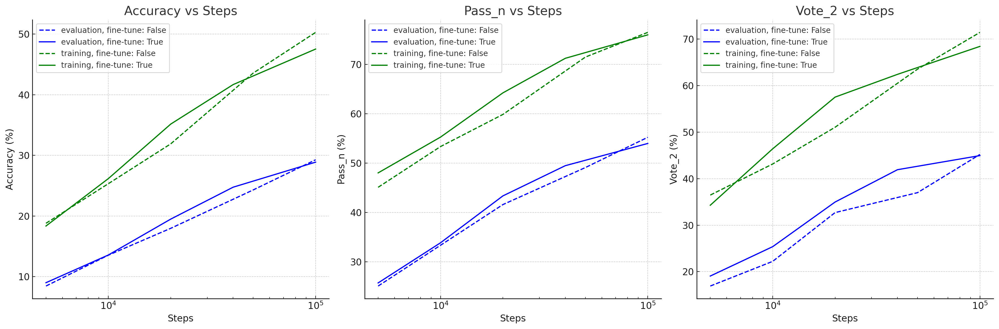
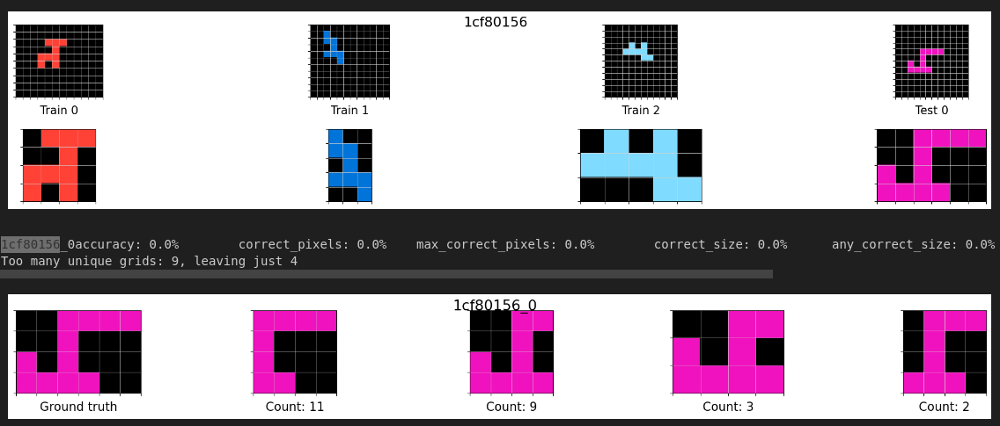
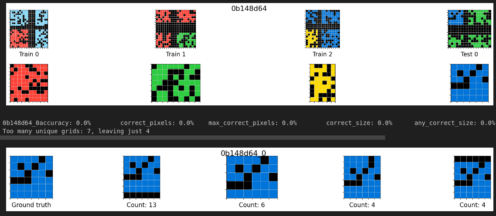
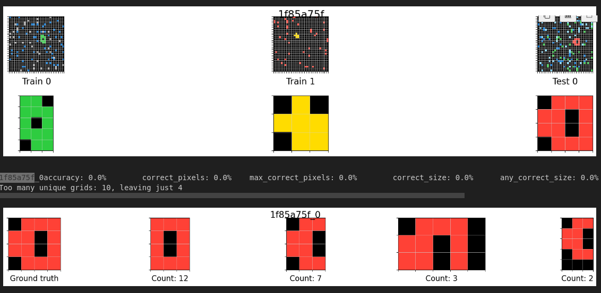

# Iteration 24. Overfit to the train set

_14-09-2024_

## Goal

If I want to solve the private test set I first have to solve the train set.

## Motivation

I have evaluated the the evaluation dataset, which I use to train the models for submission and the
accuracy was just 18%, and vote_2 solved only 29.5% of the problems. MindsAI team is solving 46% of the
hidden test problems, and I cannot solve more than 30% of the training problems.

If I can train a model to learn well the training data, I could use it to generate more training samples like
the RE-ARC dataset.

## Development

### Implement the option to do full-model fine-tuning

<details>
  <summary>Click to see bash commands</summary>

```bash
python fine-tuning.py \
--model_path=/home/gbarbadillo/data/Qwen2-0.5B-arc \
--no-use_lora \
--learning_rate 2e-5 \
--warmup_ratio 0.1 \
--output_dir /mnt/hdd0/Kaggle/arc24/models/20240915_debug_full_fine-tuning/01_baseline-no-lora_lr2e-5 \
--train_datasets /mnt/hdd0/Kaggle/arc24/data/new_partitions/val_rs7_n-1_small.json output-from-examples-v1 \
--val_dataset /mnt/hdd0/Kaggle/arc24/data/new_partitions/val_rs7_n-1_small.json output-from-examples-v1 \
--grid_encoder "GridShapeEncoder(RowNumberEncoder(MinimalGridEncoder()))" \
--max_steps=500 \
--logging_steps=10 \
--random_seed=7 \
--batch_size=5

python fine-tuning.py \
--model_path=/home/gbarbadillo/data/Qwen2-0.5B-arc \
--lora_r 32 \
--learning_rate 1e-4 \
--warmup_ratio 0.1 \
--output_dir /mnt/hdd0/Kaggle/arc24/models/20240915_debug_full_fine-tuning/02_lora-r-32 \
--train_datasets /mnt/hdd0/Kaggle/arc24/data/new_partitions/val_rs7_n-1_small.json output-from-examples-v1 \
--val_dataset /mnt/hdd0/Kaggle/arc24/data/new_partitions/val_rs7_n-1_small.json output-from-examples-v1 \
--grid_encoder "GridShapeEncoder(RowNumberEncoder(MinimalGridEncoder()))" \
--max_steps=500 \
--logging_steps=10 \
--random_seed=7 \
--batch_size=5
```
</details>

### Multi-gpu training

#### Local experiments

I'm training models for 100k steps and it seems it's going to take around 100 hours. If I can speedup
this time using multiple gpus it would be very helpful to enable faster experimentation.

I'm going to do local experiments with one and two gpus to see if I can benefit from faster training.

<details>
  <summary>Click to see bash commands</summary>

```bash
export CUDA_VISIBLE_DEVICES=0
python fine-tuning.py \
--model_path=/home/gbarbadillo/data/Qwen2-0.5B-arc \
--lora_r 32 \
--learning_rate 1e-4 \
--warmup_ratio 0.1 \
--output_dir /mnt/hdd0/Kaggle/arc24/models/20240918_debug_multi-gpu/01_baseline-1-gpu \
--train_datasets /mnt/hdd0/Kaggle/arc24/data/new_partitions/val_rs7_n-1_small.json output-from-examples-v1 \
--val_dataset /mnt/hdd0/Kaggle/arc24/data/new_partitions/val_rs7_n-1_small.json output-from-examples-v1 \
--grid_encoder "GridShapeEncoder(RowNumberEncoder(MinimalGridEncoder()))" \
--max_steps=50 \
--logging_steps=5 \
--random_seed=7 \
--n_gpus=1 \
--device_map None \
--no-verbose \
--batch_size=16

unset CUDA_VISIBLE_DEVICES
accelerate launch fine-tuning.py \
--model_path=/home/gbarbadillo/data/Qwen2-0.5B-arc \
--lora_r 32 \
--learning_rate 1e-4 \
--warmup_ratio 0.1 \
--output_dir /mnt/hdd0/Kaggle/arc24/models/20240918_debug_multi-gpu/02-2-gpus-accelerate \
--train_datasets /mnt/hdd0/Kaggle/arc24/data/new_partitions/val_rs7_n-1_small.json output-from-examples-v1 \
--val_dataset /mnt/hdd0/Kaggle/arc24/data/new_partitions/val_rs7_n-1_small.json output-from-examples-v1 \
--grid_encoder "GridShapeEncoder(RowNumberEncoder(MinimalGridEncoder()))" \
--max_steps=50 \
--logging_steps=5 \
--random_seed=7 \
--n_gpus=2 \
--device_map None \
--no-verbose \
--batch_size=16
```
</details> 

The training loss is exactly the same, but the training time is 89s when using 2 gpus vs 154 seconds
when using a single gpu.

There were some problems with doble logging when using accelerate that have been solved by updating the code.
The same code can still be used with a single gpu without any problem.

- There is a logger by accelerate, https://huggingface.co/docs/accelerate/en/package_reference/logging
- And the problem with wandb is likely my restart implementation. I don't remember why I did that.
- https://docs.wandb.ai/guides/integrations/accelerate/

#### Cluster experiments

I have to:

- update the submit script to allow using accelerate
- see how to configure accelerate (if needed)

I have been unable to train with 4 gpus, it seemed that VRAM memory is not enough. Even when using gradient checkpointing I get OOM errors.
[Link that says that accelerate uses more VRAM](https://github.com/huggingface/accelerate/issues/1677)

## Results

### Start point: what is the accuracy of my best models on the train datasets?

| model | dataset    | accuracy | correct_pixels | correct_size | pass_32 | vote_2 |
|-------|------------|----------|----------------|--------------|---------|--------|
| v18   | training   | 30.96%   | 78.82%         | 90.55%       | 58.79%  | 49.29% |
| v19   | training   | 31.68%   | 78.83%         | 90.76%       | 59.13%  | 50.38% |
| v18   | evaluation | 17.05%   | 76.69%         | 90.57%       | 40.88%  | 29.80% |
| v19   | evaluation | 17.91%   | 76.76%         | 90.53%       | 38.25%  | 29.55% |

- Accuracy of the models is very similar, despite v19 being trained for double steps (although it was trained also in the task of generating inputs)
- Train accuracy is clearly higher than evaluation accuracy. This could be because we are using RE-ARC
  for training and also because the training dataset is easier.
- If I want to save time in the task of overfitting, I should probably just train on the task of predicting outputs. Then once
  I have discovered the secret of overfitting I could train again with multiple tasks.
- I believe this metrics shows that either we are using underparametrized models or we are undertraining.
  We should be able to learn to solve all the training tasks.

### Increase model capacity and train duration

We are exploring two new axis in this experiment: increase the model capacity and train for much longer.

After increasing the model capacity and training 5 times longer, still the model does not overfit to the train dataset.



We can see that the metrics improve when increasing the training duration, but the rate of improvement is slow. There is no sign of stopping, so it is possible that training for 1e6 steps will bring additional improvements.

Also it is unclear if using full fine-tune is better than using LoRA, depends on the train duration.

Let's try to enumerate the facts:

- Training the model for longer improves the accuracy on the training data, but the rate of improvement
  is surprisingly slow.
- We have trained a model for 100k steps on a dataset of 1221 tasks. We used batch size 16 so the model
  saw a total of 1.6M of samples during training. Each task was seen 1300 times, but considering that
  we use task augmentation each original task was seen 650 times. During training we randomly swap
  between the... **Aha moment where I discovered the bug, go down to conclusions**

#### Fails on very simple tasks

F.e. on 1cf80156, 0b148d64, 1f85a75f... Maybe what they have in common is that the input is "big".

##### 1cf80156

This tasks is really simple, just crop the object. But it does not do it correctly.



##### 0b148d64

Surprisingly it adds an extra black line, or removes part of the object...



##### 1f85a75f

Another pretty simple crop task where it fails to recreate the object.



### Does changing the temperature improve the accuracy?

Maybe using temperature 0 could be preventing to find the right solution, I'm going to try using different
temperatures.

| temperature | accuracy | pass_32 | vote_2 |
|-------------|----------|---------|--------|
| 0.0         | 47.53%   | 76.00%  | 68.42% |
| 0.1         | 47.64%   | 75.50%  | 67.92% |
| 0.2         | 47.48%   | 76.25%  | 67.42% |
| 0.5         | 47.25%   | 76.50%  | 68.92% |
| 1.0         | 46.17%   | 76.50%  | 69.92% |

The temperature almost does not affect the predictions on the training set. So clearly this is not the problem.

### Check prompts

Let's check some sample prompts of the easy tasks that the model is failing: 1cf80156, 0b148d64, 1f85a75f

I don't see any problem with the prompts or the responses. My guess is that the model has trouble
when working with big inputs, f.e. a 15x17 grid. It consistently fails to predict the correct output
shape, and then it does what it can to create an output with the wrong shape.

I could go back to a simpler encoder that did not predict the output shape, but the model has to make
the decision of what the output shape is. Delaying that decision to the drawing of the grid does not
seem like a better option, because in that case it has to draw the correct pixels and the shape at the same time.

## Conclusion

I have found a bug in data augmentation that resulted on not using any of the test samples for training. The surprisingly low accuracy on the training datasets arises because we evaluate on the test samples from the train
dataset but we were not training on those samples. So the model was not able to generalize to new samples from the task, or the model could not learn the correct task from fewer samples.

This also explains why the validation loss diverged despite training on the validation dataset.

Training for longer improves the results, there is no sign of stopping in this trend.

## Next steps

- Maybe I should train a smaller lora when doing test-time fine-tuning

## TODO

- [x] Modify the evaluation script to give better names for the output files. This will allow me to evaluate
  both the train and evaluation datasets without overwriting the files.
- [x] Check if I can do a full fine-tuning instead of LoRA
- [x] Can I speedup the training by using multiple gpus or unsloth? Yes, with multiple gpus
- [x] Verify the data augmentation bug: it seems I was never using the test sample as test!! If that is true relaunch all training duration experiments.
