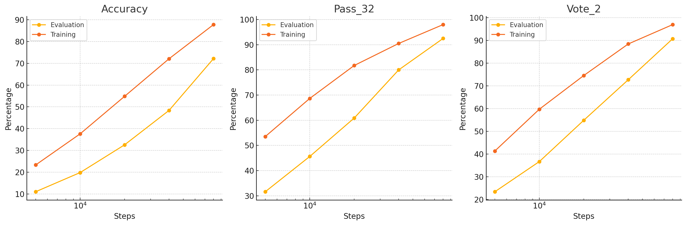
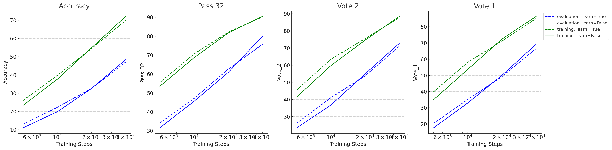

# Iteration 27. Fix data augmentation bug

_22-09-2024_

## Goal

Fix the data augmentation bug and see how the results improve after the fix.

## Motivation

On [Iteration 24: Overfit to the train set](Iteration_24_overfit_to_the_train_set.md) I discovered
that I was always swapping the train and test samples, thus I was never using the test samples for training.

This reduces the training data, thus it's very likely that after fixing the bug the resulting trained
models will be stronger.

I have also realized that this improvement is likely to be bigger in test-time fine-tuning because
we are training with n-1 samples per task. Losing one sample per task is more critical when the tasks
have less samples to learn from. So hopefully I will see a noticeable improvement on the accuracy of the
test-time fine-tuned model.

## Development

## Results

### Training results

I have repeated the experiments to overfit to the train set.

These results are much better after fixing the bug in data augmentation. It is likely that training for 200k steps would result in completely learning the training data.

### Test-time fine-tuning results

I have to repeat some test-time fine-tuning experiments and see if the validation score improves. This is the [baseline experiment](https://www.kaggle.com/code/ironbar/single-task-test-time-fine-tuning-for-arc24?scriptVersionId=196610194) and this is the [repetition after the bugfix](https://www.kaggle.com/code/ironbar/single-task-test-time-fine-tuning-for-arc24?scriptVersionId=197889382).

| bugfix | accuracy   | pass_64    | vote_2     |
|--------|------------|------------|------------|
| FALSE  | 12.50%     | **37.00%** | 21.9%      |
| TRUE   | **13.70%** | 35.50%     | **32.10%** |

We see an improvement in accuracy and a dramatic improvement in vote_2 metric. After the bugfix the drop
between pass_64 and vote_2 is very small.

### Submission results

| submission   | Single LB score | Ensemble LB score |
|--------------|-----------------|-------------------|
| with bug     | 21              | 33                |
| after bugfix | **25**          | **35**            |

Great improvement after fixing the bug on the submission, which uses test-time fine-tuning.
Those experiments were done with [v2-single-task-test-time-fine-tuning notebook](https://www.kaggle.com/code/ironbar/v2-single-task-test-time-fine-tuning-for-arc24?scriptVersionId=197730835).

Another experiment with [single-task-test-time-fine-tuning notebook](https://www.kaggle.com/code/ironbar/single-task-test-time-fine-tuning-for-arc24?scriptVersionId=198170314) improved the ensemble score
from 32 to 34.

### Overfit to train and learn the input distribution

All the curves have the same tendency, wether they were trained to learn the input distribution or not.
Thus this probes that we can learn the two tasks without any problem, even when the task losses are very different.

## Conclusion

After fixing the data augmentation bug I can completely learn the train dataset. I have also probed
that I can learn at the same time the input distribution and to solve ARC tasks.

Moreover I observed huge improvements in validation score when doing test-time fine-tuning.

On leaderboard we have seen improvements, but not as big as the seen on validation.

## Next steps

## TODO

- [x] Can I overfit to the train set and still learn the inputs distribution? Yes
- [x] Design an experiment to verify the improvement on test-time fine-tuning
- [x] Update with the results of the fine-tuned LoRA.
