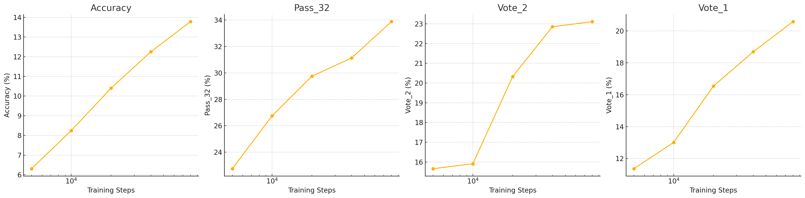

# Iteration 28. Optimal train duration and capacity

_22-09-2024_

## Goal

What is the optimal train duration and capacity to improve the validation score? And for the leaderboard score?

## Motivation

## Development

## Results

### Optimal train duration for full fine-tune

All metric improve when training for longer, we don't see signs of plateau on this experiment. Continual
training might be a good option for this challenge.

### Does LoRA achieve better generalization?

| experiment       | accuracy | pass_32 | vote_2 | vote_1 |
|------------------|----------|---------|--------|--------|
| full fine-tuning | 12.25%   | 31.13%  | 22.85% | 18.69% |
| LoRA 32          | 11.10%   | 30.25%  | 22.85% | 19.07% |
| LoRA 128         | 12.73%   | 32.25%  | 22.47% | 19.19% |

There is no evidence that full fine-tuning generalizes better than LoRA. 
Moreover considering that so far using a pretrained LoRA for TTFT gives better results it is likely that training a LoRA will give better results

## Conclusion

## Next steps

- Train new models for submission: full fine-tuning and also LoRA and compare the results on the LB

## TODO

- [x] Determine the optimal training steps for a full model fine-tune
- [x] Do the same for different LoRAs
- [ ] Does the optimal training steps double when also learning to predict input from inputs?
- [ ] Do the results hold for the leaderboard? How to account for the extra training data?
