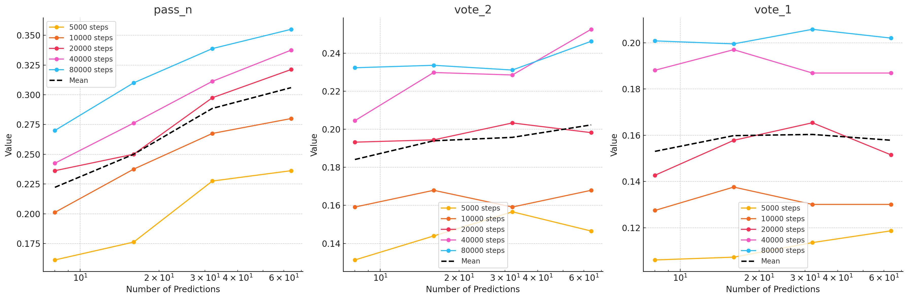

# Iteration n. Iteration_title

_24-09-2024_

## Goal

What is the optimal number of predictions in a submission?

## Motivation

If I can reduce the number of predictions I might increase the test-time fine-tuning duration.

## Development

The experiment is simple: I will take a few models and make inference with them with a different
number of predictions. Finally I will plot the accuracy vs the number of predictions.

## Results

The analysis of the data is not easy: for `pass_n` it is very clear that it increases when the number
of predictions increases. But for the other metrics is not clear, to try to ease the analysis I have plotted
the mean tendency line. For `vote_2` it seems that increasing the number of predictions is helpful, but for
`vote_1` we don't see improvements when increasing the number of predictions from 32 to 64.

TODO: we need to add more points to be able to take a conclusion

## Conclusion

## Next steps

- Early stopping on TTFT will also free time to extend the training duration
- It's likely that I can create more efficient training and inference scripts for submission, where I have
  to train and make inference with 100 models (instead of 1 that was the original use case)

## TODO

- [ ]
