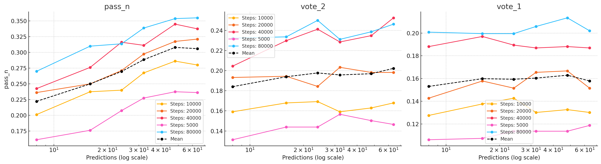
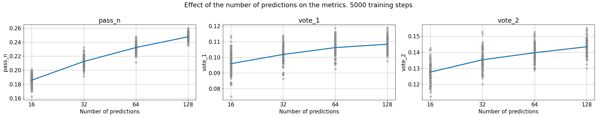
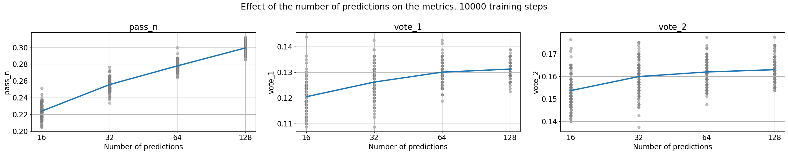
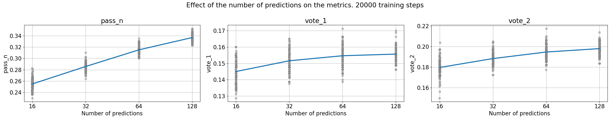
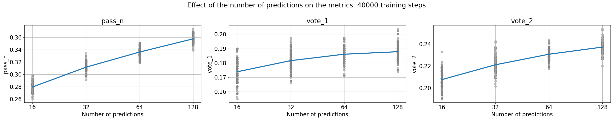
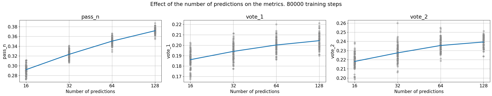

# Iteration 30. Optimal number of predictions

_24-09-2024_

## Goal

What is the optimal number of predictions in a submission?

## Motivation

If I can reduce the number of predictions I might increase the test-time fine-tuning duration.

## Development

The experiment is simple: I will take a few models and make inference with them with a different
number of predictions. Finally I will plot the accuracy vs the number of predictions.

## Results

### Experimental results

The analysis of the data is not easy: for `pass_n` it is very clear that it increases when the number
of predictions increases. But for the other metrics is not clear, it seems that increasing the number
of predictions has a positive effect, but it is small and the metrics are noisy.

The following table shows the number of predictions that got the best value for each metric.

| training steps | pass_n | vote_2 | vote_1 |
|----------------|--------|--------|--------|
| 5000           | 48     | 48     | 64     |
| 10000          | 48     | 24     | 24     |
| 20000          | 64     | 32     | 48     |
| 40000          | 48     | 64     | 16     |
| 80000          | 64     | 24     | 48     |

On `pass_n` it is clear that all the experiments get the best score on either 48 or 64 which are the
biggest number of predictions tested. But we see greater variance in the vote metrics. I believe we can
say that 8 predictions is not enough, but maybe 32 is enough and increasing the number of predictions
does not lead to higher accuracy.

Idea: we don't want to generalize, we want to maximize LB score. A smaller number of predictions will increase volatility and the chance of a lucky submission.

### Simulated results

I could take the results of all the previous experiments, and simulate new inferences by sampling. That way I could model the distribution of expected scores. Moreover I will have a total of 192 predictions, so I could extend the analysis to a higher number of predictions.

We see that on average increasing the number of predictions has a positive effect in all the metrics. It is unclear that using a smaller number of predictions can lead to better and lucky results.

## Conclusion

We have verified that increasing the number of predictions has a positive effect in all the relevant metrics. Thus reducing the number of predictions to increase the duration of test-time fine-tuning is a compromise that should be studied for each case.

## Next steps

- Early stopping on TTFT will also free time to extend the training duration
- It's likely that I can create more efficient training and inference scripts for submission, where I have
  to train and make inference with 100 models (instead of 1 that was the original use case)
