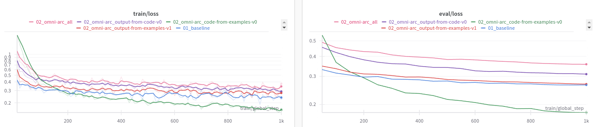

# Iteration 34. Developing Omni-ARC

_29-09-2024_

## Goal

Implement a first version of Omni-ARC and validate if the approach is promising:

- Can we improve the generalization of the current approach by learning to predict code to do the tasks? Similar to the improvement that we got when learning the inputs distribution.
- Can we use the predicted code to solve evaluation tasks?

## Motivation

## Development

### The right level of abstraction

With the right level of abstraction writing code to solve the training tasks is very easy and fast. I have implemented almost 100 training tasks in less than 2 days. Just with
very basic primitive functions like detect and draw objects is possible to solve a lot of tasks.

### Repeated or very similar tasks

On the training set I have detected some tasks that are exactly the same and other tasks
are just variations of the same task. Maybe the dataset is not as big as I thought.

### First version of Omni-ARC

I have implemented nearly 100 training tasks (25% of the tasks). I believe this is
enough to make a training and see the effect it has on the model.

### Local experiments

Let's make a quick training runs to verify that I can train using omni-arc dataset.

<details>
  <summary>Click to see bash commands</summary>

```bash
# baseline
python fine-tuning.py \
--model_path /home/gbarbadillo/data/Qwen2.5-0.5B \
--lora_r 32 \
--output_dir /mnt/hdd0/Kaggle/arc24/models/20241005_omni-arc/01_baseline \
--train_datasets /mnt/hdd0/Kaggle/arc24/data/new_partitions/train_rs7.json output-from-examples-v1 \
--val_dataset /mnt/hdd0/Kaggle/arc24/data/new_partitions/val_rs7.json output-from-examples-v1 \
--grid_encoder "GridShapeEncoder(RowNumberEncoder(MinimalGridEncoder()))" \
--max_steps 1000 \
--logging_steps 10 \
--random_seed 7 \
--batch_size 5 \
--learning_rate 4e-5 \
--verbose

# use omni-arc with output-from-examples-v1
python fine-tuning.py \
--model_path /home/gbarbadillo/data/Qwen2.5-0.5B \
--lora_r 32 \
--output_dir /mnt/hdd0/Kaggle/arc24/models/20241005_omni-arc/02_omni-arc_output-from-examples-v1 \
--train_datasets omni-arc-100 output-from-examples-v1 \
--val_dataset omni-arc-100 output-from-examples-v1 \
--grid_encoder "GridShapeEncoder(RowNumberEncoder(MinimalGridEncoder()))" \
--max_steps 1000 \
--logging_steps 10 \
--random_seed 7 \
--batch_size 5 \
--learning_rate 4e-5 \
--verbose

# code from examples
python fine-tuning.py \
--model_path /home/gbarbadillo/data/Qwen2.5-0.5B \
--lora_r 32 \
--output_dir /mnt/hdd0/Kaggle/arc24/models/20241005_omni-arc/02_omni-arc_code-from-examples-v0 \
--train_datasets omni-arc-100 code-from-examples-v0 \
--val_dataset omni-arc-100 code-from-examples-v0 \
--grid_encoder "GridShapeEncoder(RowNumberEncoder(MinimalGridEncoder()))" \
--max_steps 1000 \
--logging_steps 10 \
--random_seed 7 \
--batch_size 5 \
--learning_rate 4e-5 \
--verbose

# output from code
python fine-tuning.py \
--model_path /home/gbarbadillo/data/Qwen2.5-0.5B \
--lora_r 32 \
--output_dir /mnt/hdd0/Kaggle/arc24/models/20241005_omni-arc/02_omni-arc_output-from-code-v0 \
--train_datasets omni-arc-100 output-from-code-v0 \
--val_dataset omni-arc-100 output-from-code-v0 \
--grid_encoder "GridShapeEncoder(RowNumberEncoder(MinimalGridEncoder()))" \
--max_steps 1000 \
--logging_steps 10 \
--random_seed 7 \
--batch_size 5 \
--learning_rate 4e-5 \
--verbose

# all together
python fine-tuning.py \
--model_path /home/gbarbadillo/data/Qwen2.5-0.5B \
--lora_r 32 \
--output_dir /mnt/hdd0/Kaggle/arc24/models/20241005_omni-arc/02_omni-arc_all \
--train_datasets omni-arc-100 output-from-code-v0 \
--train_datasets omni-arc-100 code-from-examples-v0 \
--train_datasets omni-arc-100 output-from-examples-v1 \
--train_datasets omni-arc-100 input-from-inputs-v0 \
--val_dataset omni-arc-100 output-from-code-v0 \
--grid_encoder "GridShapeEncoder(RowNumberEncoder(MinimalGridEncoder()))" \
--max_steps 1000 \
--logging_steps 10 \
--random_seed 7 \
--batch_size 5 \
--learning_rate 4e-5 \
--verbose

# prompt refinement
python fine-tuning.py \
--model_path /home/gbarbadillo/data/Qwen2.5-0.5B \
--lora_r 32 \
--output_dir /mnt/hdd0/Kaggle/arc24/models/20241005_omni-arc/03_omni-arc_code-from-examples-v1 \
--train_datasets omni-arc-100 code-from-examples-v1 \
--val_dataset omni-arc-100 code-from-examples-v1 \
--grid_encoder "GridShapeEncoder(RowNumberEncoder(MinimalGridEncoder()))" \
--max_steps 10 \
--logging_steps 10 \
--random_seed 7 \
--batch_size 5 \
--learning_rate 4e-5 \
--verbose
```

</details>

### Experiment design

We have two dimensions to test:

1. Which tasks are useful?
2. How we should weight omni-arc dataset against all the other datasets?

The training duration should be increased proportionally to the new tasks.

The baseline has 1200 tasks.

## Results

### Local experiments training metrics



I have only trained for 1k steps. It seems that the difficulty from easier to harder is:

- code from examples
- output from examples
- output from code

Training speed was not affected by using omni-arc. In fact it was faster but this could be due to the tasks being smaller.

## Conclusion

## Next steps

## TODO

- [x] Implement first version of omni-arc
- [x] Add new prompt templates
- [x] Update fine-tuning script to support omni-arc dataset
- [x] Is training speed affected by using omni-arc? I believe generation is fast enough to be done real-time
- [x] Clone omni-arc repo in the cluster and add the path to the PYTHONPATH
- [ ] Refine the prompts using ChatGPT
- [ ] Experiment to see if learning 3 tasks is better than learning two tasks. The baseline learns output-from-examples and input-from-inputs, the new experiment also learns code-from-examples. 10k steps per task.
- [ ] Can we solve some of the evaluation tasks using generated code?
