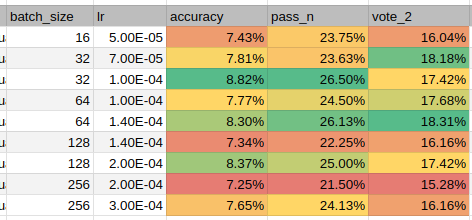

# Iteration 35. Optimize batch size

_07-10-2024_

## Goal

Can I train faster if I optimize the batch size?

## Motivation

So far I have mainly trained using a batch size of 16. However when learning 3 tasks I have observed
sudden spikes in the training loss. This might be caused by the "small" batch size.

In this experiment I'm going to increase the batch size and see how the training and validation metrics
are affected.

Since all the tasks are supposed to be independent and different (I already know that this is not true and are repeated
tasks on the training dataset), increasing the batch size might help to learn better.

## Development

## Results

All experiments were done with LoRA rank 128. The only change was the batch size and learning rate, the number
of training steps was adjusted to the batch size so all the trainings used the same number of samples.

The results show that we can get the same or better results when increasing the batch size over the
default 16.

## Conclusion

We can increase the batch size and get same or better results. Thus when training omni-arc on multiple
tasks it might be worth to use a bigger batch size.

## Next steps

## TODO

- [ ]
