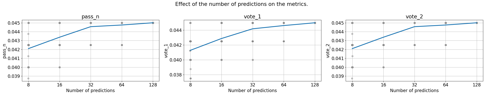

# Iteration 36. Solving evaluation tasks with code

_09-10-2024_

## Goal

Can we solve the evaluation tasks by predicting code that implements the tasks?

## Motivation

On [Iteration 34](Iteration_34_developing_omni_arc.md) I trained models on omni-arc tasks. It was unclear
if the approach of `output-from-examples` benefited from training the model to do multiple tasks.

However if I can predict python code that could be game-changer because I can verify the python
code with the train samples.

## Development

First models were trained with 100 training tasks, second model with close to 150. Coverage of the
training dataset is important because it's likely correlated with coverage of the evaluation and test dataset.

### First steps with inference

<details>
  <summary>Click to see bash commands</summary>

```bash
# baseline
python inference.py \
--model_path  /mnt/hdd0/Kaggle/arc24/models/20241006_omniarc_validation/02_omni-arc-400-code-from-examples-Qwen2.5-0.5B-Instruct_lr5e-5_14000steps_2gpus_8192msl/checkpoint-14000 \
--prompt_version code-from-examples-v0 \
--dataset_path /mnt/hdd0/Kaggle/arc24/data/arc-agi_evaluation_challenges.json \
--predictions_per_task 8 \
--output_filepath /mnt/hdd0/Kaggle/arc24/debug/first_predictions/checkpoint-14000/inference_evaluation_x008.json \
--verbose

python inference.py \
--model_path  /mnt/hdd0/Kaggle/arc24/models/20241006_omniarc_validation/02_omni-arc-400-code-from-examples-Qwen2.5-0.5B-Instruct_lr5e-5_14000steps_2gpus_8192msl/checkpoint-14000 \
--prompt_version code-from-examples-v0 \
--dataset_path /mnt/hdd0/Kaggle/arc24/data/arc-agi_evaluation_challenges.json \
--predictions_per_task 32 \
--output_filepath /mnt/hdd0/Kaggle/arc24/debug/first_predictions/checkpoint-14000/inference_evaluation_x032.json

python merge_lora.py --base_model_path /home/gbarbadillo/data/Qwen2.5-0.5B-Instruct --lora_path /mnt/hdd0/MEGA/projects/temp/20241006_omniarc_validation/05_omni-arc-400-code-from-examples-v1-Qwen2.5-0.5B-Instruct_lora128_lr1e-4_bs32_7000steps_2gpus_8192msl/checkpoint-7000 --output_path /home/gbarbadillo/data/Qwen2.5-0.5B-Instruct-omni-arc

python inference.py \
--model_path  /home/gbarbadillo/data/Qwen2.5-0.5B-Instruct-omni-arc \
--prompt_version code-from-examples-v1 \
--dataset_path /mnt/hdd0/Kaggle/arc24/data/arc-agi_evaluation_challenges.json \
--predictions_per_task 8 \
--output_filepath /mnt/hdd0/Kaggle/arc24/debug/second_model/checkpoint-7000/inference_evaluation_x008.json \
--verbose

python inference.py \
--model_path  /home/gbarbadillo/data/Qwen2.5-0.5B-Instruct-omni-arc \
--prompt_version code-from-examples-v1 \
--dataset_path /mnt/hdd0/Kaggle/arc24/data/arc-agi_evaluation_challenges.json \
--predictions_per_task 32 \
--output_filepath /mnt/hdd0/Kaggle/arc24/debug/second_model/checkpoint-7000/inference_evaluation_x032.json

python inference.py \
--model_path  /home/gbarbadillo/data/Qwen2.5-0.5B-Instruct-omni-arc \
--prompt_version code-from-examples-v1 \
--dataset_path /mnt/hdd0/Kaggle/arc24/data/arc-agi_evaluation_challenges.json \
--predictions_per_task 32 \
--temperature 0.5 \
--output_filepath /mnt/hdd0/Kaggle/arc24/debug/second_model/checkpoint-7000/inference_evaluation_x032_t5e-1.json

python inference.py \
--model_path  /home/gbarbadillo/data/Qwen2.5-0.5B-Instruct-omni-arc \
--prompt_version code-from-examples-v1 \
--dataset_path /mnt/hdd0/Kaggle/arc24/data/arc-agi_evaluation_challenges.json \
--predictions_per_task 32 \
--temperature 0.7 \
--output_filepath /mnt/hdd0/Kaggle/arc24/debug/second_model/checkpoint-7000/inference_evaluation_x032_t7e-1.json

python inference.py \
--model_path  /home/gbarbadillo/data/Qwen2.5-0.5B-Instruct-omni-arc \
--prompt_version code-from-examples-v1 \
--dataset_path /mnt/hdd0/Kaggle/arc24/data/arc-agi_evaluation_challenges.json \
--predictions_per_task 32 \
--temperature 0.9 \
--output_filepath /mnt/hdd0/Kaggle/arc24/debug/second_model/checkpoint-7000/inference_evaluation_x032_t9e-1.json

python inference.py \
--model_path  /home/gbarbadillo/data/Qwen2.5-0.5B-Instruct-omni-arc \
--prompt_version code-from-examples-v1 \
--dataset_path /mnt/hdd0/Kaggle/arc24/data/arc-agi_evaluation_challenges.json \
--predictions_per_task 32 \
--temperature 1 \
--output_filepath /mnt/hdd0/Kaggle/arc24/debug/second_model/checkpoint-7000/inference_evaluation_x032_t1.json

python inference.py \
--model_path  /home/gbarbadillo/data/Qwen2.5-0.5B-Instruct-omni-arc \
--prompt_version code-from-examples-v1 \
--dataset_path /mnt/hdd0/Kaggle/arc24/data/arc-agi_evaluation_challenges.json \
--predictions_per_task 128 \
--temperature 0.7 \
--output_filepath /mnt/hdd0/Kaggle/arc24/debug/second_model/checkpoint-7000/inference_evaluation_x128_t7e-1.json


python inference.py \
--model_path  /mnt/hdd0/MEGA/projects/temp/20241006_omniarc_validation/03_omni-arc-800-all-code-Qwen2.5-0.5B-Instruct_lr5e-5_26000steps_2gpus_8192msl/checkpoint-26000 \
--prompt_version code-from-examples-v0 \
--dataset_path /mnt/hdd0/Kaggle/arc24/data/arc-agi_evaluation_challenges.json \
--predictions_per_task 8 \
--temperature 0.7 \
--output_filepath /mnt/hdd0/Kaggle/arc24/debug/third_model/checkpoint-26000/inference_evaluation_x008_t7e-1.json

```

</details>

The model is generating valid python code, I have to improve the inference script to check that the
code is correct and create the output. Add timeouts for safety.

## Results

### Preliminary results

I solve 4% of the tasks from the evaluation dataset. All predictions seem to be correct because they
are validated against the train dataset. When using temperature 0 there does not seem to be any favorable scaling law.

Made up to 132 predictions, but the accuracy improves very slowly. The output from examples approach
had a very different dynamic.

| model | accuracy | pass_n | vote_1 | unanswered |
|-------|----------|--------|--------|------------|
| 1     | 2.41%    | 3.75%  | 3.75%  | 97.59%     |
| 2     | 3.00%    | 4.00%  | 4.00%  | 96.94%     |
| 3     | 2.98%    | 4.75%  | 4.75%  | 97.02%     |

On the best case we are able to solve close to 5% of the evaluation tasks.
The most relevant aspect is that all the predictions are correct.

### Token distribution of omni-arc code


We can see that the code is much smaller than predicting the whole grid which can have up to 1000 tokens,
but the code is 200 tokens at maximum, 5 times smaller.

### How does the method scale with the number of predictions?



This first models do not scale well with the number of predictions, the improvement is very slow.

As a reference we can compare it to a experiment from [Iteration 30](Iteration_30_optimal_number_predictions.md)


My hypothesis is that the dataset is small and the model has not learned correctly yet.

### First submissions

I have made a first submission with model: `20241006_omniarc_validation/05_omni-arc-400-code-from-examples-v1-Qwen2.5-0.5B-Instruct_lora128_lr1e-4_bs32_7000steps_2gpus_8192msl/checkpoint-7000` and it solved 1 of the private test set tasks. It's a humble beginning, but if I can make it work this could be game-changing.

I have also tried using test-time fine-tuning but then it did not solve any of the tasks.

## Conclusion

We have been able to solve new tasks by generating python code. The first evaluation solves close to 5% of the
evaluation tasks. The most relevant thing is that all the predictions are either correct or empty. Thus
this approach is very good for ensembling.

## Next steps

- [ ] If the code approach does not pay off, we could try to train a model to verify the solutions. Given two solutions to the problem select the correct one.

## TODO

- [x] How to execute the code safely and with timeouts? Check AIMO competition. This should be added
  to the omni-arc repo, because all the dsl functions are there.
- [x] How does the method scale with compute? Validation should allow to scale well.
- [x] Verify that everything is working fine by looking at the predictions. -> It is working fine, but the model is pretty bad at guessing the transformation. Probably more variability at the inputs is needed.
- [x] What is the token distribution of the functions that implement the training tasks?
- [x] Fix problems with evaluation metrics
- [x] Fix problem with inference returning an error code
