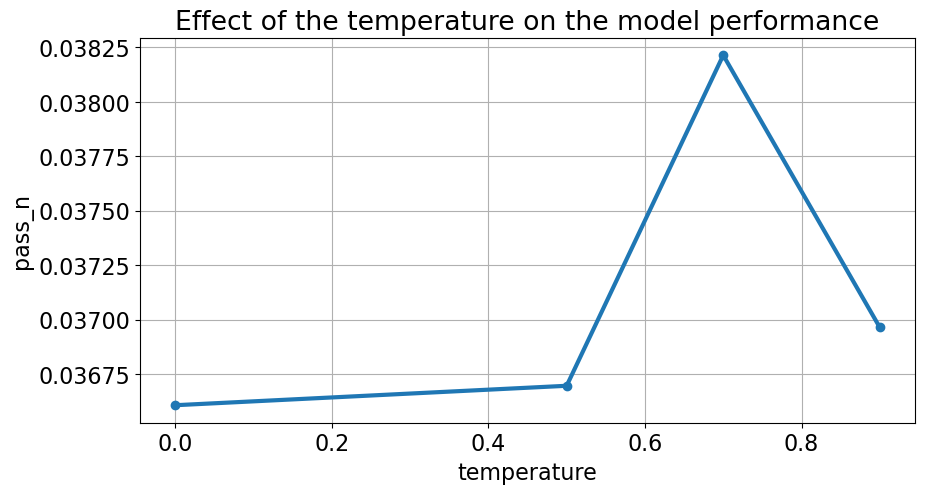

# Iteration 37. Optimize code generation

_10-10-2024_

## Goal

We have verified that we can can solve ARC tasks by generating python code. Let's try to understand the
dynamics of this new training and optimize the hyperparameters.

## Motivation

Solving tasks with code works, but can I optimize and improve the accuracy of the model?

## Development

## Results

### How does the training steps affect the accuracy?

### Is it helpful to learn to do other tasks?

### Is it helpful to use a temperature different than 0?

There is great uncertainty in the results, so the best way to study the tendency is to compute the
mean value for all the experiments.

The improvement is not huge, but we get better results on average when using a temperature of 0.7

## Conclusion

## Next steps

- Try with bigger models. If test-time fine-tuning is not necessary we might benefit from using bigger or coding models. F.e.
  - https://huggingface.co/Qwen/Qwen2.5-Coder-1.5B-Instruct
  - https://huggingface.co/Qwen/Qwen2.5-Coder-7B-Instruct
- Improve the omni-arc dataset:
  - Add more tasks to increase coverage
  - Add more training inputs to have more variability (can I reuse re-arc for this?)
  - Add task variations
  - Add task to learn to use the primitives

## TODO

- [ ] How does the training steps affect the accuracy? -> Run trainings with different training lenght, just using code data
- [ ] What is the best prompt? Is there any difference?
- [ ] Is it helpful to learn to do other tasks?
- [ ] Do the results improve if we do test-time fine-tuning?
- [ ] What if I train on omniarc just on the default task?
