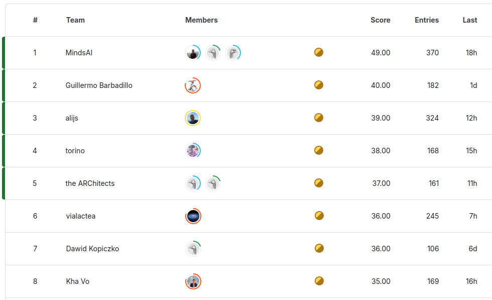
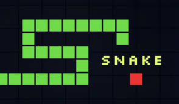

# Iteration 41. Next steps

_13-10-2024_

## Goal

There is less than one month until the end of the competition and the teams are improving their leaderboard
scores. I need to think ideas and prioritize them.

## Ideas

These are the most promising ideas, I present them from the most promising to the least. I believe I can
try them all, but I should focus on OmniARC.

### Improve OmniARC, more and better data for training

There is a lot of room to improve the Omni-ARC dataset:

- Add more tasks to increase coverage
- Add more training inputs to have more variability (can I reuse re-arc for this?)
- Add task variations
- Add task to learn to use the primitives

This path is not very funny, I just have to implement new code and do it with high quality. But it is
very likely to pay off.

### Train a verifier

Voting is a good way to select between the predicted grids, but it is not perfect. It is possible
that I might train the LLM to select the correct output, an additional task where the model just
needs to choose between two possible output grids.

I would have to create a dataset to do this. Probably the best way is to use the submission models,
that have been trained on all the data and maybe increase the temperature to induce errors in the
prediction.

Benefits of this approach:

- If it works well I could use the verifier to create a better ensemble, by selecting the most promising candidates
- The data can be generated entirely automatically
- Predictions should be fast because the model only has to predict one token

One good thing of this approach i

### Find another source of data, such as a video game (Atari)? 30x30 pixels

Training a model to predict future frames given the past frames and some actions could induce some
prior knowledge about objects, movements... into the LLM.

I need to find games that can be represented on a image of 30x30 pixels or less, and with just 10 colors.

This approach is interesting because I don't need to create the data myself just like in the OmniARC approach.

For example the Snake game could fit the requirements.

### Revisit SmolLM and how to train it for long context

It might be possible that we more effort I can make SmolLM models work with bigger context window. Or
`AMD-Llama-135m`. I could make experiments with a synthetic task that requires the longer context window
to be solved.

A smaller model could allow for faster training and inference, which can be very helpful for the Kaggle submission.
