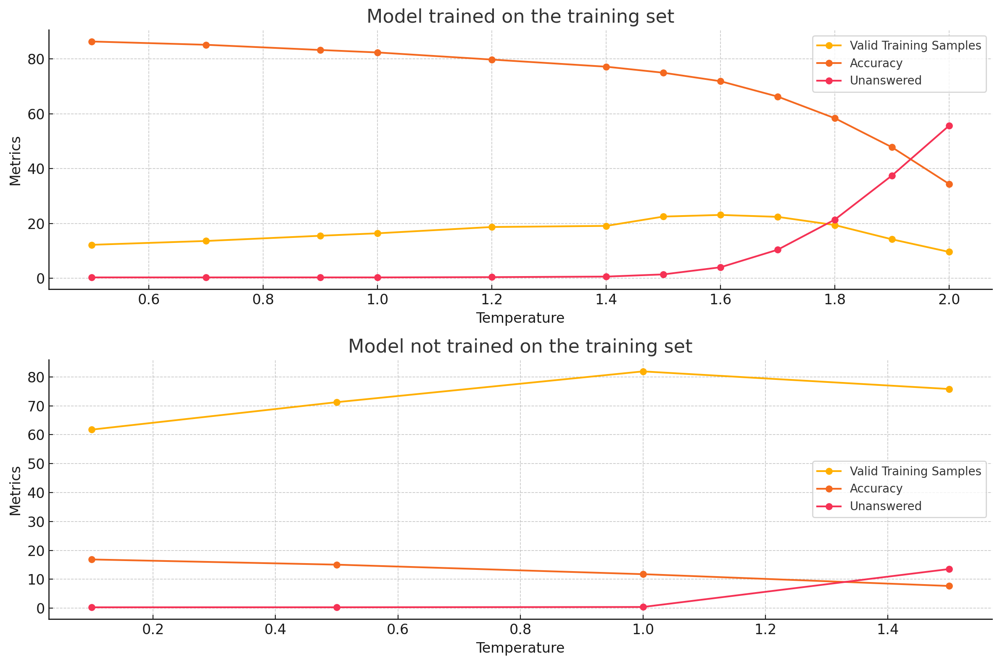
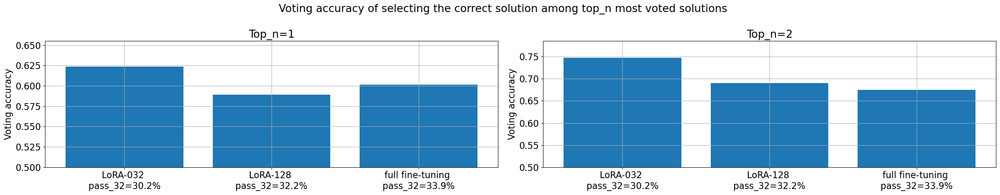

# Iteration 43. Train a verifier

_21-10-2024_

## Goal

Can we improve the LB score by better selecting the predictions?

## Motivation

Currently I use voting to select the predictions of the model for the submission. On [Iteration 9](Iteration_09_improve_inference.md) we saw that voting can select the
best answer with an accuracy of 30-50%.

If we can use a model to improve the answer selection there could be a lot of room
for improvement, in the best case we might triple the score! (it's not going to happen)

The idea is to train a model that is able to select between two possible answers
for a task. Instead of predicting the whole answer it just has to select the correct one.

## Development

### Dataset design

Original tasks have the following format:

```yaml
train: [{input:, output:}, .., {input:, output:}]
test: [{input:, output:}, .., {input:, output:}]
```

I have reviewed the data augmentation code and it is applied to any field for each sample, so I could
add additional fields to `input` and `output` and they will also be data augmented. For example I could
add `attempt_1`, `attempt_2` and so on.

Then at training I should select:

1. Which would be the test sample
2. Which prediction will be used for training

### Local run to verify that it is working

<details>
  <summary>Click to see bash commands</summary>

```bash
python fine-tuning.py \
--model_path /home/gbarbadillo/data/Qwen2.5-0.5B \
--device_map None \
--lora_r 128 \
--output_dir /mnt/hdd0/Kaggle/arc24/models/20241023_debug_verifier/01_baseline \
--train_datasets /mnt/hdd0/Kaggle/arc24/data/verifier/training_v0.json select-output-from-examples-v0 \
--val_dataset /mnt/hdd0/Kaggle/arc24/data/new_partitions/smaller_5_tasks.json output-from-examples-v1 \
--grid_encoder "GridShapeEncoder(RowNumberEncoder(MinimalGridEncoder()))" \
--max_steps 10 \
--logging_steps 10 \
--eval_steps 200 \
--batch_size 16 \
--learning_rate 1e-4 \
--max_seq_len 4096 \
--no-resume_from_checkpoint \
--verbose
```

</details>

### Experiment design

We need to train a verifier an check if it allows to improve the accuracy of the prediction selection.
Later on following iterations we could optimize the training.

I believe the experiment that is most likely to succeed is to use a LoRA that has been already fine-tuned
on ARC tasks and fine-tune again for output selection. I could run a few trainings with different durations.

F.e. the model `20240921_optimal_train_duration/05_LoRA-032-Qwen2-0.5B-Instruct_lr1e-4_4e4steps_2gpus_8192msl/checkpoint-40000` could be
a good candidate.

### Prediction ranking

What is the best ranking system to find the top k players among a group of n players?

This are the requirements:

- The matches are 1vs1
- The system should be as efficient as possible, it should work with the minimun number of matches
- The system should be robust to unexpected results, there is some randomness in the results of the matches
- Ideally the system will allocate the matches to extract the most information from the result
- There could be some level of uncertainty in the results that should decrease if the budget for the number of matches increases

Some options:

#### Trueskill

- <https://trueskill.org/>
- <https://www.microsoft.com/en-us/research/project/trueskill-ranking-system/>
- <https://en.wikipedia.org/wiki/TrueSkill>
- <https://stackoverflow.com/questions/15054004/trueskill-matchmaking-implementation>

> Player ranks are displayed as the conservative estimate of their skill, `R=\mu -3\times \sigma`. This is conservative, because the system is 99% sure that the player's skill is actually higher than what is displayed as their rank.

#### Swiss-system tournament

- <https://en.wikipedia.org/wiki/Swiss-system_tournament>

> A Swiss-system tournament is a non-eliminating tournament format that features a fixed number of rounds of competition, but considerably fewer than for a round-robin tournament; thus each competitor (team or individual) does not play all the other competitors. Competitors meet one-on-one in each round and are paired using a set of rules designed to ensure that each competitor plays opponents with a similar running score, but does not play the same opponent more than once. The winner is the competitor with the highest aggregate points earned in all rounds. With an even number of participants, all competitors play in each round.

<!--- --->

> The Swiss system seeks to provide a clear winner with a large number of competitors and a relatively small number of rounds of competition, without a single bad result terminating participation. In a Swiss system the match pairing for each round is done after the previous round has ended and depends on its results.

<!--- --->

> Assuming no drawn games, determining a clear winner (and, incidentally, a clear loser) would require the same number of **rounds** as that of a knockout tournament, which is the binary logarithm of the number of players rounded up.

Notice that it requires the same number of rounds, but the number of matches will be higher because it is constant throughout the rounds compared to teh knockout tournament.

> Another advantage compared to knockout tournaments is that the final ranking gives some indication of the relative strengths of all contestants, not just of the tournament winner.

#### Round-robin tournament

<https://en.wikipedia.org/wiki/Round-robin_tournament>

> A round-robin tournament or all-play-all tournament is a competition format in which each contestant meets every other participant, usually in turn.

<!--- --->

> In theory, a round-robin tournament is the fairest way to determine the champion from among a known and fixed number of contestants. Each contestant, whether player or team, has equal chances against all other opponents because there is no prior seeding of contestants that will preclude a match between any given pair. The element of luck is seen to be reduced as compared to a knockout system since one or two bad performances need not ruin a competitor's chance of ultimate victory. Final records of participants are more accurate, in the sense that they represent the results over a longer period against the same opposition.

<!--- --->

> Round-robins can suffer from being too long compared to other tournament types, and with later scheduled games potentially not having any substantial meaning. They may also require tie-breaking procedures.

## Results

### Generating wrong predictions

It is surprisingly difficult to generate wrong predictions for the training dataset. That is why
I'm going to train new models that do not use the training dataset for training. We can modify
the temperature of the inference to force the errors, but it also increases the number of non valid predictions.



### Accuracy of voting



For these models voting is able to select the best response in the first position around 60% of the times, and around 70% in the top two positions.

## Conclusion

## Next steps

## TODO

- [ ] Maybe I can force VLLM to generate different predictions for the same prompt?
- [ ] Train a model without the train dataset to generate wrong predictions
- [x] Create a dataset that can be used to train a verifier.
  - [x] How do the wrong answers look like?
  - [x] It has to be of the train dataset, so I can measure the improvement on the evaluation set.
- [x] Create prompts to select between answers
- [x] How to integrate this new task into the training script?
  - [x] How should I format the dataset?
  - [x] How to apply data augmentation?
  - [x] ~Add support for task augmentation~ Currently is only applied to input or output, so it would not work with a new key
- [x] Train a model to select answers
- [ ] What is the best way to use the model? There might be some compute intensive way and a faster and approximate one
- [ ] Measure the improvement over voting
- [ ] Can I train a single model to do all the tasks?
- [ ] What if instead of choosing two options I just request the model to answer if the proposed output is correct or not?
  That would simplify the post-processing a lot.