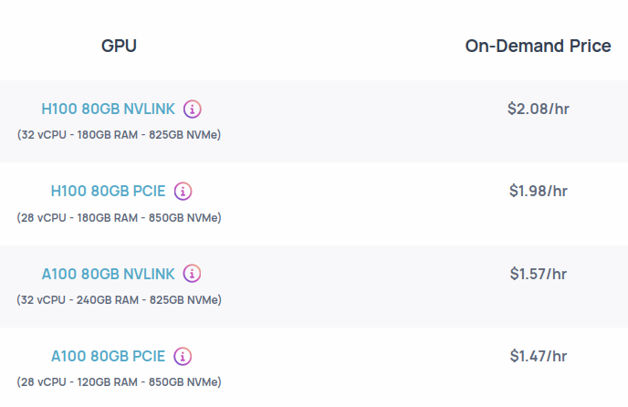

# Iteration 44. Learn to use Strong Compute

_22-10-2024_

## Goal

Learn to use the Strong Compute cluster.

## Motivation

[Strong compute](https://strongcompute.com/) has graciously granted me with compute credits to speedup my development in the
last weeks of the challenge. That means I will have access to GPUs with 80GBs of memory and I could
train much faster than with the [Veridas](https://veridas.com/en/) cluster.

## Development

- [Strong compute documentation](https://strong-compute.gitbook.io/developer-docs)
- [ISC demos repo](https://github.com/StrongResearch/isc-demos)

### Quick guide to connect to Strong compute

1. Go to [Strong compute control panel](https://cp.strongcompute.ai/user/credentials) and start a workstation.
1. Start the vpn with `sudo wg-quick up wg0`
1. Connect to the workstation using vscode
1. After all the work has been done disconnect the vpn `sudo wg-quick down wg0`
1. And stop the workstation

### Creating a python environment for the experiments

I already have the requirements on `requirements.txt` file, so I just have to clone the repo into
the workstation.

To do so I have created an ssh key doing `ssh-keygen` on the workstation and added the public key to github.

```bash
cd ~/code/arc24
python3 -m virtualenv ~/envs/arc24
source ~/envs/arc24/bin/activate
pip install -r requirements.txt
pip install flash-attn --no-build-isolation
```

### First training

```job.isc
isc_project_id = "46f4672b-2489-457f-b302-eab855b36b70"
experiment_name = "first_arc24_training"
gpu_type = "24GB VRAM GPU"
gpus = 8
compute_mode = "burst"
output_path = "~/outputs/first_arc24_training"
command = "source ~/envs/arc24/bin/activate && cd ~/code/arc24/scripts && ~/jobs/job.sh"
burst_shape_priority_list = ["oblivus-mon1-h100n"]
```

### Initial idea

- Since my datasets are small I believe I can work on the root folder.
- They have said that it only has sense to use GPUs in multiples of 8.
- H100 is [newer and faster than a100](https://gcore.com/blog/nvidia-h100-a100/)

### H100 vs A100

https://oblivus.com/pricing/



The Nvlink machines are slightly more expensive than the pcie. For multi-gpu training it should be
faster so probably it's better to just avoid using the PCIE machines.

The H100 is more expensive than the A100, we have to see if the speedup is worth it.

## Results

First training with 8xA100 is 5x times faster than using 2xA6000.

## Conclusion

## Next steps

## TODO

- [ ] Create a python environment for the experiments
- [ ] Copy the data and code to the ISC (instant super computer)
- [ ] Train a submission model with strong compute
- [ ] How much faster can I train?
- [ ] Differences between A100 and H100
- [ ] https://huggingface.co/docs/accelerate/en/usage_guides/low_precision_training On H100
- [ ] Multi-line submit files TOML https://toml.io/en/