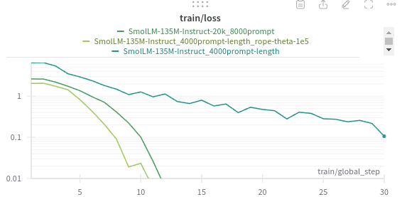
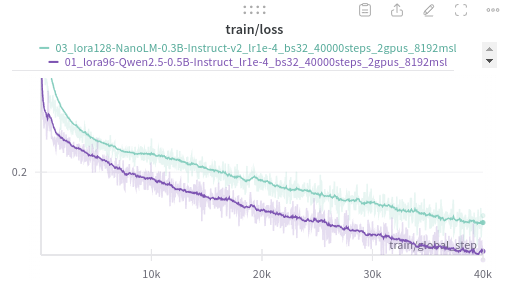
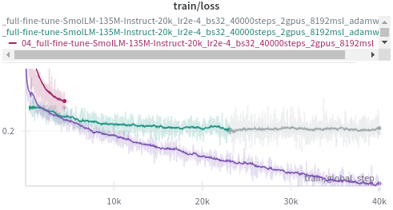
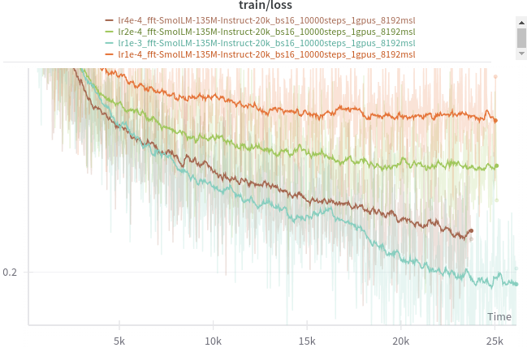

# Iteration 46. Revisit small LLMs

_28-10-2024_

## Goal

Can I train a smaller LLM than Qwen2.5-0.5B to achieve the same accuracy?

## Motivation

I don't have too many ideas that can be implemented in 2 weeks. If I can train a smaller model than
then 0.5B Qwen then I could do a longer test-time fine-tuning during the submission or do more
inference steps. That could translate to higher LB scores.

I encountered two problems on past iterations:

1. Small models typically have a context length of 2k or less
2. Some models don't even have a chat template

## Development

### Available options

It's quite difficult to search for an LLM with a certain configuration. I have found a [leaderboard](https://huggingface.co/datasets/open-llm-leaderboard/contents/viewer/default/train?sort%5Bcolumn%5D=%23Params+%28B%29&sort%5Bdirection%5D=asc&row=512)
that allows to sort by the number of parameters. I have also found [awesome-mobile-llm](https://github.com/stevelaskaridis/awesome-mobile-llm).

| model                                                                                           | parameters (M) | max_position_embeddings | rope_theta | attention heads | has chat-template? |
|-------------------------------------------------------------------------------------------------|----------------|-------------------------|------------|-----------------|--------------------|
| [AMD-Llama-135m](https://huggingface.co/amd/AMD-Llama-135m)                                     | 135            | 2048                    | 1.00E+04   | 12              | FALSE              |
| [HuggingFaceTB/SmolLM-135M-Instruct](https://huggingface.co/HuggingFaceTB/SmolLM-135M-Instruct) | 135            | 2048                    | 1.00E+04   | 9               | TRUE               |
| [TinyMistral-248M-Instruct](https://huggingface.co/Locutusque/TinyMistral-248M-Instruct)        | 248            | 32768                   | 1.00E+04   | 32              | FALSE              |
| [OpenELM-270M](https://huggingface.co/apple/OpenELM-270M)                                       | 270            | 2048                    | -          | ?               | FALSE              |
| [Mxode/NanoLM-0.3B-Instruct-v2](https://huggingface.co/Mxode/NanoLM-0.3B-Instruct-v2)           | 365            | 131072                  | 1.00E+06   | 14              | TRUE               |
| [Qwen2.5-0.5B-Instruct](https://huggingface.co/Qwen/Qwen2.5-0.5B-Instruct)                      | 500            | 32768                   | 1.00E+06   | 14              | TRUE               |

The SmolLM model has an uneven number of attention heads and VLLM does not support model parallel in that case. However
I might not need to use 2 GPUs for such an small model.

### Adding a chat template

I have noticed that Qwen has the chat template in the [tokenizer_config.json](https://huggingface.co/Qwen/Qwen2.5-0.5B-Instruct/blob/main/tokenizer_config.json#L198).

It seems that I can simply copy it and assign to the AMD-Llama-135m model. [How do I create a chat template?](https://huggingface.co/docs/transformers/main/en/chat_templating#how-do-i-create-a-chat-template)

#### Problems when adding the chat template

Despite the code being very simple, I get a weird error with the collator. It does not find the keys, although they
are in the text.

```
  warnings.warn(
/home/gbarbadillo/miniconda3/envs/arc/lib/python3.10/site-packages/trl/trainer/utils.py:198: UserWarning: Could not find instruction key `<|im_start|>user` in the following instance: <s> <|im_start|>system
You are a helpful assistant.<|im_end|>
<|im_start|>user
Let's see if you can solve this simple Abstraction and Reasoning Challenge (ARC) task.
Below there are some input-output grid examples that define the task.
...
...
<|im_end|>
 This instance will be ignored in loss calculation. Note, if this happens often, consider increasing the `max_seq_length`.
  warnings.warn(
```

### Local trainings to verify I can train the small models

<details>
  <summary>Click to see bash commands</summary>

```bash
python fine-tuning.py \
--model_path /home/gbarbadillo/data/Qwen2.5-0.5B-Instruct \
--output_dir /mnt/hdd0/Kaggle/arc24/models/20241028_debug_small_LLMs/01_Qwen2.5-0.5B-Instruct \
--train_datasets /mnt/hdd0/Kaggle/arc24/data/arc-agi_training_challenges.json output-from-examples-v1 \
--val_dataset /mnt/hdd0/Kaggle/arc24/data/arc-agi_evaluation_challenges.json output-from-examples-v1 \
--grid_encoder "GridShapeEncoder(RowNumberEncoder(MinimalGridEncoder()))" \
--device_map None \
--lora_r 32 \
--max_steps 10 \
--logging_steps 1 \
--eval_steps 200 \
--batch_size 16 \
--learning_rate 1e-4 \
--max_seq_len 4096 \
--no-resume_from_checkpoint \
--random_seed 7 \
--verbose

python fine-tuning.py \
--model_path /home/gbarbadillo/data/NanoLM-0.3B-Instruct-v2 \
--output_dir /mnt/hdd0/Kaggle/arc24/models/20241028_debug_small_LLMs/02_NanoLM-0.3B-Instruct-v2 \
--train_datasets /mnt/hdd0/Kaggle/arc24/data/arc-agi_training_challenges.json output-from-examples-v1 \
--val_dataset /mnt/hdd0/Kaggle/arc24/data/arc-agi_evaluation_challenges.json output-from-examples-v1 \
--grid_encoder "GridShapeEncoder(RowNumberEncoder(MinimalGridEncoder()))" \
--device_map None \
--lora_r 32 \
--max_steps 10 \
--logging_steps 1 \
--eval_steps 200 \
--batch_size 16 \
--learning_rate 1e-4 \
--max_seq_len 4096 \
--no-resume_from_checkpoint \
--random_seed 7 \
--verbose

python fine-tuning.py \
--model_path /home/gbarbadillo/data/SmolLM-135M-Instruct \
--output_dir /mnt/hdd0/Kaggle/arc24/models/20241028_debug_small_LLMs/03_SmolLM-135M-Instruct \
--train_datasets /mnt/hdd0/Kaggle/arc24/data/arc-agi_training_challenges.json output-from-examples-v1 \
--val_dataset /mnt/hdd0/Kaggle/arc24/data/arc-agi_evaluation_challenges.json output-from-examples-v1 \
--grid_encoder "GridShapeEncoder(RowNumberEncoder(MinimalGridEncoder()))" \
--device_map None \
--lora_r 32 \
--max_steps 10 \
--logging_steps 1 \
--eval_steps 200 \
--batch_size 16 \
--learning_rate 1e-4 \
--max_seq_len 4096 \
--no-resume_from_checkpoint \
--random_seed 7 \
--verbose

python fine-tuning.py \
--model_path /home/gbarbadillo/data/AMD-Llama-135m \
--output_dir /mnt/hdd0/Kaggle/arc24/models/20241028_debug_small_LLMs/04_AMD-Llama-135m \
--train_datasets /mnt/hdd0/Kaggle/arc24/data/arc-agi_training_challenges.json output-from-examples-v1 \
--val_dataset /mnt/hdd0/Kaggle/arc24/data/arc-agi_evaluation_challenges.json output-from-examples-v1 \
--grid_encoder "GridShapeEncoder(RowNumberEncoder(MinimalGridEncoder()))" \
--device_map None \
--lora_r 32 \
--max_steps 1 \
--logging_steps 1 \
--eval_steps 200 \
--batch_size 16 \
--learning_rate 1e-4 \
--max_seq_len 1024 \
--no-resume_from_checkpoint \
--random_seed 7 \
--remove_train_samples_to_fit_max_seq_len \
--verbose

```

</details>

### Debug long context fine-tuning

I'm going to create a temporal fine-tuning script to validate the idea of long context fine-tuning.

The idea is to try with synthetic questions and responses that cannot be answered if not using a big
enough context. If the model has a big enough context answering the questions is trivial. That should
be a very clear test to see if the context window of the model has been extended.

<details>
  <summary>Click to see bash commands</summary>

```bash
export model=Qwen2.5-0.5B-Instruct
export prompt_tokens_target=4000

export model=SmolLM-135M-Instruct
export prompt_tokens_target=4000
python long-context-fine-tuning.py \
--prompt_tokens_target ${prompt_tokens_target} \
--model_path /home/gbarbadillo/data/${model} \
--output_dir /mnt/hdd0/Kaggle/arc24/models/20241029_debug_long_context/${model}_${prompt_tokens_target}prompt-length \
--max_steps 30 \
--max_seq_len 4096

export model=SmolLM-135M-Instruct
export prompt_tokens_target=8000
python long-context-fine-tuning.py \
--prompt_tokens_target ${prompt_tokens_target} \
--model_path /home/gbarbadillo/data/${model} \
--output_dir /mnt/hdd0/Kaggle/arc24/models/20241029_debug_long_context/${model}_${prompt_tokens_target}prompt-length_rope-theta-1e5 \
--max_steps 30 \
--max_seq_len 8096

export model=SmolLM-135M-Instruct-20k
export prompt_tokens_target=8000
python long-context-fine-tuning.py \
--prompt_tokens_target ${prompt_tokens_target} \
--model_path /home/gbarbadillo/data/${model} \
--output_dir /mnt/hdd0/Kaggle/arc24/models/20241029_debug_long_context/${model}_${prompt_tokens_target}prompt \
--max_steps 30 \
--max_seq_len 8096
```

</details>

> Token indices sequence length is longer than the specified maximum sequence length for this model (2511 > 2048). Running this sequence through the model will result in indexing errors

TODO: I have proben that by changing rope_theta from 1e4 to 1e5 the model can work with inputs of 8k tokens correctly.

One way of increasing the context window is modifying the model at loading, but that adds complexity
to the training script:

```
config = AutoConfig.from_pretrained(model_path)
config.max_position_embeddings = 10240
config.rope_theta = 1e5

model = AutoModelForCausalLM.from_pretrained(
    model_path,
    config=config)

tokenizer = AutoTokenizer.from_pretrained(
        model_path,
        trust_remote_code=True,
        model_max_length=10240,
        max_length=10240,)
```

The other and maybe easier option is to modify the `.json` config files of the model and tokenizer.
The result is exactly the same but it does not increase the complexity of the fine-tuning script.

### Error when resuming training

> Error invalid argument at line 396 in file /src/csrc/pythonInterface.cpp
https://github.com/bitsandbytes-foundation/bitsandbytes/issues/782

One user says that using `adamw_torch` solves the issue. And it was true, adding `--optim adamw_torch` to
the training arguments solved the problem.

### Problem with SmolLM predictions

I'm facing a weird error with some fine-tuned SmolLM models:

1. I saw NaN losses when retraining in Kaggle
2. Inference is empty

```bash

export model_path=/mnt/hdd0/Kaggle/arc24/models/20241028_training_models/04_full-fine-tune-SmolLM-135M-Instruct-20k_lr2e-4_bs32_40000steps_2gpus_8192msl_adamw-torch/checkpoint-40000
export model_path=/mnt/hdd0/Kaggle/arc24/models/20241028_training_models/07_continue_full-fine-tune-SmolLM-135M-Instruct-20k_lr1e-3_bs16_40000steps_2gpus_8192msl_adamw-torch/checkpoint-40000/
export model_path=/mnt/hdd0/Kaggle/arc24/models/20241031_smollm_learning_rate/lr1e-4_fft-SmolLM-135M-Instruct-20k_bs16_10000steps_1gpus_8192msl/checkpoint-10000
export model_path=/mnt/hdd0/Kaggle/arc24/models/20241028_submission_models/06_fft-SmolLM-135M-Instruct-20k_lr1e-3_bs16_100000steps_2gpus_8192msl/checkpoint-36000
export model_path=/mnt/hdd0/Kaggle/arc24/models/20241028_submission_models/06_fft-SmolLM-135M-Instruct-20k_lr1e-3_bs16_200000steps_2gpus_8192msl/checkpoint-13000
export model_path=/mnt/hdd0/Kaggle/arc24/models/20241028_submission_models/06_fft-SmolLM-135M-Instruct-20k_lr1e-3_bs16_400000steps_2gpus_8192msl/checkpoint-13500

export model_path=/mnt/hdd0/Kaggle/arc24/models/20241028_training_models/08_fft-SmolLM-135M-Instruct-20k_lr1e-3_bs16_100000steps_2gpus_8192msl/checkpoint-100000 &&
python inference.py --model_path ${model_path} --output_filepath /mnt/hdd0/Kaggle/arc24/debug/smollm_problems/debug.json --predictions_per_task 8 --grid_encoder "GridShapeEncoder(RowNumberEncoder(MinimalGridEncoder()))" --dataset_path /mnt/hdd0/Kaggle/arc24/data/arc-agi_evaluation_challenges.json --prompt_version output-from-examples-v1 --temperature 0.0 --n_tasks 1
```

After analyzing the output it is always predicting `<|endoftext|>`, which is the pad token.

There is a workaround that could be tried: https://github.com/vllm-project/vllm/issues/3361

However the problem was that all inference logits were NaNs, so it was selecting the first token
which happened to be `<|endoftext|>`.

The problem was related to training on `bfloat16` and doing inference with `float16`.

> While bfloat16 uses the same number of bits as float16, it has a wider dynamic range but lower precision.

It seemed that the model was working on a regime where `float16` fails but `bfloat16` works due to its
higher dynamic range. That could be solved by using `dtype='auto',` on VLLM, but I have concerns that in
Kaggle might not work, or work more slowly.

## Results

### Increasing the context length by increasing `rope_theta`

On a synthetic task I have probed that I can increase the context length of `SmolLM-135M-Instruct`
to be able to work with prompts of 8k tokens by increasing `rope_theta` from 1e4 to 1e5.



The plot above shows how quickly the task is learned once the model has enough context window.
Using `rope_scaling` almost did not have any effect.

### First evaluation results

| model                    | lora_r | batch_size | training steps | multi-tasks | accuracy | pass_n | vote_2 | vote_1 |
|--------------------------|--------|------------|----------------|-------------|----------|--------|--------|--------|
| Qwen2-0.5B               | fft    | 16         | 4E+04          | 1           | 12.25%   | 31.13% | 22.62% | 18.50% |
| Qwen2-0.5B               | 32     | 16         | 4E+04          | 1           | 11.10%   | 30.25% | 22.62% | 18.88% |
| Qwen2-0.5B               | 128    | 16         | 4E+04          | 1           | 12.73%   | 32.25% | 22.25% | 19.00% |
| Qwen2.5-0.5B             | 64     | 32         | 4E+04          | 4           | 8.02%    | 23.75% | 18.12% | 12.75% |
| Qwen2.5-0.5B             | 96     | 32         | 4E+04          | 4           | 7.93%    | 24.62% | 16.38% | 12.62% |
| NanoLM-0.3B-Instruct-v2  | 64     | 32         | 4E+04          | 4           | 3.93%    | 18.25% | 10.50% | 7.25%  |
| NanoLM-0.3B-Instruct-v2  | 128    | 32         | 4E+04          | 4           | 5.27%    | 20.00% | 12.88% | 9.12%  |
| SmolLM-135M-Instruct-20k | fft    | 32         | 4E+04          | 4           | 1.83%    | 9.00%  | 5.62%  | 3.88%  |

- First observation is that we are not getting the same results as the baseline Qwen2 models. My believe
  is that the new models are undertrained and they need to be trained for longer. I already have launched
  training continuations.
- Second observation is that NanoLM and SmolLM get worse results than Qwen for the same amount of training steps.
  ¿Maybe we have to train the smaller models for longer? I need to think about this.

### Studying training dynamics

#### Qwen vs NanoLM



NanoLM models learns more slowly than Qwen, but so far there is no sign of plateau and it seems that if trained for longer it would have reached the same point as the bigger model.

#### Qwen vs SmolLM



However the training dynamic of SmolLM is totally different. It learns at teh beginning but quickly decreases
the learning speed. Why could this be happening?

- Lack of capacity. This might be possible, although the total size of the model is bigger than most of the LoRA adapters that I have trained so far.
- Bad learning rate schedule
- Local minima, this might be solved with a different learning rate schedule.

### SmolLM optimal learning rate



I have found that to fine-tune SmolLM model I have to use a learning rate almost 10 times bigger
than the one I was using.

However at the same time using a higher learning rate could result at a model that fails when using
`float16` at inference, as shown in this [section](#problem-with-smollm-predictions)

## Conclusion

## Next steps

- Try SmolLM2 on a next iteration

## TODO

- [x] Experiment to validate that I can extend the context window of the model. At the beginning is a simple instruction, then a lot of distraction text. If the model has enough context length the task is trivial, otherwise is impossible.
- [x] How can I add a chat template to a model?
- [ ] Can I reach the same validation results as old Qwen?
  - [ ] Qwen2.5
    - [ ] [09_lora64-Qwen2.5-0.5B-Instruct_lr1e-4_bs16_120000steps_2gpus_8192msl](https://wandb.ai/guillermobarbadillo/20241028_training_models/runs/6wvr45kb)
  - [ ] Mxode/NanoLM-0.3B-Instruct-v2
    - [ ] [10_lora128-NanoLM-0.3B-Instruct-v2_lr1e-4_bs16_200000steps_2gpus_8192msl](https://wandb.ai/guillermobarbadillo/20241028_training_models/runs/3tj7bhgj?nw=nwuserguillermobarbadillo)
  - [ ] SmolLM-135M-Instruct-20k
    - [ ] [08_fft-SmolLM-135M-Instruct-20k_lr1e-3_bs16_400000steps_2gpus_8192msl](https://wandb.ai/guillermobarbadillo/20241028_training_models/runs/0tvxtzx5)
- [x] Make SmolLM great again, do multiple short trainings with different learning rate schedules
- [x] ~~Does it help to pretrain SmolLM-20k model on text?~~ Cancelled because SmolLM2 was released.
  - [x] Datasets for long context fine-tuning. https://huggingface.co/blog/wenbopan/long-context-fine-tuning#long-text-data
- [ ] Check the problem of dtype on Kaggle. Is `float32` or `bfloat16` slower on Kaggle?