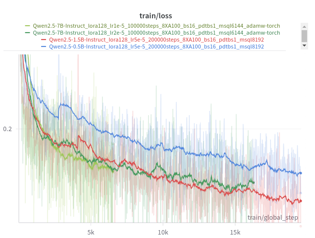
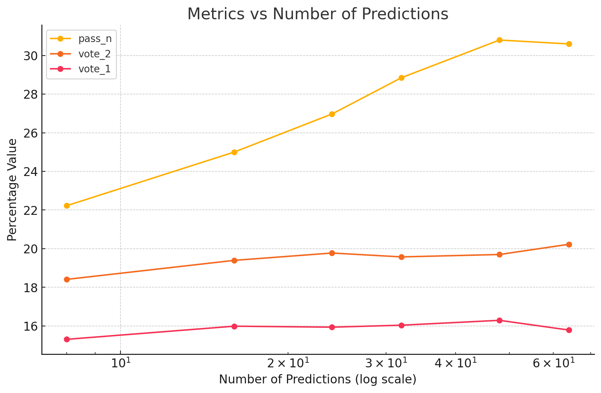

# Iteration 50. Last trainings

_06-11-2024_

## Goal

Can we improve the LB score by training the last models on a powerful server?

## Motivation

There is not enough time to train models on Veridas cluster, I need to use a 8xA100 server to train
the models fast enough for the end of the challenge.

## Development

### Steps to train the model

1. Add the public SSH key of the machine to [Github](https://github.com/settings/keys). `cat ~/.ssh/id_rsa.pub`
1. Clone the arc 24 repo to the machine: `cd ~/code; git clone git@github.com:ironbar/arc24.git`
1. Create a python environment for training

```bash
cd ~/code/arc24
python3 -m virtualenv ~/envs/arc24
source ~/envs/arc24/bin/activate
pip install -r requirements.txt
pip install flash-attn --no-build-isolation
```

1. Do some first trainings to see if the training speed is enough

```bash
source ~/envs/arc24/bin/activate
export gpus=8
export batch_size=16
export steps=200
export per_device_train_batch_size=1
export model_path=Qwen/Qwen2.5-0.5B-Instruct
export WANDB_API_KEY=

accelerate launch --num_processes ${gpus} --num_machines 1 --mixed_precision bf16 --multi_gpu \
/root/code/arc24/scripts/fine-tuning.py \
--n_gpus ${gpus} \
--batch_size ${batch_size} \
--per_device_train_batch_size ${per_device_train_batch_size} \
--output_dir /root/models/20241106_debug_training_speed/${gpus}XA100_bs${batch_size}_pdtbs${per_device_train_batch_size}_${steps}steps_$(basename $model_path) \
--max_steps ${steps} \
--model_path ${model_path} \
--lora_r 128 \
--device_map None \
--no-verbose \
--max_seq_len 8192 \
--learning_rate 5e-5 \
--train_datasets /root/code/arc24/data/original_data/arc-agi_training_challenges.json output-from-examples-v1 \
--val_dataset /root/code/arc24/data/original_data/arc-agi_evaluation_challenges.json output-from-examples-v1 \
--remove_train_samples_to_fit_max_seq_len \
--save_steps 500 \
--eval_steps 5000000 \
--warmup_ratio 1e-1
```

1. Copy extra data

```bash
export machine_ip=94.156.8.181
export machine_ip=94.156.8.119
export machine_ip=94.156.8.239
scp -P 50022 /mnt/hdd0/Kaggle/arc24/data/verifier/evaluation_v0.json root@${machine_ip}:~/code/arc24/data/verifier
scp -P 50022 /mnt/hdd0/Kaggle/arc24/data/verifier/training_v1.json  root@${machine_ip}:~/code/arc24/data/verifier
scp -P 50022 /mnt/hdd0/Kaggle/arc24/data/rearc/v2/re-arc.json root@${machine_ip}:~/code/arc24/data/external_data
```

1. Download barc datasets

```bash
mkdir /root/code/arc24/data/barc
cd /root/code/arc24/data/barc
wget https://huggingface.co/datasets/barc0/100k-gpt4-description-gpt4omini-code_generated_problems/resolve/main/100k-gpt4-description-gpt4omini-code_generated_problems.jsonl?download=true -O 100k-gpt4-description-gpt4omini-code_generated_problems.jsonl
wget https://huggingface.co/datasets/barc0/100k-gpt4omini-description-gpt4omini-code_generated_problems/resolve/main/100k_gpt4o-mini_generated_problems.jsonl?download=true -O 100k_gpt4o-mini_generated_problems.jsonl
wget https://huggingface.co/datasets/barc0/200k_HEAVY_gpt4o-description-gpt4omini-code_generated_problems/resolve/main/data_100k.jsonl?download=true -O data_100k.jsonl
wget https://huggingface.co/datasets/barc0/200k_HEAVY_gpt4o-description-gpt4omini-code_generated_problems/resolve/main/data_suggestfunction_100k.jsonl?download=true -O data_suggestfunction_100k.jsonl
```

1. Install packages: `apt install screen nvtop htop rsync`
1. Run the final training:

```bash
export model_path=Qwen/Qwen2.5-1.5B-Instruct
export learning_rate=5e-5
export lora_r=128
export gpus=8
export batch_size=16
export steps=200000
export per_device_train_batch_size=1
export max_seq_len=8192
export WANDB_API_KEY=

accelerate launch --num_processes ${gpus} --num_machines 1 --mixed_precision bf16 --multi_gpu \
/root/code/arc24/scripts/fine-tuning.py \
--n_gpus ${gpus} \
--batch_size ${batch_size} \
--per_device_train_batch_size ${per_device_train_batch_size} \
--output_dir /root/models/20241106_final_training/$(basename $model_path)_lora${lora_r}_lr${learning_rate}_${steps}steps_${gpus}XA100_bs${batch_size}_pdtbs${per_device_train_batch_size}_msql${max_seq_len} \
--max_steps ${steps} \
--model_path ${model_path} \
--lora_r ${lora_r} \
--device_map None \
--no-verbose \
--max_seq_len ${max_seq_len} \
--learning_rate ${learning_rate} \
--train_datasets barc-200-20-/root/code/arc24/data/barc/100k-gpt4-description-gpt4omini-code_generated_problems.jsonl output-from-examples-v1 \
--train_datasets barc-200-20-/root/code/arc24/data/barc/100k_gpt4o-mini_generated_problems.jsonl output-from-examples-v1 \
--train_datasets barc-200-20-/root/code/arc24/data/barc/data_100k.jsonl output-from-examples-v1 \
--train_datasets barc-200-20-/root/code/arc24/data/barc/data_suggestfunction_100k.jsonl output-from-examples-v1 \
--train_datasets /root/code/arc24/data/verifier/training_v1.json select-output-from-examples-v0 \
--train_datasets /root/code/arc24/data/verifier/training_v1.json verify-output-from-examples-v0 \
--train_datasets /root/code/arc24/data/verifier/evaluation_v0.json select-output-from-examples-v0 \
--train_datasets /root/code/arc24/data/verifier/evaluation_v0.json verify-output-from-examples-v0 \
--train_datasets /root/code/arc24/data/original_data/arc-agi_training_challenges.json output-from-examples-v1 \
--train_datasets /root/code/arc24/data/original_data/arc-agi_evaluation_challenges.json output-from-examples-v1 \
--train_datasets /root/code/arc24/data/external_data/re-arc.json output-from-examples-v1 \
--train_datasets /root/code/arc24/data/external_data/kaggle.json output-from-examples-v1  \
--train_datasets /root/code/arc24/data/external_data/pqa-dataset-1k.json output-from-examples-v1  \
--train_datasets /root/code/arc24/data/external_data/neoeye_tama.json output-from-examples-v1  \
--train_datasets /root/code/arc24/data/external_data/MINI-ARC.json output-from-examples-v1  \
--train_datasets /root/code/arc24/data/original_data/arc-agi_training_challenges.json input-from-inputs-v0 \
--train_datasets /root/code/arc24/data/original_data/arc-agi_evaluation_challenges.json input-from-inputs-v0 \
--train_datasets /root/code/arc24/data/external_data/re-arc.json input-from-inputs-v0 \
--train_datasets /root/code/arc24/data/external_data/kaggle.json input-from-inputs-v0  \
--train_datasets /root/code/arc24/data/external_data/pqa-dataset-1k.json input-from-inputs-v0  \
--train_datasets /root/code/arc24/data/external_data/neoeye_tama.json input-from-inputs-v0  \
--train_datasets /root/code/arc24/data/external_data/MINI-ARC.json input-from-inputs-v0  \
--val_dataset /root/code/arc24/data/original_data/arc-agi_evaluation_challenges.json output-from-examples-v1 \
--remove_train_samples_to_fit_max_seq_len \
--optim adamw_torch \
--save_steps 500 \
--eval_steps 5000000 \
--warmup_ratio 2e-2
```

### Syncronize checkpoints

```bash
while true; do
    for machine_ip in 94.156.8.181 94.156.8.119; do
        rsync -r -avP -e "ssh -i ~/.ssh/id_rsa.pub -p 50022" root@${machine_ip}:~/models/20241106_final_training/ /mnt/hdd0/Kaggle/arc24/models/20241106_final_training/
    done
    for machine_ip in 192.222.52.72; do
        rsync -r -avP -e "ssh -i ~/.ssh/id_rsa.pub" ubuntu@${machine_ip}:~/models/20241106_final_training/ /mnt/hdd0/Kaggle/arc24/models/20241106_final_training/
    done
    sleep 1h
done


while true; do
    for machine_ip in 94.156.8.181 94.156.8.119 94.156.8.239; do
        rsync -r -avP -e "ssh -i ~/.ssh/id_rsa.pub -p 50022" root@${machine_ip}:~/models/20241106_final_training/ /mnt/hdd0/Kaggle/arc24/models/20241106_final_training/
    done
    sleep 1h
done
```

### Train bigger models

It might be worth to train bigger models. I already studied the improvements of using bigger models on [iteration 20](Iteration_20_bigger_models.md).
Also on [iteration 46](Iteration_46_revisit_small_llms.md) I have seen that using smaller models produced
worse results even when training the models for longer.

Now that I have a model that can select predictions, it might be worth to use bigger models even when I
cannot do test-time fine-tuning on them.

### FP8 training on H100

- https://huggingface.co/docs/accelerate/en/usage_guides/low_precision_training
- https://github.com/NVIDIA/TransformerEngine

```bash
pip install git+https://github.com/NVIDIA/TransformerEngine.git@stable
```

I have not been able to install the backends required for fp8 training.

### Plan the final 12 submissions

I'm not sure if I will have a Qwen2.5-7B model, it depends on the availability of a 3rd training machine
by compute strong and being able to train the model successfully.

I have to answer the following questions:

- How good are the new models at selecting predictions? (and how fast also) Answering this question
  will allow to better choose the combination methods for the predictions.
- Do the new models improve the LB score when using the classic test-time fine-tuning submission?
- Is it worth to make predictions with the model without test-time fine-tuning? That would be fast and
  might solve some additional tasks (8 minutes to do 16 predictions per task using Qwen2.5-0.5B).
- Could I do test-time fine-tuning with the 1.5B model? I could test this in the Kaggle notebook without submission.

There are 3 sources of predictions:

1. Test-time fine-tuned model
2. Frozen model
3. 2020 solution

And there are 4 ways of combining the predictions:

1. Selection using a model
2. Voting
3. Combination of predictions (first attempt from one submission and the second from other submission)
4. Concatenation

The submissions that I can create are the combination of this two variables.

#### Thursday 7 November

I'm going to have available Qwen2.5-0.5B trained for 200k steps. I have made a classic submission
that scored 35 and two triple ensemble submission that scored 35 and 33.

#### Friday 8

I'm going to have available Qwen2.5-0.5B trained for 400k steps and Qwen2.5-1.5B trained for 200k steps.

- Submission with Qwen2.5-0.5B and learning rate 4e-5: 38
- Submission with Qwen2.5-1.5B and learning rate 1e-5: 35 (but I had an error on `max_seq_len`, so score might be higher. Also I had a timeout on another submission with Qwen2.5-1.5B)

#### Saturday 9

I have available a Qwen2.5-0.5B trained for 400k steps, Qwen2.5-1.5B trained for 300k steps and Qwen2.5-7B trained for 100k steps.

- Submission with Qwen2.5-1.5B and learning rate 1e-5: ongoing
- Submission with Qwen2.5-1.5B and learning rate 2e-5: ongoing
- Submission with Qwen2.5-1.5B and learning rate 4e-5: 
- Triple ensemble with Qwen2.5-7B:
- Can I fine-tune Qwen2.5-7B?
- More submissions with Qwen2.5-0.5B increasing the learning rate?
- Something with prediction selection?

#### Sunday 10

13:00 is the last time to submit a system that takes 12 hours to create the submission

### Test-time fine-tuning with Qwen2.5-1.5B

On this [notebook](https://www.kaggle.com/code/ironbar/single-task-test-time-fine-tuning-for-arc24?scriptVersionId=205771369) I have verified that I can do test-time fine-tuning with Qwen2.5-1.5B.

I had to decrease the `max_seq_len` from 5120 to 3584 to avoid OOM errors.

- Fine-tuning took 2.6 minutes per task for 100 steps
- Inference took 1.2 minutes per task to do 32 predictions

Under that conditions a submission would take around 6 hours. It seems we have margin to increase either
the training steps or the number of predictions.

Experiment with bigger steps and predictions:

- 64 predictions -> 1.5 minutes per tasks
- 200 steps -> 4.3 minutes per task

Which learning rate to use? I can't use the evaluation set to tune the learning rate. However I can
have a look at the Qwen2.5-0.5B models. We trained the models with learning rate between 5e-5 and 1e-4.
And the test-time fine-tuning learning rates were 4e-5 and 8e-5 most frequently. Thus we can see that
we used almost the exact same learning rate despite using a batch size of 1 for test-time fine-tuning.

The Qwen2.5-1.5B was trained with a learning rate of 5e-5. A conservative learning rate for test-time
fine-tuning would be 1e-5. If it works we could try increasing it to 2e-5.

### Test-time fine-tuning with Qwen2.5-7B

Let's see if we can use test-time fine-tuning with Qwen2.5-7B.

If I decrease the `max_seq_len` to 896 I can fine-tune on Kaggle machines, at a speed of around 2.45 seconds per sample.
In those conditions I could only use around 50% of the tasks for training.

If I use 4 bit quantization the speed slows down to around 11.5 seconds per sample. Then I have tried
disabling gradient checkpointing and the speed increases to 7 seconds per sample. Is better but still
very slow.

My idea is to create a notebook for the 7B model, that only does test-time fine-tuning on the 50% smallest tasks
and does inference with the frozen model for the grouped other 50% tasks. I'm not sure if this might
work better than the smaller models but it is worth to try it.

## Results

### Training speed

I have done some initial training speed experiments to verify that the machines work well. I haven't seen
any speed improvement by increasing the batch size or increasing the per device train batch size.

| model                 | hardware | it/s |
|-----------------------|----------|------|
| Qwen2.5-0.5B-Instruct | 8xA100   | 2.38 |
| Qwen2.5-1.5B-Instruct | 8xA100   | 1.44 |
| Qwen2.5-7B-Instruct   | 8xA100   | 0.68 |
| Qwen2.5-7B-Instruct   | 8xH100   | 1.09 |

The H100 might be a good idea for `Qwen2.5-7B-Instruct`.

### Qwen2.5-7B-Instruct is not showing better results than Qwen2.5-1.5B-Instruct



We show a great improvement of `Qwen2.5-1.5B-Instruct` over `Qwen2.5-0.5B-Instruct` on training loss.
However we don't observe the same improvement with `Qwen2.5-7B-Instruct`. I have tried with 3 different
learning rates: 1e-5, 2e-5, 5e-5 (diverged)

| model parameters | LoRA parameters for rank 128 |
|------------------|------------------------------|
| 0.5B             | 17M                          |
| 1.5B             | 35M                          |
| 7B               | 80M                          |

We can see that the trainable number of parameters is different, but can it explain the different training dynamics?

### Effect of the number of predictions

I'm reusing data from [iteration 30](Iteration_30_optimal_number_predictions.md) to create the plot below.



The plot shows that the `pass_n` metric increases linearly with the logarithmic of the number of predictions.
However voting improves with a much lower slope. This is likely due to the fact that the solutions that are
found when using a higher number of predictions do not reach the needed majority of the votes.

¿Maybe a selection model could scale better? So far I have only used the selection model for 32 predictions.

## Conclusion

## Next steps

## TODO

- [x] How to sync checkpoints between the servers and my machine?
- [x] Verify that I can use the bigger models in Kaggle
  - [x] Upload base models
  - [x] Upload loras from early checkpoints
  - [x] Notebook to do inference without test-time fine-tuning (I believe it already exists)
- [x] train Qwen2.5-7B-Instruct with lora_r=64
- [ ] Plan the last 12 submissions
- [ ] Voting and selection dynamics could be different after test-time fine-tuning
- [ ] Could I do test-time fine-tuning with the 1.5B model?
- [x] Create a notebook for triple ensemble
